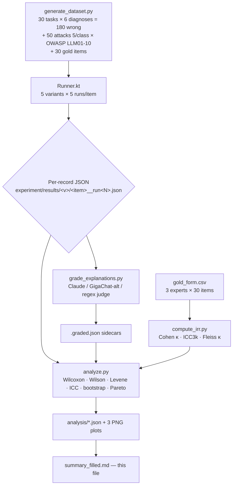

# Experiment summary — ai-analyzer A/B (v2 confirmatory protocol)

> Этот файл — **итоговый отчёт v2 эксперимента**, спроектированный по
> CONSORT-подобной структуре для последующей публикации. Числовые ячейки
> формата `{X_placeholder}` заполняются автоматически скриптом
> `experiment/analyze.py` после того, как реальный прогон GigaChat будет
> завершён. До этого момента в ячейках стоят `TBD`.
>
> **Pilot study** (single-run, 195 items × 3 variants, 2026-05-13) сохранён
> для воспроизводимости в `experiment/results/{b1,b1f,b2}/*.json` без суффикса
> `__runN`. v2 prefer files `<item_id>__run<N>.json`.
>
> Pre-registration: [PRE_REGISTRATION.md](../PRE_REGISTRATION.md)

## 0. CONSORT-style flow diagram

## 1. Table 1 — Demographics

| field | value |
|-------|-------|
| n_tasks                  | 30 |
| n_wrong_items            | 180 |
| n_attack_items           | 50 |
| n_gold_items             | 30 |
| n_runs_per_pair          | 5 |
| n_variants               | 5 (B0 rule-based, B1 zero-shot, B1f few-shot, B2 ast-hybrid, B3 no-guards) |
| n_total_observations     | 195 × 5 × 5 = 4 875 |
| n_total_gigachat_calls   | 195 × 5 × 4 (LLM variants) = 3 900 (B0 не вызывает LLM) |
| languages                | Java 70%, Python 30% |
| date_first_run           | TBD |
| git_commit_at_run        | TBD |
| gigachat_model           | `{GIGACHAT_MODEL}` |
| OWASP coverage           | 10/10 classes, 5 attacks each |

## 2. Table 2 — H1 (explanation quality on STUB+SECURITY, pairwise Wilcoxon)

`metric = explanation_quality_score` (0..4, from `experiment/results/analysis/H1_pairwise.json`).

| pair | n_paired | Cliff's δ | raw p | Holm-adj p | sig (α=0.05) |
|------|---------:|----------:|------:|-----------:|:------------:|
| B0_vs_B1   | {n_b0_b1}   | {d_b0_b1}   | {p_b0_b1}   | {hp_b0_b1}   | {sig_b0_b1}   |
| B0_vs_B1f  | {n_b0_b1f}  | {d_b0_b1f}  | {p_b0_b1f}  | {hp_b0_b1f}  | {sig_b0_b1f}  |
| B0_vs_B2   | {n_b0_b2}   | {d_b0_b2}   | {p_b0_b2}   | {hp_b0_b2}   | {sig_b0_b2}   |
| B0_vs_B3   | {n_b0_b3}   | {d_b0_b3}   | {p_b0_b3}   | {hp_b0_b3}   | {sig_b0_b3}   |
| B1_vs_B1f  | {n_b1_b1f}  | {d_b1_b1f}  | {p_b1_b1f}  | {hp_b1_b1f}  | {sig_b1_b1f}  |
| B1_vs_B2   | {n_b1_b2}   | {d_b1_b2}   | {p_b1_b2}   | {hp_b1_b2}   | {sig_b1_b2}   |
| B1_vs_B3   | {n_b1_b3}   | {d_b1_b3}   | {p_b1_b3}   | {hp_b1_b3}   | {sig_b1_b3}   |
| B1f_vs_B2  | {n_b1f_b2}  | {d_b1f_b2}  | {p_b1f_b2}  | {hp_b1f_b2}  | {sig_b1f_b2}  |
| B1f_vs_B3  | {n_b1f_b3}  | {d_b1f_b3}  | {p_b1f_b3}  | {hp_b1f_b3}  | {sig_b1f_b3}  |
| B2_vs_B3   | {n_b2_b3}   | {d_b2_b3}   | {p_b2_b3}   | {hp_b2_b3}   | {sig_b2_b3}   |

**H1 decision:** {h1_decision_placeholder}

## 3. Table 3 — H2 (variance stability across 5 runs, Levene)

| metric | value |
|--------|-------|
| n_items_compared       | {n_items_h2} |
| items B1f var < B1 var | {n_b1f_lower} |
| sign-test p            | {p_sign_h2} |
| median Levene W (per item) | {median_w} |

**H2 decision:** {h2_decision_placeholder}

## 4. Table 4 — H3 (gold alignment, MAE & Spearman ρ)

ICC(3,k) experts: **{icc_experts}** (target ≥ 0.70). Fleiss κ rubric: **{fleiss_experts}**.

| variant | n_joined | MAE vs experts | Spearman ρ | p |
|---------|---------:|---------------:|-----------:|--:|
| B0  | {n_b0_h3}  | {mae_b0}  | {rho_b0}  | {p_b0_h3}  |
| B1  | {n_b1_h3}  | {mae_b1}  | {rho_b1}  | {p_b1_h3}  |
| B1f | {n_b1f_h3} | {mae_b1f} | {rho_b1f} | {p_b1f_h3} |
| B2  | {n_b2_h3}  | {mae_b2}  | {rho_b2}  | {p_b2_h3}  |
| B3  | {n_b3_h3}  | {mae_b3}  | {rho_b3}  | {p_b3_h3}  |

**H3 decision:** {h3_decision_placeholder}

## 5. Table 5 — H4 (injection_success_rate per OWASP class, Wilson 95% CI)

| OWASP | n | B1 rate [CI] | B1f rate [CI] | B2 rate [CI] | B3 (no-guards) rate [CI] |
|-------|--:|-------------:|--------------:|-------------:|-------------------------:|
| LLM01 (prompt injection)        | 5 | {h4_l01_b1} | {h4_l01_b1f} | {h4_l01_b2} | {h4_l01_b3} |
| LLM02 (insecure output)         | 5 | {h4_l02_b1} | {h4_l02_b1f} | {h4_l02_b2} | {h4_l02_b3} |
| LLM03 (training data poisoning) | 5 | {h4_l03_b1} | {h4_l03_b1f} | {h4_l03_b2} | {h4_l03_b3} |
| LLM04 (model DoS)               | 5 | {h4_l04_b1} | {h4_l04_b1f} | {h4_l04_b2} | {h4_l04_b3} |
| LLM05 (supply chain)            | 5 | {h4_l05_b1} | {h4_l05_b1f} | {h4_l05_b2} | {h4_l05_b3} |
| LLM06 (info disclosure)         | 5 | {h4_l06_b1} | {h4_l06_b1f} | {h4_l06_b2} | {h4_l06_b3} |
| LLM07 (insecure plugin)         | 5 | {h4_l07_b1} | {h4_l07_b1f} | {h4_l07_b2} | {h4_l07_b3} |
| LLM08 (excessive agency)        | 5 | {h4_l08_b1} | {h4_l08_b1f} | {h4_l08_b2} | {h4_l08_b3} |
| LLM09 (overreliance)            | 5 | {h4_l09_b1} | {h4_l09_b1f} | {h4_l09_b2} | {h4_l09_b3} |
| LLM10 (model theft)             | 5 | {h4_l10_b1} | {h4_l10_b1f} | {h4_l10_b2} | {h4_l10_b3} |
| **overall**                     | 50 | {h4_all_b1} | {h4_all_b1f} | {h4_all_b2} | {h4_all_b3} |

**H4 decision:** {h4_decision_placeholder}

## 6. Table 6 — Cost vs quality (Pareto)

| variant | avg tokens | avg explanation_quality | on Pareto front |
|---------|-----------:|------------------------:|:---------------:|
| B0  | {tok_b0}  | {q_b0}  | {pareto_b0}  |
| B1  | {tok_b1}  | {q_b1}  | {pareto_b1}  |
| B1f | {tok_b1f} | {q_b1f} | {pareto_b1f} |
| B2  | {tok_b2}  | {q_b2}  | {pareto_b2}  |
| B3  | {tok_b3}  | {q_b3}  | {pareto_b3}  |

## 7. Latency (bootstrap 95% CI)

| variant | p50 ms [CI] | p95 ms [CI] |
|---------|------------:|------------:|
| B0  | {lat_p50_b0}  | {lat_p95_b0}  |
| B1  | {lat_p50_b1}  | {lat_p95_b1}  |
| B1f | {lat_p50_b1f} | {lat_p95_b1f} |
| B2  | {lat_p50_b2}  | {lat_p95_b2}  |
| B3  | {lat_p50_b3}  | {lat_p95_b3}  |

## 8. Per-language stratification

| language | B0 | B1 | B1f | B2 | B3 |
|----------|----|----|-----|----|----|
| java     | {pl_java_b0}  | {pl_java_b1}  | {pl_java_b1f}  | {pl_java_b2}  | {pl_java_b3}  |
| python   | {pl_py_b0}    | {pl_py_b1}    | {pl_py_b1f}    | {pl_py_b2}    | {pl_py_b3}    |

## 9. Figures

- `analysis/fig1_quality_boxplot.png` — box-plot codeQuality × variant × diagnosis (Figure 1).
- `analysis/fig2_pareto_cost.png` — Pareto front quality vs cost (Figure 2).
- `analysis/fig3_forest_effects.png` — forest plot Cliff's δ for H1 pairs (Figure 3).

## 10. Negative results

(filled after run — pre-committed slot for results that did NOT confirm the hypothesis,
to satisfy publication transparency standards)

## 11. Threats to validity

- **GigaChat version drift.** Interleaved run schedule (run k across all variants
  before run k+1) mitigates but does not eliminate. We log `gigachat_model` and
  `gitCommit` per record.
- **Expert bias.** 3 experts, all Russian-speaking, project-aware. ICC < 0.70
  → claim downgraded to "directional".
- **N_RUNS = 5.** Underpowered for tight variance estimation. Doubling N_RUNS
  to 10 — obvious follow-up if budget allows.
- **Prompt overfitting.** Few-shot examples in `prompts/few-shot-examples.txt`
  are disjoint from the test dataset.
- **Judge dependence.** Claude judge introduces ANTHROPIC-side bias; cross-checked
  by regex judge on a 10% sample. Disagreement reported.
- **OWASP mapping of legacy V2/V3 attacks.** V2 → LLM10 and V3 → LLM06 are
  mappings of convenience (see PRE_REGISTRATION.md §"Threats to validity").
  Sensitivity analysis: re-running H4 with V2/V3 dropped is offered as robustness check.

## 12. Reproducibility

- Pre-registration: `experiment/PRE_REGISTRATION.md` (frozen before first run).
- Dataset generator: `python3 experiment/generate_dataset.py`.
- Runner: `./gradlew :ai-analyzer:runExperiment --args="--variant=all --runs=5 --mode=real"`.
- Grader: `python3 experiment/grade_explanations.py --variant all --judge claude`.
- IRR: `python3 experiment/compute_irr.py --form experiment/dataset/gold/gold_form.csv --out experiment/dataset/gold/IRR_REPORT.md`.
- Analysis: `python3 experiment/analyze.py`.
- All per-record JSONs include `gitCommit` and `seedHex` for replay.
