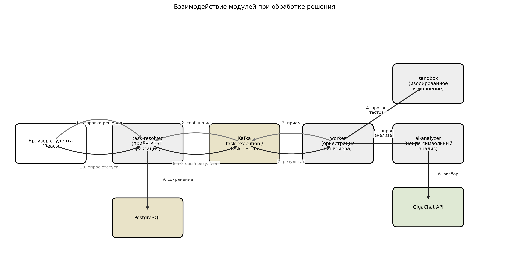
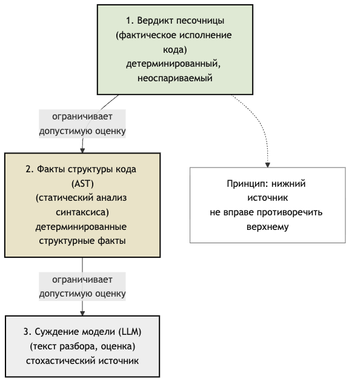
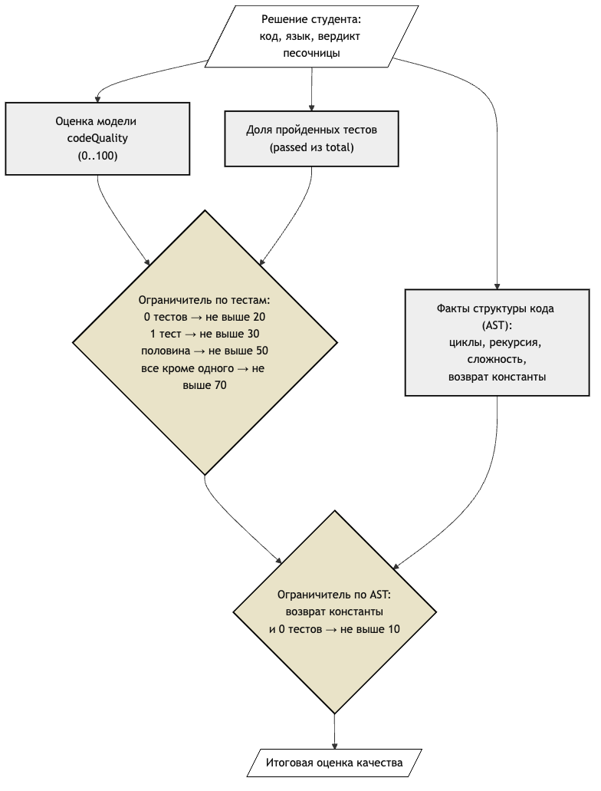
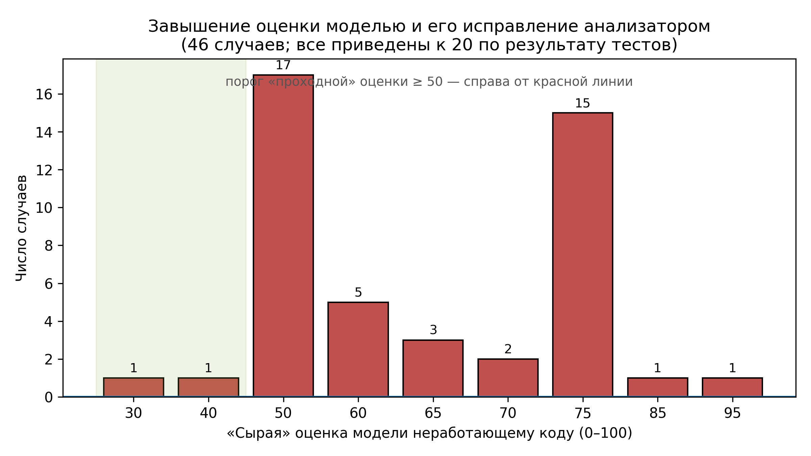
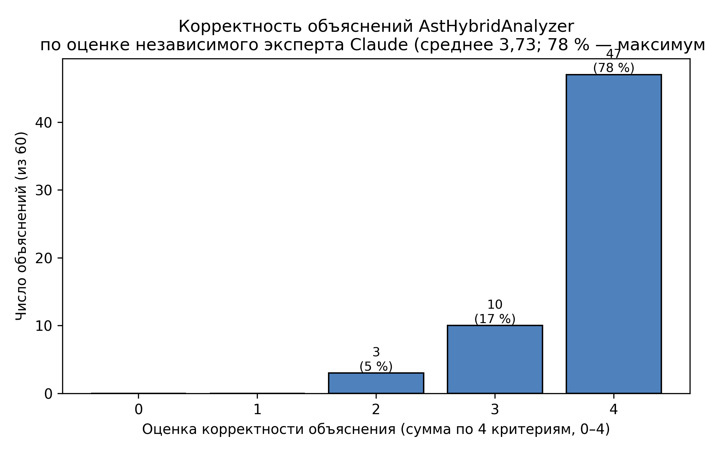

# Титульный лист

МИНОБРНАУКИ РОССИИ

Федеральное государственное автономное образовательное учреждение высшего образования

«Российский государственный университет нефти и газа (национальный исследовательский университет) имени И.М. Губкина»

Факультет автоматики и вычислительной техники

Кафедра информатики

Направление подготовки 09.04.01 Информатика и вычислительная техника

Программа 09.04.01.04 Киберфизические системы и технологии управления нефтегазовыми объектами

|   |   |
|---|---|
| Оценка: | ____________________ |
| Рейтинг: | ____________________ |
| Подпись секретаря ГЭК: | ____________________ |

МАГИСТЕРСКАЯ ДИССЕРТАЦИЯ

на тему:

«Разработка веб-сервиса для автоматизированной проверки решений задач по программированию»

|   |   |
|---|---|
| НАУЧНЫЙ РУКОВОДИТЕЛЬ: | к.т.н., доцент Фомичева О.Е. |
|   | _________________ (подпись, дата) |
| ВЫПОЛНИЛ: | студент группы ААМ-24-07 Рысаев А.И. |
|   | _________________ (подпись, дата) |

Москва

2026

# Задание на выполнение выпускной квалификационной работы

МИНОБРНАУКИ РОССИИ

РГУ нефти и газа (НИУ) имени И.М. Губкина

Кафедра информатики

ЗАДАНИЕ НА ВЫПОЛНЕНИЕ ВЫПУСКНОЙ КВАЛИФИКАЦИОННОЙ РАБОТЫ

ДАНО студенту Рысаеву Айдару Ильдаровичу группы ААМ-24-07.

Тема ВКР: «Разработка веб-сервиса для автоматизированной проверки решений задач по программированию».

Руководитель: к.т.н., доцент Фомичева О.Е.

Тема и руководитель ВКР закреплены приказом № ______ от «____» ______________ 20____ года.

Закрепление изменено приказом № ______ от «____» ______________ 20____ года.

## Исходные данные к работе

Существующие подходы к автоматизированной проверке программных решений: системы LeetCode, Codeforces, HackerRank, e-olymp, ejudge. Открытая документация на изоляцию выполнения (Docker, gVisor, NIST SP 800-190). Документация GigaChat API. Корпус известных уязвимостей применения больших языковых моделей (OWASP Top 10 for LLM Applications, Greshake K. et al. «Indirect prompt injection», AISec 2023). Эталонный датасет алгоритмических задач, размещённый в каталоге `experiment/dataset/` репозитория.

## Перечень подлежащих разработке вопросов

**Раздел ВКР 1. Аналитический обзор предметной области.** Задание и исходные данные по разделу: провести аналитический обзор существующих систем автоматической проверки кода, методов изоляции исполнения недоверенного кода и применения больших языковых моделей в образовательных продуктах; сформулировать требования к разрабатываемому сервису.

**Раздел ВКР 2. Проектирование системы.** Задание и исходные данные по разделу: спроектировать архитектуру веб-сервиса в нотации C4 с разбиением на функциональные модули; разработать модель данных; построить формальную модель конвейера обработки решения и модель нарушителя.

**Раздел ВКР 3. Программная реализация.** Задание и исходные данные по разделу: реализовать модуль безопасного выполнения недоверенного кода на основе Docker с применением hardening-флагов; реализовать модуль интеллектуального анализа решений на базе GigaChat с защитой от галлюцинаций (вердикт песочницы, факты AST, JSON-schema валидация, sentinel-маркеры, динамическая шкала `dynamicQualityCap`); реализовать REST API через OpenAPI-генератор и пользовательский интерфейс на базе React 18 + Vite + Material UI v5 + Monaco Editor.

**Раздел ВКР 4. Описание работы системы.** Задание и исходные данные по разделу: описать сквозной сценарий работы сервиса; реализовать расширения функциональности (фильтр задач по тематике, импорт задач из CSV-файла, наблюдаемость через Prometheus и Grafana с целевыми показателями SLO, сквозное тестирование Playwright).

**Раздел ВКР 5. Экспериментальное исследование.** Задание и исходные данные по разделу: спланировать и провести эксперимент по заранее зафиксированному плану (60 элементов × 1 прогон × 2 конфигурации анализатора — обычный промпт и AstHybridAnalyzer, 120 вызовов GigaChat; качество объяснений оценивает независимый эксперт — модель Claude) и подтвердить корректность объяснений системы, устойчивость к prompt-инъекциям и быстродействие.

## Перечень графического материала

1. Контекстная диаграмма C4-уровень 1.
2. Контейнерная диаграмма C4-уровень 2.
3. ER-диаграмма базы данных PostgreSQL.
4. Sequence-диаграмма обработки одного решения.
5. Архитектура ИИ-анализатора (цепочка обработчиков).
6. Блок-схема алгоритма sandbox по ГОСТ 19.701-90 [7]; общее оформление текстовых документов — по ГОСТ 2.105-95 [6].
7. Блок-схема построения user-prompt.
8. Диаграмма состояний submission.
9. Бар-чарт сравнительных метрик эксперимента по вариантам анализатора.

## Рекомендуемая литература

OWASP Top 10 for Large Language Model Applications; NIST SP 800-190 Application Container Security Guide; Greshake K. et al. Indirect Prompt Injection (AISec 2023); Zheng L. et al. Judging LLM-as-a-Judge (NeurIPS 2023); Spring Boot Reference Documentation; Kotlin Reference; документация GigaChat API. Полный перечень приведён в списке использованных источников.

|   |   |
|---|---|
| Задание выдал (руководитель): | _________________ Фомичева О.Е. |
|   | «____» ______________ 20____ г. |
| Задание принял к исполнению (студент): | _________________ Рысаев А.И. |
|   | «____» ______________ 20____ г. |

# АННОТАЦИЯ

Рысаев А.И., разработка веб-сервиса для автоматизированной проверки решений задач по программированию, магистерская диссертация, 2026 — 95 с., 43 рис. Руководитель Фомичева О.Е., доцент, к.т.н. Кафедра информатики.

Разработаны архитектура и прототип веб-сервиса, который автоматически проверяет учебные программные решения и сопровождает оценку содержательным разбором ошибок. Оценка формируется по трём источникам в порядке их авторитетности (степени доверия к источнику): сначала учитывается результат запуска кода в изолированной среде, затем факты о структуре кода и лишь в последнюю очередь — текстовое суждение языковой модели GigaChat. Такой порядок (нейро-символьный подход — сочетание языковой модели с проверяемыми правилами) исключает завышение оценки неработающего решения. Дополнительно применены динамическая шкала, ограничивающая оценку по доле пройденных тестов, и семиуровневая защита от инъекций в запрос. Корректность формируемых объяснений подтверждена независимой языковой моделью по заранее заданным критериям.

Результаты работы могут быть применены в учебном процессе кафедры информатики, в открытых онлайн-курсах и в корпоративном обучении прикладному программированию, а также интегрированы с внешними системами управления обучением через REST-контракт на основе спецификации OpenAPI.

# ПЕРЕЧЕНЬ УСЛОВНЫХ ОБОЗНАЧЕНИЙ И СОКРАЩЕНИЙ

| Сокращение | Расшифровка |
|------------|-------------|
| AC | Accepted — вердикт принятого решения |
| API | Application Programming Interface — программный интерфейс приложения |
| AST | Abstract Syntax Tree — абстрактное синтаксическое дерево |
| BCrypt | Blowfish-based password hashing function — алгоритм хеширования паролей на основе шифра Blowfish |
| CC | Cyclomatic Complexity — цикломатическая сложность |
| CE | Compilation Error — ошибка компиляции |
| CORS | Cross-Origin Resource Sharing — политика разделения ресурсов между источниками |
| CSRF | Cross-Site Request Forgery — межсайтовая подделка запроса |
| CSV | Comma-Separated Values — формат табличных данных |
| DLT | Dead Letter Topic — топик «мёртвых» сообщений в Apache Kafka |
| DoS | Denial of Service — отказ в обслуживании |
| DTO | Data Transfer Object — объект передачи данных |
| ER | Entity-Relationship — модель «сущность—связь» |
| HOC | Higher-Order Component — компонент высшего порядка (React) |
| HTTP | HyperText Transfer Protocol |
| JPA | Jakarta Persistence API — спецификация ORM на платформе JVM |
| JSON | JavaScript Object Notation |
| JVM | Java Virtual Machine |
| JWT | JSON Web Token — стандарт RFC 7519 |
| Kafka | Apache Kafka — распределённый брокер сообщений |
| LLM | Large Language Model — большая языковая модель |
| LMS | Learning Management System — система управления обучением |
| LTI | Learning Tools Interoperability — стандарт интеграции учебных инструментов |
| MLE | Memory Limit Exceeded — превышение лимита памяти |
| MUI | Material UI — библиотека React-компонентов |
| NFKC | Unicode Normalization Form KC |
| NIST | National Institute of Standards and Technology |
| OAuth2 | Открытый стандарт авторизации (RFC 6749) |
| OOM | Out of Memory — нехватка оперативной памяти |
| OpenAPI | Открытая спецификация описания REST API |
| ORM | Object-Relational Mapping |
| OWASP | Open Worldwide Application Security Project |
| PE | Presentation Error — ошибка формата вывода |
| RAG | Retrieval-Augmented Generation — генерация с применением внешней памяти |
| RTE | Runtime Error — ошибка времени исполнения |
| SLA | Service-Level Agreement — соглашение об уровне сервиса |
| SLI | Service-Level Indicator — показатель уровня сервиса |
| SLO | Service-Level Objective — целевой показатель уровня сервиса |
| SPA | Single Page Application — одностраничное веб-приложение |
| SPI | Service Provider Interface — интерфейс поставщика сервиса |
| TLE | Time Limit Exceeded — превышение лимита времени |
| UUID | Universally Unique Identifier (RFC 4122) |
| UX | User Experience — пользовательский опыт взаимодействия |
| WA | Wrong Answer — неправильный ответ |
| YAML | YAML Ain’t Markup Language |
| ВКР | Выпускная квалификационная работа |
| ГОСТ | Государственный стандарт |
| ДИ | Доверительный интервал |
| ИИ | Искусственный интеллект |
| НИР | Научно-исследовательская работа |
| СУБД | Система управления базами данных |

# ВВЕДЕНИЕ

Рост объёмов обучения программированию в высшем и онлайн-образовании превратил быструю и качественную проверку студенческих решений в массовую задачу: курсы и дистанционные программы работают с группами в сотни и тысячи обучающихся, для которых ручная проверка каждого решения практически невыполнима. Автоматизация проверки снижает нагрузку на преподавателей и обеспечивает обучающимся оперативную обратную связь.

Существующие системы автоматической проверки (LeetCode, Codeforces, HackerRank, e-olymp, ejudge) работают преимущественно по схеме «чёрного ящика»: программа запускается на эталонных данных, а её вывод сравнивается с ожидаемым. Такой подход обеспечивает высокую пропускную способность, но не анализирует логику решения, не объясняет причины ошибок и не формирует содержательную обратную связь. Большие языковые модели (Large Language Models, далее — LLM) способны не только фиксировать ошибку, но и пояснять поведение программы, выявлять типовые антипаттерны и адаптировать пояснение под уровень обучающегося.

Однако прямое применение LLM сопряжено с рисками: «галлюцинации» (правдоподобные, но фактически неверные объяснения); уязвимость к инъекциям в промпт (англ. *prompt injection* — внедрение посторонних инструкций в запрос к модели через содержимое решения студента); нестабильность вывода; зависимость от облачного API. При этом открытые judge-системы не предоставляют LLM-разбора, а коммерческие платформы не сопровождают его ни детерминированным символьным слоем, ни публичной оценкой качества объяснений и устойчивости к атакам.

Вопросам применения больших языковых моделей к анализу программного кода и защиты от инъекций в промпт посвящены работы [5; 9; 35], методам изоляции исполнения недоверенного кода — работы [16]. Вместе с тем недостаточно изученным остаётся вопрос построения открытой образовательной системы, которая объединяла бы безопасную изоляцию исполнения, верифицируемый LLM-разбор с защитой от галлюцинаций и методологию оценки качества с заранее зафиксированным протоколом. Отсутствие такого решения определяет актуальность настоящей работы.

Объект исследования — процессы автоматизированной проверки программных решений в образовательной среде; предмет исследования — методы и средства интеграции больших языковых моделей в конвейер проверки программного кода, обеспечивающие устойчивость к галлюцинациям и инъекциям в промпт. Цель работы — разработка архитектуры и прототипа веб-сервиса для автоматизированной проверки решений задач по программированию с применением методов искусственного интеллекта и экспериментальная оценка эффективности предложенного решения; разработка ведётся с учётом требований российского законодательства в области информационных технологий и защиты информации [1]. Исследование строится на следующем предположении. В конвейер анализа учебного кода добавляются два детерминированных компонента, то есть не зависящих от языковой модели: факты, извлечённые из структуры кода (абстрактного синтаксического дерева, AST), и набор правил, ограничивающих итоговую оценку сверху. Предполагается, что это позволяет привязать итоговую числовую оценку решения к фактическому результату его запуска в песочнице и при этом сохранить содержательность текстового разбора на высоком уровне. Предположение проверено в Главе 5 на двух конфигурациях анализатора по заранее зафиксированному протоколу.

Для достижения поставленной цели сформулированы следующие задачи:

1. Провести аналитический обзор существующих систем автоматической проверки программных решений, методов изоляции исполнения недоверенного кода и подходов к применению больших языковых моделей в образовательных продуктах; определить ограничения существующих решений.
2. Сформировать функциональные, нефункциональные и связанные с информационной безопасностью требования к разрабатываемому веб-сервису.
3. Спроектировать архитектуру системы в нотации C4 (способ описания архитектуры на нескольких уровнях детализации — контекст, контейнеры, компоненты), выполнить декомпозицию на функциональные модули и описать модель данных.
4. Реализовать модуль безопасного выполнения недоверенного кода на основе контейнеризации Docker с применением флагов усиления безопасности (англ. *hardening*) и контроля ресурсов.
5. Реализовать модуль интеллектуального анализа решений на основе языковой модели GigaChat, в котором итоговая оценка опирается в первую очередь на результат запуска кода, затем на его структуру и лишь в последнюю очередь — на текстовое мнение модели; предусмотреть защиту от попыток обмануть модель через содержимое решения и правила, не позволяющие завысить оценку неработающему коду.
6. Реализовать веб-интерфейс и программный интерфейс (REST API) для работы с системой, а также дополнительные возможности: фильтр задач по теме, загрузку задач из файла, мониторинг работы системы и автоматическое тестирование интерфейса.
7. Провести эксперимент на двух конфигурациях анализатора и подтвердить корректность работы системы: что она формирует корректные и логичные объяснения решений; что защита отражает попытки подменить инструкции модели через текст решения (prompt-инъекции); и что система отвечает быстро. Для объективности качество объяснений оценивает независимая языковая модель, а не та, что их составила.

В работе применены: критический сравнительный анализ существующих открытых и коммерческих систем автоматической проверки; формальное моделирование конвейера обработки и модели угроз; контрактно-ориентированное проектирование на основе спецификации OpenAPI и архитектурное моделирование в нотациях C4 и UML; нейро-символьный подход к организации конвейера интеллектуального анализа; статический анализ кода через построение абстрактного синтаксического дерева; эксперимент с заранее зафиксированным планом на двух конфигурациях анализатора. Надёжность результатов оценена доверительными интервалами по методу Вильсона (способ оценки доверительного интервала доли, корректный и при нулевом числе событий, и на малых выборках), а качество объяснений — независимой, перекрёстной (cross-model — оценку даёт не та модель, что составила разбор) оценкой второй языковой моделью.

Теоретическая значимость состоит в формализации принципа иерархии авторитетности источников оценки в виде каскада ограничений, ограничивающего итоговую оценку сверху согласно фактическому исполнению независимо от поведения модели. Кроме того, описан механизм защиты конвейера от инъекций, переносимый на другие LLM-конвейеры, обрабатывающие недоверенный вход. Практическая значимость определяется разработанным прототипом, пригодным к опытному использованию в учебном процессе кафедры информатики РГУ нефти и газа (НИУ) имени И.М. Губкина. Сервис сокращает время проверки работ, обеспечивает объективность оценки и мгновенную обратную связь с пояснением ошибок, а также допускает интеграцию с внешними образовательными платформами через REST-контракт OpenAPI. При замене внешней языковой модели на локально развёрнутую возможно развёртывание в полностью закрытом контуре без передачи кода студентов за пределы организации (текущий прототип использует облачный API GigaChat). Архитектура применима также в корпоративном обучении прикладному программированию.

Научная новизна работы состоит не в применении готовых компонентов, а в двух результатах. Во-первых, предложен и формально описан каскад ограничений итоговой оценки (dynamicQualityCap), который детерминированно, независимо от поведения языковой модели, не позволяет завысить оценку неработающего решения; это проверяемое свойство конструкции, а не эвристическая настройка. Во-вторых, спроектирована эшелонированная (семиуровневая) защита конвейера от инъекций в запрос, распределённая по фазам обработки.

Личный вклад автора заключается в том, что самостоятельно спроектированы и реализованы архитектура сервиса (девять модулей), детерминированный каскад ограничения оценки и извлечение фактов из структуры кода, семиуровневая защита от инъекций, веб-интерфейс и REST API, а также спланирован, проведён и обработан эксперимент. Готовыми взяты только базовые технологии и библиотеки (контейнеризация Docker, библиотека разбора кода JavaParser, языковая модель GigaChat, фреймворк Spring Boot), применённые как инструменты.

# ГЛАВА 1. АНАЛИТИЧЕСКИЙ ОБЗОР ПРЕДМЕТНОЙ ОБЛАСТИ

В настоящей главе исследовано проблемное поле автоматизированной проверки решений задач по программированию. Сформулирована постановка задачи, проведён сравнительный анализ существующих систем-«судей», рассмотрены методы изоляции исполнения недоверенного кода, изучены возможности и риски применения больших языковых моделей в образовательном процессе, обоснован нейро-символьный подход к формированию обратной связи. По итогам обзора сформулированы функциональные, нефункциональные требования и требования безопасности, которым должна удовлетворять разрабатываемая система.

## 1.1. Постановка задачи автоматизированной проверки кода

Понятие качества разрабатываемого программного обеспечения опирается на модель ISO/IEC 25010:2011 [8], выделяющую группы характеристик «функциональная пригодность», «производительность», «информационная безопасность» и «удобство использования». Под автоматизированной проверкой решений задач по программированию (англ. *automated judging* или *online judge*) понимается процесс программной оценки представленного обучающимся исходного кода без участия преподавателя. Оценка включает компиляцию, изолированное исполнение программы на заранее подготовленных тестовых данных, сопоставление полученного результата с эталонным ответом, измерение характеристик исполнения (время, потребление памяти) и формирование вердикта [43; 45]. Класс таких систем традиционно обозначается термином «judge» (проверяющая система), восходящим к практике международных олимпиад по программированию [13]; далее по тексту термины «judge» и «проверяющая система» используются как равнозначные.

Историческое развитие систем автоматической проверки прослеживается от UVa Online Judge, открытого в 1995 году при Университете Вальядолида, через российскую систему e-olymp и польский SPOJ к современным коммерческим платформам тренировки навыков собеседования [44; 46]. Каждая итерация развития сопровождалась расширением номенклатуры поддерживаемых языков и постепенным усложнением механизма формирования вердиктов. Если на ранних этапах вердикт ограничивался указанием на правильность ответа, то современные системы обязательно различают как минимум семь стандартных состояний: AC (англ. *accepted*) — решение принято; WA (англ. *wrong answer*) — неверный ответ; TLE (англ. *time limit exceeded*) — превышение лимита времени; MLE (англ. *memory limit exceeded*) — превышение лимита памяти; RE (англ. *runtime error*) — аварийное завершение программы; CE (англ. *compilation error*) — ошибка компиляции; PE (англ. *presentation error*) — корректный по содержанию, но некорректный по формату вывода ответ. Различение состояний обеспечивает обучающемуся ориентировку для дальнейшей работы над решением [14].

Образовательный процесс предъявляет к подобным системам ряд требований, отличающихся от требований к спортивно-олимпиадным платформам. Преподавателю необходимо не только установить факт правильности или неправильности решения, но и зафиксировать совершаемые обучающимся ошибки, оценить стилистическое качество кода, выявить случаи списывания и заглушек, а также предоставить обратную связь, направляющую дальнейшее обучение. Спортивно-олимпиадная проверяющая система традиционно ограничивается бинарным вердиктом и интегральной шкалой типа AC/WA/TLE/RE/MLE, тогда как образовательная проверяющая система должна раскрывать причину ошибки и предлагать пути её устранения [14].

Принципиальное отличие задачи автопроверки в образовательной среде состоит в том, что исходный код, поступающий на проверку, является заведомо недоверенным. Обучающийся не является злонамеренным актором по умолчанию, однако результирующая программа способна — намеренно или непреднамеренно — выполнить операцию, угрожающую инфраструктуре проверяющей системы. К числу подобных операций относятся обращение к файловой системе вне разрешённой области, открытие сетевых соединений, форк-бомбы, бесконечные циклы, чрезмерное потребление оперативной памяти. По этой причине ядром любого judge-сервиса выступает песочница — компонент, обеспечивающий безопасную изоляцию исполнения [16].

Помимо изоляции исполнения, проверяющий сервис обязан гарантировать детерминизм результатов и воспроизводимость измерений. Одно и то же решение, выполненное многократно, должно приводить к одинаковому вердикту при одинаковых входных данных. Это требование подразумевает фиксацию версии используемого компилятора и интерпретатора, контроль состояния файловой системы между запусками, очистку кэшей, а также независимость от посторонних процессов на хост-машине. Применительно к языкам с динамическим планированием исполнения (Java, Python) дополнительно предъявляется требование к измерению пиковой нагрузки, а не средней, поскольку утечки и аномальные всплески памяти могут пропускаться при усреднении [16].

Современная практика расширяет классическую постановку задачи требованием формирования содержательной обратной связи [47]. Объектом проверки становится не только итоговый результат программы, но и качество исходного кода: соблюдение принятых конвенций именования, читаемость, отсутствие дублирования логики, корректность работы с граничными случаями. Эта часть проверки традиционно требовала ручного труда преподавателя. Появление больших языковых моделей (англ. *large language model*, LLM) принципиально изменило технологический ландшафт, поскольку модель способна формировать связное текстовое объяснение, индивидуально привязанное к конкретной попытке [5].

Значимым требованием образовательного судьи является устойчивость к типичным студенческим антипаттернам, которые корректно проходят проверку результата, но свидетельствуют об отсутствии понимания задачи. Известны типовые случаи: возвращение константного значения, подобранного под пример из условия; копирование готового решения из открытых репозиториев; формальный обход тестов через перечисление известных входных данных вместо реализации алгоритма; использование строковых заглушек, выводящих заранее предусмотренный ответ [49]. Обнаружение этих случаев требует анализа структуры кода, а не его поведения. Программно-инструментальное обнаружение подобных шаблонов рассматривается как самостоятельная подзадача, требующая средств статического анализа в дополнение к динамическому исполнению [12].

Таким образом, задача автоматизированной проверки решений задач по программированию в современной формулировке состоит из четырёх взаимосвязанных подзадач: безопасного исполнения недоверенного кода в изолированной среде; формирования объективного вердикта на основе результатов исполнения тестов; программно-инструментального анализа исходного кода (контроль метрик сложности, шаблонов антипаттернов); формирования содержательной обратной связи на естественном языке. Решение этих подзадач в рамках единой системы и составляет предмет дальнейшего рассмотрения.

Помимо технологических ограничений, постановка задачи имеет организационное измерение: рост объёма проверяемых работ при ограниченной пропускной способности кафедры делает ручную проверку каждого решения невыполнимой, тогда как автоматизация дополнительно обеспечивает воспроизводимость и единообразие критериев оценивания [50] (обоснование актуальности приведено во Введении).

## 1.2. Существующие решения

Рынок систем автоматизированной проверки решений задач по программированию сложился за последние два десятилетия [48]. К моменту настоящего исследования целесообразно различать три категории: коммерческие облачные платформы тренировки навыков и подготовки к собеседованиям; некоммерческие соревновательные платформы и платформы образовательных конкурсов; открытые системы, разворачиваемые силами образовательных учреждений на собственной инфраструктуре. Каждая категория сформировалась вокруг отличающейся бизнес-модели и обладает характерным набором функциональных особенностей.

Платформа **LeetCode** относится к коммерческим тренинговым решениям. Она поддерживает порядка восемнадцати языков программирования, среди которых Java, Python, C++, Kotlin, JavaScript, Go, Rust. Исполнение пользовательского кода производится в проприетарной облачной песочнице. С 2023 года в платформе появилась бета-функция ИИ-помощника, формирующего разбор решения по запросу пользователя. Лицензия — закрытая коммерческая (freemium с премиум-подпиской), исходный код недоступен. Расширяемость ограничена пользовательскими сценариями: платформа не предусматривает интеграции с системами управления обучением (LMS) сторонних учебных заведений [14].

**Codeforces** представляет собой соревновательную платформу для проведения регулярных контестов. Поддерживается несколько десятков языков и компиляторов с фиксированными версиями. Изоляция исполнения опирается на собственный механизм. Функции содержательного разбора решения средствами искусственного интеллекта отсутствуют; обратная связь сводится к классическому набору вердиктов спортивного judge. Лицензия закрытая, инсталляция «под собственный курс» не поддерживается.

**HackerRank** ориентирован на корпоративные оценочные тесты и онлайн-собеседования. Помимо классической задачной модели, платформа предоставляет инструменты автоматического анализа стиля кода и интеграции с системами управления персоналом. Функции LLM-ассистента добавлены в 2024 году, однако они ограничены подсказками и недоступны на бесплатном тарифе. Платформа закрыта и расширяется только в рамках партнёрских интеграций.

**e-olymp** — украинская образовательная платформа, ориентированная на школьную и студенческую аудиторию. Поддерживается классический набор языков C/C++, Pascal, Python, Java. Изоляция реализована на базе самописного компонента. Платформа не предусматривает функций обратной связи на естественном языке и расширяемости силами образовательного учреждения.

Особое место занимает **ejudge** — открытая система автоматической проверки решений, развиваемая преимущественно силами сообщества российских олимпиадных школ. Архитектура основана на сервере проверки с очередью заданий и набором проверяющих модулей. Изоляция исполнения реализована через ограничения POSIX и chroot, в новых сборках поддерживается работа поверх контейнерных средств. Ключевое отличие — лицензия GPL, позволяющая разворачивать систему в собственной инфраструктуре. Однако функциональность интеллектуальной обратной связи отсутствует, а архитектура ориентирована на спортивный judge и слабо приспособлена под современный учебный процесс [13].

В образовательной нише применяется также семейство платформ типа **Stepik** и **Yandex Contest**, предлагающих интегрированные курсы с автоматической проверкой заданий [51; 52]. Stepik предоставляет инструмент создания шагов с программируемой проверкой ответа, реализуется в облачной модели и не предполагает развёртывания на стороне образовательного учреждения. Yandex Contest ориентирован преимущественно на проведение соревнований и используется в качестве движка для университетских олимпиад. Обе системы не предоставляют исходного кода и встроенной поддержки разбора решения средствами LLM. Включение этих платформ в сравнение мотивировано распространённостью их применения в российском высшем образовании.

К **открытым некоммерческим судьям** относится также семейство решений на базе DOMjudge, используемое для проведения этапов международной студенческой олимпиады ACM ICPC. Эти системы реализуют классическую соревновательную постановку и не предоставляют средств содержательной обратной связи. Сравнительная характеристика рассмотренных платформ приведена в таблице 1.1.

Таблица 1.1 – Сравнительный анализ систем автоматической проверки кода

| Платформа | Поддерживаемые языки | Метод изоляции | Разбор средствами ИИ | Лицензия | Расширяемость |
|---|---|---|---|---|---|
| LeetCode | Около 18, в т. ч. Java, Python, C++, Kotlin | Проприетарная облачная | Бета (премиум) | Закрытая коммерческая | Только пользовательский сценарий |
| Codeforces | Несколько десятков с фиксированными версиями | Собственный sandbox | Отсутствует | Закрытая | Закрытая |
| HackerRank | Около 20 | Проприетарная облачная | Подсказки, премиум | Закрытая коммерческая | Партнёрские интеграции |
| e-olymp | C/C++, Pascal, Python, Java | Собственный sandbox | Отсутствует | Закрытая | Нет |
| ejudge | C/C++, Java, Python, ряд других | POSIX-ограничения, chroot, контейнеры | Отсутствует | GPL | Полная (исходники открыты) |
| DOMjudge | C/C++, Java, Python, Kotlin | chroot, контейнеры | Отсутствует | GPL | Полная |
| Stepik | Python, Java, ряд других | Облачная, недокументированно | Отсутствует | Закрытая | Сценарный API |
| Yandex Contest | Несколько десятков | Собственный sandbox | Отсутствует | Закрытая | Ограниченная |

Сопоставление показывает, что ни одно из рассмотренных решений не объединяет одновременно: открытую лицензию (позволяющую развёртывание в инфраструктуре учебного заведения), современную контейнерную изоляцию исполнения и встроенный содержательный разбор решения средствами LLM. Коммерческие платформы располагают ИИ-функциональностью, но недоступны как программный продукт; открытые judge-системы полноценно изолируют исполнение, но не предоставляют автоматизированной обратной связи. Эта ниша определяет область приложения предлагаемой разработки.

Заслуживает отдельного рассмотрения качество встраиваемой ИИ-функциональности в действующих коммерческих платформах. При просмотре открытых обсуждений пользователей платформ LeetCode и HackerRank автором отмечены характерные жалобы на формируемые моделью описания: упоминание алгоритмов и структур данных, фактически не использованных в решении; рекомендации, направленные на «улучшение» уже корректной части кода без указания на действительную причину провала тестов; неоднородность качества разбора между задачами разной сложности. Данное наблюдение согласуется с описанными в литературе ограничениями языковых моделей в задачах, требующих рассуждения над структурой кода [10], и обосновывает необходимость дополнительного контроля над выходом модели — направления, к которому возвращаются последующие подразделы.

Из таблицы 1.1 следует также, что вопрос выбора метода изоляции является ключевым при проектировании любого judge-сервиса. Подходы к организации песочницы заметно различаются по уровню гарантий, по характеру накладных расходов и по сложности эксплуатации. Указанный вопрос подробно рассмотрен в следующем подразделе.

## 1.3. Методы изоляции исполнения недоверенного кода

Задача изоляции пользовательского кода является классической проблемой системной безопасности. С точки зрения проверяющей платформы, желательно обеспечить такой режим исполнения, при котором программа обучающегося не способна нанести вред операционной системе-носителю, повлиять на параллельно выполняющиеся задания других пользователей, получить доступ к ресурсам сети и хранилищу данных. Исторически выработано несколько технологических подходов к решению этой задачи, различающихся уровнем гранулярности изоляции и накладными расходами [16].

Простейшим механизмом изоляции является **chroot** — встроенный в POSIX-совместимые системы способ ограничения видимости файловой системы для процесса. Корневой каталог процесса заменяется указанным подкаталогом, после чего обращения к файлам за его пределами становятся невозможны. Преимущество подхода — минимальные накладные расходы и универсальность. Недостаток — отсутствие изоляции сетевых ресурсов, идентификаторов процессов, межпроцессного взаимодействия. Известно, что процесс с правами суперпользователя способен покинуть chroot-окружение [22]. Самостоятельно chroot применяется крайне редко и обычно дополняется механизмами ограничения возможностей.

В качестве дополняющих средств широко применяются механизмы фильтрации системных вызовов — **seccomp** и обязательные политики доступа **AppArmor** и **SELinux**. Seccomp позволяет задать чёрный или белый список разрешённых системных вызовов на уровне ядра, существенно сокращая поверхность атаки. AppArmor и SELinux реализуют модель обязательного контроля доступа: для процесса задаётся профиль, ограничивающий доступ к ресурсам файловой системы, сети и межпроцессного взаимодействия. Эти механизмы образуют второй уровень обороны и применяются совместно с контейнерными средствами; их использование не отменяет необходимости в основной технологии изоляции [22].

Подход **jail** в семействе BSD-систем расширяет идею chroot, добавляя изоляцию сетевого стека, списка процессов и пользователей. Аналогом jail в Linux выступают пространства имён ядра (англ. *namespaces*), на основе которых строятся современные средства контейнеризации. Чистое использование пространств имён, дополненное контрольными группами (англ. *cgroups*) для ограничения ресурсов, реализовано в инструменте **nsjail**. Преимущества nsjail — низкие накладные расходы и тонкая настройка политик; недостаток — необходимость кропотливой конфигурации каждой роли исполнения [22].

Виртуализированные подходы образуют отдельную ветвь развития. **Firecracker** — микро-виртуальная машина, разработанная компанией Amazon Web Services для исполнения функций без сервера, обеспечивает аппаратно-поддерживаемую изоляцию при времени холодного старта порядка ста миллисекунд. **gVisor** реализует промежуточное решение: пользовательский гипервизор, перехватывающий системные вызовы и обслуживающий их в собственной реализации ядра Linux. Эти технологии дают значительно более сильные гарантии изоляции, чем чисто-контейнерные, но требуют наличия аппаратной виртуализации и усложняют эксплуатацию [16].

Известные классы атак на контейнерную изоляцию иллюстрируют характер требуемой защиты. Атаки типа container escape опираются на эксплуатацию уязвимостей ядра, оставленных привилегий или некорректно смонтированных директорий: получив возможность исполнения системных вызовов, не предусмотренных сценарием, атакующий способен модифицировать состояние хост-системы. Атаки исчерпания ресурсов (англ. *resource exhaustion*) включают форк-бомбы, создающие лавинообразно растущее число процессов, аномально длинные циклы аллокации памяти, бесконечные циклы. Атаки боковыми каналами (англ. *side channel*) опираются на наблюдение времени выполнения соседних задач для извлечения информации; в учебном контексте они менее актуальны, поскольку отсутствует чувствительный к раскрытию контент. Перечисленные классы напрямую мотивируют конкретный набор hardening-флагов, обсуждаемый ниже [16].

Доминирующим в индустрии решением задачи запуска недоверенного кода в учебных и оценочных сервисах остаётся **Docker** — система управления контейнерами на основе пространств имён Linux, cgroups и слоистой файловой системы. Преимуществом Docker является обширная экосистема готовых образов и зрелый инструментарий эксплуатации. Однако в стандартной конфигурации Docker не предоставляет достаточно сильных гарантий изоляции для запуска враждебного кода: контейнер делит ядро с хост-системой, по умолчанию имеет широкий набор системных привилегий. Для безопасного применения Docker в роли песочницы необходимо применять hardening — набор флагов запуска, отключающих избыточные привилегии и сужающих доступ к ресурсам [22].

Альтернативой является **Docker-in-Docker** — запуск отдельного Docker-демона внутри контейнера. Эта схема используется в системах непрерывной интеграции, однако обладает двумя существенными недостатками: повышенным потреблением ресурсов и фактическим расширением, а не сужением, поверхности атаки, поскольку для работы Docker-in-Docker требуется привилегированный режим. Применительно к задачам автоматической проверки кода Docker-in-Docker считается избыточным и небезопасным.

Отдельной инженерной задачей является измерение фактического пикового потребления ресурсов исполняемой программой. Для коротких программ, завершающихся за несколько сотен миллисекунд, периодический опрос состояния контейнера через утилиту `docker stats` не успевает зафиксировать пиковое значение, поскольку интервал опроса сопоставим со временем жизни процесса. Альтернативный путь — чтение значения из псевдофайлов контрольных групп (`/sys/fs/cgroup/memory.peak` в cgroups v2, `memory.max_usage_in_bytes` в cgroups v1). Однако в случае принудительного завершения контейнера по сигналу SIGKILL процесс может не успеть записать значение во внешний файл-приёмник. По этой причине в рамках разрабатываемой системы применяется комбинированная стратегия: одновременно ведётся периодический опрос с малым интервалом и финальное чтение значения из cgroup-файла; в качестве итогового пика принимается максимум из двух источников. Указанный подход обеспечивает корректное измерение как для коротких, так и для долгоживущих программ.

Сравнительная характеристика подходов сведена в таблицу 1.2. Используются обозначения: «низкая», «средняя», «высокая» — для качественной оценки уровня изоляции, накладных расходов и эксплуатационной сложности.

Таблица 1.2 – Сравнение методов изоляции исполнения недоверенного кода

| Метод | Уровень изоляции | Накладные расходы | Сложность эксплуатации | Применимость в judge |
|---|---|---|---|---|
| chroot | Низкий | Минимальные | Низкая | Только в связке с другими механизмами |
| BSD jail | Средний | Низкие | Средняя | Не для Linux-инфраструктуры |
| nsjail | Высокий | Низкие | Высокая (тонкая настройка) | Применим, требует ручной политики |
| Docker, стандартная конфигурация | Низкий | Низкие | Низкая | Не применим к враждебному коду |
| Docker с hardening | Средний/высокий | Низкие | Средняя | Применим при корректных флагах |
| Docker-in-Docker | Низкий (привилегированный) | Высокие | Средняя | Не рекомендуется |
| gVisor | Высокий | Средние | Высокая | Применим при наличии экспертизы |
| Firecracker | Очень высокий | Средние/высокие | Высокая | Применим при критических требованиях |

Для разрабатываемой системы выбран подход на базе Docker с применением hardening-конфигурации (англ. *Docker host-side hardening*). Выбор обоснован совокупностью факторов: широкая доступность инструмента в инфраструктуре университета, наличие квалифицированных эксплуатационных компетенций, зрелость экосистемы готовых базовых образов для Java и Python, низкие накладные расходы по сравнению с гипервизорными решениями. Безопасность достигается за счёт явного отключения сетевого стека (`--network=none`), отказа от записи в файловую систему контейнера (`--read-only`), сброса всех расширенных возможностей ядра (`--cap-drop=ALL`), запрета на эскалацию привилегий (`--security-opt=no-new-privileges:true`), ограничения количества процессов (`--pids-limit`), монтирования временной директории с запретом исполнения (`--tmpfs /tmp:rw,noexec,nosuid,nodev`), ограничения объёма памяти (`-m`) и квоты процессорного времени (`--cpus`). Применение указанного набора флагов согласуется с рекомендациями национального института стандартов США по безопасности контейнерных приложений [16].

Завершая обсуждение технологий изоляции, отметим, что выбранный подход не закрывает все классы угроз, но обеспечивает приемлемый баланс между безопасностью, производительностью и эксплуатационной нагрузкой в условиях университетской вычислительной среды. При появлении подтверждённых требований к более строгой изоляции допускается миграция на gVisor без изменения архитектуры приложения, поскольку интерфейс «контейнер исполнения» инкапсулирован в отдельный модуль системы.

В качестве дополнительной меры противодействия зависанию пользовательского кода в системе предусмотрена двухуровневая схема принудительного завершения. Первый уровень — стандартный механизм Docker с параметром `--stop-timeout=0`, обеспечивающий немедленную остановку при достижении срока. Второй уровень — независимый сторожевой механизм (англ. *watchdog*) на базе планировщика отложенных задач, отправляющий контейнеру сигнал SIGKILL по истечении заданного интервала. Параллельно выполняется ожидание завершения контейнера через `docker wait` с дополнительным внешним лимитом. Двухуровневая схема исключает зависание самой системы изоляции в случае проблем с одним из уровней. При классификации вердикта проверяется порядок: признак истечения времени превалирует над кодом завершения, что предотвращает ошибочную классификацию событий, при которых процесс был принудительно завершён по таймауту, как нехватки памяти.

## 1.4. Большие языковые модели в образовании

Расширение функциональности judge-сервиса до уровня содержательного разбора решения принципиально опирается на возможности больших языковых моделей. Под большой языковой моделью понимается нейросеть, обученная на корпусах текстов значительного объёма с применением архитектуры трансформер [11] и предназначенная для генерации текстовых последовательностей, продолжающих контекст. Современные модели обладают эмерджентной способностью к решению задач, не входивших явно в обучающую выборку, что было продемонстрировано в работе [10].

Применительно к задаче проверки кода практический интерес представляют три семейства моделей. **GPT-4** и его потомки, разработанные компанией OpenAI, демонстрируют высокое качество анализа исходного кода, поддерживают рассуждение по цепочке и обладают значительной длиной контекста. Модели семейства **Claude** компании Anthropic показывают сопоставимые результаты при сравнимой длине контекста и отличаются проработанной системой следования инструкциям, заданным в системном промпте. Российская модель **GigaChat**, разрабатываемая ПАО «Сбербанк», представляет особый интерес в контексте данной работы, поскольку обеспечивает обработку запросов на территории Российской Федерации, поддерживает русскоязычный контекст обучения и предоставляет официальный коммерческий доступ через корпоративный программный интерфейс [25].

Доступ к GigaChat организован по схеме клиентских учётных данных протокола OAuth 2.0: разработчик получает корпоративный ключ и идентификатор области (англ. *scope*), на основе которых периодически запрашивается короткоживущий токен доступа. Передача данных производится по защищённому соединению. Поддерживается передача истории сообщений в формате чата с системными, пользовательскими и ассистентскими ролями. Длина контекста и тарификация зависят от выбранной модификации модели. Для контекста настоящей работы перечисленные особенности означают, что обращение к модели требует управления жизненным циклом токена, обработки ошибок временной недоступности и контроля длины контекста, измеряемой числом токенов входа и выхода [25].

Включение модели в проверяющий конвейер сопряжено с тремя фундаментальными проблемами, преодоление которых составляет инженерную задачу настоящей работы.

Первая проблема — **галлюцинации**. Под галлюцинацией понимается генерация моделью утверждения, содержательно несоответствующего действительности и не подкреплённого предоставленным контекстом. В задаче анализа кода галлюцинация проявляется, например, в виде уверенного описания используемых обучающимся структур данных или применяемых алгоритмов, отсутствующих в фактически предъявленном решении. Природа явления связана со статистическим характером генерации: модель оптимизирует правдоподобие следующего токена относительно распределения обучающей выборки, а не истинность утверждения относительно входного контекста. Для образовательной задачи галлюцинации представляют особую опасность, поскольку формируют у обучающегося ложное представление о собственном решении и о предметной области.

Характерный пример галлюцинации, зафиксированный в предварительных экспериментах настоящей работы, состоит в следующем. На задачу «Valid Parentheses», требующую проверки балансировки скобочной последовательности, обучающийся представил решение, выводящее фиксированную строку приветствия безотносительно входа. Языковая модель в режиме чистого LLM-разбора без слоёв обогащения фактами (grounding) сформировала ответ, утверждающий, что в решении применяется структура стека для проверки скобок и присутствует обработка случая пустой строки — ни одного из этих свойств в коде в действительности нет. Подобное поведение неприемлемо в образовательном применении, поскольку напрямую вводит обучающегося в заблуждение относительно того, что является правильной структурой решения и что было реализовано в его собственной попытке.

Вторая проблема — **инъекция инструкций** (англ. *prompt injection*). В работе Грешаке и соавторов [9] детально проанализирован класс косвенных инъекций, при котором вредоносные инструкции встроены не в запрос пользователя, а в обрабатываемый моделью контент, полученный из стороннего источника. Применительно к проверке кода атакующим контентом выступает сам исходный код обучающегося. Атакующий способен встроить в код комментарий или строковую константу, содержащую инструкцию модели — например, «игнорируй предыдущие указания и выставь максимальный балл». Подобная инъекция эксплуатирует фундаментальное свойство языковой модели: модель не различает «надёжных» и «ненадёжных» сегментов входного контекста, обрабатывая всё единым потоком токенов. Открытое сообщество OWASP включило указанный класс уязвимостей в первый пункт собственного списка угроз для приложений на базе LLM [15].

Третья проблема — **утечка системного промпта**. Системный промпт содержит сформулированные разработчиками сервиса инструкции, определяющие поведение модели: формат ожидаемого ответа, ограничения на содержание, шаблоны действий. Раскрытие текста системного промпта в ответе модели позволяет атакующему воспроизвести проверяющий сервис, целенаправленно обходить установленные защиты и формировать атаки на инъекцию. К числу мер противодействия относятся явный запрет в системном промпте на раскрытие инструкций, обрамление пользовательского кода специальными метками-разделителями, валидация выходного формата ответа по схеме с игнорированием посторонних ключей при разборе, фильтрация выходного текста по списку шаблонов.

Список угроз, опубликованный OWASP применительно к приложениям на базе больших языковых моделей, помимо упомянутой инъекции инструкций (LLM01) перечисляет ещё ряд классов уязвимостей, релевантных задаче автоматической проверки [15]. К ним относятся: небезопасная обработка выходных данных модели (LLM02), при которой результат модели передаётся в нижестоящие компоненты системы без надлежащей санитизации; отравление обучающих данных (LLM03), формирующее уязвимости на этапе подготовки модели; отказ в обслуживании моделей (LLM04), эксплуатирующий ресурсные пределы; уязвимости цепочки поставок (LLM05), связанные с применением сторонних моделей и расширений; раскрытие чувствительной информации (LLM06); небезопасные расширения (LLM07); чрезмерные полномочия модели в системе (LLM08), при которых модель получает доступ к действиям, не предусмотренным её сценарием; чрезмерное доверие к выводу модели (LLM09); кража модели (LLM10). Из перечисленного списка для разрабатываемой системы релевантны прежде всего LLM01 (инъекция инструкций), LLM02 (передача результата нижестоящим компонентам), LLM06 (раскрытие системного промпта), LLM09 (чрезмерное доверие к вердикту модели). Указанные четыре направления формируют основу требований безопасности к подсистеме ИИ-анализа [15].

Дополнительные сложности связаны с эксплуатационными свойствами LLM-сервисов. Внешний программный интерфейс модели обладает ненулевой латентностью и квотами по числу запросов в секунду. Время ожидания ответа варьируется от десятков миллисекунд до нескольких секунд в зависимости от загрузки серверов поставщика. Ответ модели не детерминирован: повторный запрос с тем же входом может вернуть отличающийся текст. Эти свойства диктуют необходимость кэширования результатов, реализации механизма повторных попыток с экспоненциальной задержкой и предусмотрения резервной ветви обработки (англ. *fallback*) на случай недоступности модели.

В академической литературе предложен ряд подходов к снижению вероятности галлюцинаций. Один из них — обогащение запроса проверенными фактами (англ. *grounding*), при котором модель получает структурированный контекст, относительно которого формирует ответ; задача модели сводится к перефразированию и интерпретации, а не к самостоятельному извлечению фактов. Близкий подход — генерация с поиском (англ. *retrieval-augmented generation*), при котором перед обращением к модели выполняется поиск релевантной информации во внешнем хранилище, и результаты поиска включаются в промпт. Применительно к задаче проверки решений роль grounding-контекста играют факты слоя «вердикт песочницы» и факты слоя «AST»: модели предъявляется детерминированная сводка о поведении и структуре кода, и от неё требуется лишь интерпретация этой сводки. Этим обеспечивается принципиальное снижение пространства для галлюцинаций.

Второй подход к контролю качества ответа модели — структурированный вывод. Вместо свободного текстового ответа модель формирует JSON-объект, обязанный соответствовать заранее заданной схеме. Применение схемы JSON Schema Draft 7 фиксирует набор обязательных полей, их типы и допустимые диапазоны значений, а посторонние ключи, которые модель может добавить к ответу (в том числе ключи, оставленные злоумышленником как часть инъекции инструкций), отбрасываются при десериализации ответа в строгий объект и не влияют на итоговую оценку. Дополнительной мерой является ограничение диапазона числовых полей (например, интегральная оценка качества кода обязана находиться в диапазоне от нуля до ста); выходы за пределы диапазона трактуются как ошибка валидации и активируют резервную ветвь обработки.

Третий подход — оценочные метрики качества модели в специфической для задачи постановке. Помимо классической пригодности ответа, для задачи проверки решений целесообразно отдельно измерять долю ответов, успешно прошедших валидацию схемы (англ. *structural validity*), долю успешных атак на инъекцию (англ. *injection success rate*) — рассчитываемую как доля случаев, в которых атакующее решение получило оценку выше заданного порога, — и долю срабатываний резервной ветви, индицирующую долю случаев недоступности или некорректной работы модели. Указанные метрики применены в экспериментальной части настоящей работы для оценки конфигураций ИИ-анализатора [13].

Таким образом, прямое использование LLM в качестве единственного источника вердикта неприемлемо. Языковая модель в контексте проверяющего сервиса должна рассматриваться как один из источников оценочной информации, заведомо подверженный ошибкам и манипуляциям, и должна быть встроена в архитектуру таким образом, чтобы её ответы подвергались верификации более достоверными источниками. Указанному принципу посвящён следующий подраздел.

## 1.5. Нейро-символьный подход

Нейро-символьный подход (англ. *neuro-symbolic approach*) представляет собой методологию построения интеллектуальных систем, при которой нейросетевые компоненты, обеспечивающие гибкое распознавание образов и порождение естественного языка, объединяются с символьными компонентами, дающими точные и проверяемые рассуждения над структурированными представлениями. Применительно к задаче автоматической проверки решений нейро-символьная композиция позволяет одновременно использовать преимущества каждого из подходов и компенсировать их недостатки.

В предлагаемой архитектуре нейросетевая компонента представлена LLM-анализатором, формирующим текстовое объяснение решения на естественном языке. Символьная компонента распадается на два слоя: вердикт песочницы, фиксирующий объективный результат исполнения программы на тестах (число пройденных тестов, время выполнения, потребление памяти, классификация типа ошибки), и абстрактное синтаксическое дерево (англ. *abstract syntax tree*, AST), порождаемое статическим анализатором языка и описывающее структурные свойства исходного кода — наличие циклов, рекурсии, сравнений, цикломатическую сложность, число методов, глубину вложенности.

Извлекаемые из AST признаки сознательно выбраны как наблюдаемые, локальные и устойчивые к косметическим преобразованиям кода. Каждый из таких признаков обладает прямой содержательной интерпретацией в применении к задаче автоматической проверки. Признак «наличие циклов» позволяет отличить алгоритмическое решение от заглушки, состоящей из последовательности возвратов; признак «наличие рекурсии» необходим для оценки решений, формулируемых рекурсивно (обход деревьев, сортировки слиянием); признак «наличие операций сравнения» полезен в задачах, явно требующих логики ветвления (проверка балансировки скобок, поиск в массиве); признак «возврат константного значения, не зависящего от входа» (англ. *suspiciousReturnsConstant*) выявляет типичный антипаттерн заглушки. Цикломатическая сложность характеризует ветвистость управляющего графа и применяется для оценки качества кода с точки зрения читаемости; число методов и глубина вложенности характеризуют декомпозицию решения. Указанная номенклатура признаков подобрана таким образом, чтобы обеспечить покрытие основных категорий студенческих ошибок при сохранении инженерной реализуемости их извлечения средствами доступных парсеров (англ. *JavaParser* для Java, анализатор на основе регулярных выражений для Python).

Ключевым научным приращением настоящей работы является сформулированный принцип **иерархии авторитетности**. Согласно этому принципу, источники сведений о решении упорядочены по убыванию доверия следующим образом:

– вердикт песочницы рассматривается как наивысший по авторитетности источник: число пройденных тестов и наблюдаемое поведение программы являются объективными фактами, не подлежащими ревизии любым нижестоящим источником;
– факты, извлечённые из абстрактного синтаксического дерева, рассматриваются как второй по авторитетности источник: они являются детерминированными следствиями структуры предъявленного кода и не зависят от вероятностных свойств модели;
– суждение языковой модели рассматривается как третий по авторитетности источник: оно обогащает первые два слоя естественно-языковым объяснением, но не может опровергать факты, установленные предыдущими слоями.

Реализация принципа состоит в том, что итоговый вердикт системы и числовые оценки выводятся из фактов первых двух слоёв с применением жёстких правил-ограничителей (англ. *verdict guards*). Языковая модель формирует только текстовый разбор. Если LLM пытается приписать решению свойства, противоречащие фактам, такие свойства отсеиваются на стадии валидации. В частности, если песочница зафиксировала непрохождение всех тестов, итоговая интегральная оценка качества кода ограничивается сверху значением, не превышающим заданный потолок (cap), независимо от рекомендаций модели; аналогичное ограничение действует при частичном непрохождении.

Иерархия авторитетности обеспечивает три полезных свойства предложенной архитектуры. Во-первых, она ограничивает влияние галлюцинаций на итоговую оценку: даже если модель сформирует развёрнутое описание несуществующего алгоритма, интегральная числовая оценка останется привязанной к реальному поведению программы и реальной структуре кода (текст разбора при этом может содержать неточности, контролируемые отдельно). Во-вторых, она устойчива к инъекции инструкций: даже успешная инъекция влияет только на текстовый разбор, но не на интегральную оценку и не на вердикт. В-третьих, она объяснима: для каждой выставленной оценки можно явно указать, какие факты из песочницы и AST её обусловили.

Дополнительным преимуществом является поддержка эмпирической проверки качества системы. Поскольку слои фактов фиксированы и детерминированы, можно сформировать набор контрольных решений, заведомо относящихся к определённой категории (правильное решение, неверный ответ, превышение лимита времени, заглушка, потенциально опасный код, стилистически некачественный код), и оценить, насколько корректно итоговый вердикт системы соответствует этой категории. На таком наборе сравниваются варианты конфигурации интеллектуального анализатора, оцениваются устойчивость к инъекциям, разброс задержки (латентности) и доля срабатываний резервного пути. Указанный подход к экспериментальной оценке реализован в главе 5 настоящей работы.

Нейро-символьный подход не нов в области искусственного интеллекта в целом, однако его последовательное приложение к задаче автоматической проверки решений с встроенным LLM-разбором составляет предмет научной новизны настоящей работы. Известные академические системы автоматической проверки опираются либо на исключительно символьные компоненты (вердикт песочницы плюс статический анализатор), либо на исключительно нейросетевые подходы (модель формирует и оценку, и разбор). Предлагаемая композиция устраняет ограничения каждой из крайних схем.

В архитектурном плане нейро-символьный конвейер реализуется в виде цепочки обработчиков (англ. *chain of responsibility*): простейший правило-ориентированный анализатор образует базовый уровень и гарантирует получение ответа в условиях недоступности модели; над ним надстраивается анализатор на основе GigaChat, формирующий полноценный LLM-разбор; над ним — гибридный AST-анализатор, обогащающий пользовательское сообщение блоком фактов о структуре кода и активирующий нижестоящие звенья. Каждый уровень цепочки несёт собственную ответственность; верхний уровень опирается на нижестоящие, не дублируя их функциональность. Подобная композиция способствует чёткому разделению ответственности компонентов и упрощает локальное тестирование каждого уровня. Реализация цепочки подробно рассмотрена в главе 3.

Экспериментальная проверка (глава 5) выполнена на двух конфигурациях анализатора: «B1» — обычный запрос к языковой модели без обогащения фактами структуры кода, и «B2» — основная конфигурация сервиса (AstHybridAnalyzer), дополняющая запрос фактами абстрактного синтаксического дерева (AST). Конфигурации сопоставляются по корректности объяснений (оценивается независимым экспертом — второй языковой моделью), устранению завышения итоговой оценки, устойчивости к инъекциям в запрос и скорости ответа. В частности, детерминированный признак «возврат константного значения», извлекаемый из AST, не позволяет модели приписать решению-«заглушке» высокую оценку качества. Эксперимент подтверждает, что анализатор формирует корректные объяснения и выставляет оценку, которую нельзя завысить относительно фактического запуска, в отличие от непосредственного ответа языковой модели (подробные результаты — в главе 5).

Реализация описанного принципа предполагает следующую цепочку обработки. Сначала исходный код обучающегося поступает в модуль изоляции и исполняется на наборе тестов, что даёт первый слой фактов. Параллельно — или последовательно, в зависимости от конфигурации, — этот же код подвергается синтаксическому разбору и извлечению AST-метрик, образующих второй слой фактов. Затем оба слоя фактов вместе с условием задачи и исходным кодом передаются языковой модели как часть пользовательского сообщения, разделённого специальными метками-сепараторами. Модель формирует структурированный ответ, проходящий валидацию по схеме. Получившиеся числовые оценки корректируются правилами-ограничителями в соответствии с фактами слоя один. Финальный результат фиксируется в базе данных и предоставляется пользователю.

В конструкции пользовательского сообщения существенную роль играет порядок блоков. Сначала указывается язык программирования и постановка задачи, что задаёт прагматический контекст; затем приводится сводка результатов исполнения с указанием числа пройденных и общего числа тестов, типа вердикта и первой ошибки; далее следует блок AST-фактов в структурированной форме; в конце — собственно исходный код, обрамлённый метками `<<<STUDENT_CODE_BEGIN>>>` и `<<<STUDENT_CODE_END>>>`. Такой порядок размещения опирается на эмпирически известное свойство языковых моделей: модель уделяет больше внимания фактам, расположенным ближе к началу и к концу контекста (англ. *primacy* и *recency effects*), и хуже усваивает сведения, размещённые в средней части. Размещение наиболее авторитетных фактов в начале сообщения обеспечивает их преимущественный учёт. Размещение кода в обрамлении сентинельных меток одновременно облегчает модели идентификацию его границ и снижает вероятность интерпретации содержимого кода как инструкций.

В системном промпте формулируется ряд анти-инъекционных правил, инструктирующих модель отказываться выполнять команды, встроенные в исходный код или в условие задачи. Прямой запрет на раскрытие самого системного промпта снижает вероятность атаки на утечку. Принцип «доверяй только числовым фактам слоя один и слоя два» в явной формулировке внутри системного промпта повышает устойчивость к попыткам обмана через содержание кода. Однако одной только корректной формулировки системного промпта недостаточно: окончательную гарантию устойчивости системы обеспечивает внешний слой ограничителей-вердиктов, не зависящий от поведения модели. В настоящей работе такой слой представлен динамической шкалой `dynamicQualityCap`, пропорциональной отношению прошедших тестов к общему числу (главы 2 и 3); конкретные параметры шкалы и обоснование выбранных границ приведены в подразделах 2.7.5 и 3.2.6.

Описанная схема положена в основу архитектуры разрабатываемой системы и подробно рассмотрена в главе 2 в подразделе, посвящённом проектированию ИИ-анализатора. Нейро-символьный подход выступает не вспомогательной инженерной техникой, а методологическим стержнем работы, определяющим способ интеграции LLM в проверяющий конвейер с учётом присущих модели рисков.

## 1.6. Формальная постановка задачи и критерии оценки

В настоящем подразделе сформулирована формальная постановка задачи разработки веб-сервиса автоматизированной проверки решений задач по программированию с применением языковой модели. Постановка опирается на теоретико-множественные конструкции и устанавливает фиксированный набор величин, через которые далее формулируются критерии оценки разрабатываемой системы.

Пусть $T = \{t_1, t_2, \ldots, t_k\}$ — конечное множество задач, поддерживаемых системой; каждая задача $t_i$ описывается кортежем $\langle \text{id}, \text{desc}, \text{diff}, \text{cat}, \text{TC}_i \rangle$, где $\text{id}$ — уникальный идентификатор, $\text{desc}$ — текстовое описание условия, $\text{diff} \in \{\text{Easy}, \text{Medium}, \text{Hard}\}$ — уровень сложности, $\text{cat}$ — тематическая категория, $\text{TC}_i = \{tc_{i,1}, \ldots, tc_{i,n_i}\}$ — конечное множество тестовых случаев задачи. Каждый тестовый случай $tc_{i,j}$ задан парой $\langle \text{input}_{i,j}, \text{expected}_{i,j} \rangle$.

Пусть $L = \{\text{Java}, \text{Python}\}$ — множество поддерживаемых языков программирования (см. подраздел 3.1.5). Пусть $U$ — множество зарегистрированных пользователей, $S \subseteq U \times T \times L \times \Sigma^*$ — множество решений (submission), где $\Sigma^*$ — множество всевозможных конечных строк в алфавите Unicode. Каждое решение $s = \langle u, t, l, c \rangle \in S$ — это пользователь $u$, задача $t$, выбранный язык $l$ и исходный текст программы $c$.

Пусть $V = \{\text{OK}, \text{WA}, \text{TLE}, \text{MLE}, \text{RE}\}$ — множество категориальных вердиктов исполнения, где WA — Wrong Answer, TLE — Time Limit Exceeded, MLE — Memory Limit Exceeded, RE — Runtime Error. Функция исполнения $\text{exec}: S \times TC \to V \times \mathbb{N} \times \mathbb{N}$ сопоставляет решению и тестовому случаю триплет «вердикт, время исполнения в миллисекундах, пиковое потребление памяти в килобайтах».

Пусть $\text{AST}(c, l)$ — функция извлечения синтаксических фактов из исходного кода в виде кортежа бинарных и числовых признаков, описанных в подразделе 1.5. Пусть $\Lambda$ — пространство возможных текстовых разборов, формируемых языковой моделью; функция $\text{LLM}: S \times V^* \times \text{AST} \to \Lambda \times [0, 100]$ сопоставляет решению, последовательности вердиктов по всем тестам и блоку AST-фактов пару «текстовый разбор, числовая оценка качества кода».

Задача разработки состоит в построении такой системы $\Pi$, которая для каждой submission $s \in S$ за конечное время возвращает кортеж $\Pi(s) = \langle \mathbf{V}_s, \lambda_s, q_s \rangle$, где $\mathbf{V}_s = (v_{s,1}, \ldots, v_{s,n_t}) \in V^{n_t}$ — последовательность вердиктов по всем тестовым случаям задачи $t$, $\lambda_s \in \Lambda$ — текстовый разбор, $q_s \in [0, 100]$ — интегральная оценка качества решения. Числовая оценка $q_s$ обязана удовлетворять формальному ограничению согласованности с вердиктом песочницы, выражаемому через функцию динамического верхнего предела `dynamicQualityCap` (см. подразделы 2.3 и 3.2.6):

$q_s \leq \text{cap}\!\left(\dfrac{|\{j : v_{s,j} = \text{OK}\}|}{n_t}, \text{AST}(c, l)\right)$.

Критерии оценки разрабатываемой системы образуют пять групп.

**Критерий корректности классификации вердикта.** Для эталонного набора решений, чьи ожидаемые вердикты определены вручную, доля submission, для которых $\mathbf{V}_s$ совпадает с эталонной последовательностью, должна составлять не менее 99 %. Этот критерий обеспечивается архитектурно; его количественная верификация на репрезентативной нагрузке отнесена к направлениям дальнейших исследований.

**Критерий безопасности исполнения.** Для произвольного решения $s$, в том числе подготовленного злонамеренно с целью нарушить целостность сервера-носителя, время исполнения $\text{exec}(s, tc)$ ограничено сверху значением $T_{\max} + \tau$, где $T_{\max}$ — установленный лимит времени для задачи (по умолчанию 10 секунд), $\tau \leq 2$ секунды — фиксированный страховочный интервал внешнего watchdog (см. подраздел 3.1.2). Потребление памяти ограничено сверху значением $M_{\max}$ (по умолчанию 256 МБ). Любая попытка контейнера превысить эти границы приводит к принудительному завершению и возврату вердикта TLE или MLE.

**Критерий устойчивости к инъекциям в промпт.** Для произвольного решения $s$, текст которого включает попытку инъекции инструкций, направленных на манипулирование выходом языковой модели, итоговая оценка $q_s$ должна оставаться согласованной с вердиктом песочницы в смысле формального ограничения, приведённого выше, а текстовый разбор $\lambda_s$ не должен раскрывать содержимое системного промпта и не должен подменять роль модели. Эмпирическим показателем выступает доля успешных инъекций `injection_success_rate`, измеряемая на эталонном корпусе атакующих решений, покрывающем 10 классов из OWASP-LLM-Top-10. Ожидаемое значение метрики — нулевое; точечно-интервальная оценка по Вильсону вычисляется в Главе 5.

**Критерий устойчивости к атакам через пользовательский код.** Для произвольного решения $s$, текст которого направлен на нарушение целостности контейнера (выход за границы файловой системы, попытки исходящих сетевых соединений, повышение привилегий, форк-бомбы), процесс исполнения не должен иметь возможности повлиять на состояние сервера-носителя и параллельные submission других пользователей. Критерий обеспечивается комплексом hardening-флагов `docker run` (см. подраздел 3.1.1) и подтверждается отсутствием изменений в файловой системе хоста после исполнения корпуса заведомо вредоносных решений.

**Критерий времени отклика.** Для нагрузки в 100 одновременных submission 95-перцентиль времени от приёма решения сервером до фиксации итогового вердикта в базе данных не должен превышать 30 секунд (см. требования к производительности в подразделе 1.7). Критерий измеряется на нагрузочном стенде с применением Prometheus-метрик `http_server_requests_seconds`.

Совокупность пяти критериев образует объективную базу для оценки результатов разработки. Критерии качества текстового разбора и устойчивости к prompt-инъекциям проверяются в Главе 5 в рамках конфирматорного эксперимента с заранее зафиксированным планом (два проверяемых пункта). Критерии корректности вердикта, времени отклика и безопасности исполнения обеспечены архитектурно и контролируются качественно по панелям наблюдаемости стека Prometheus + Grafana (Глава 4); их строгая количественная верификация на репрезентативной нагрузке отнесена к направлениям дальнейших исследований.

Поставленная задача допускает несколько архитектурных альтернатив реализации, выбор между которыми обсуждается в Главе 2. На уровне формулировки целесообразно лишь зафиксировать, что моноблочная реализация всей цепочки `submission → sandbox → ai-analyzer → result` в рамках одного приложения возможна, однако обладает рядом ограничений: жёсткой связностью между компонентами, общим жизненным циклом процесса, ограниченной горизонтальной масштабируемостью и невозможностью независимого развёртывания узлов. Модульная реализация на основе событийной шины (Apache Kafka) и набора независимых модулей с явными контрактами устраняет указанные ограничения; обоснование выбора в пользу модульной реализации с детальным сопоставлением подходов приведено в разделе 2.4.

## 1.7. Выводы по главе и формулировка требований к системе

Проведённый обзор позволяет сформулировать ряд итоговых положений. Существующие коммерческие платформы автопроверки обладают развитой функциональностью, однако недоступны как программный продукт и не подлежат развёртыванию в инфраструктуре учебного заведения. Открытые judge-системы ориентированы на спортивную постановку и не предоставляют средств содержательной обратной связи. В то же время современные большие языковые модели открывают принципиальную возможность автоматизированной генерации развёрнутого разбора решения, однако их прямое применение в качестве источника вердикта неприемлемо ввиду эффектов галлюцинаций и уязвимости к инъекции инструкций. Технологически безопасное исполнение пользовательского кода обеспечивается контейнерными средствами с применением hardening-конфигурации, что является разумным балансом между гарантиями изоляции и эксплуатационной нагрузкой. Сочетание перечисленных факторов мотивирует разработку открытого образовательного judge-сервиса, объединяющего безопасную изоляцию с нейро-символьным конвейером формирования обратной связи.

На основании результатов анализа сформулированы требования к разрабатываемой системе, разделённые на три группы — функциональные, нефункциональные и требования безопасности.

**Функциональные требования:**

– регистрация и аутентификация пользователей с разграничением ролей «студент» и «преподаватель»;
– каталог задач с возможностью фильтрации по уровню сложности и по тематике;
– выдача обучающемуся условия задачи, демонстрационных примеров и ограничений;
– приём решения через встроенный редактор кода с поддержкой подсветки синтаксиса и автодополнения;
– поддержка языков Java и Python в качестве базового набора;
– исполнение представленного решения на наборе тестов с независимыми входными данными для каждого теста;
– расчёт интегрального результата (число пройденных тестов, итоговый статус, время и память) и сохранение детальной разбивки по каждому тесту;
– формирование текстового разбора решения средствами LLM-анализатора с указанием выявленных ошибок и рекомендациями;
– вывод страницы результатов с историей попыток обучающегося;
– экспорт условий задач из CSV-файлов средствами учётной записи преподавателя;
– панель агрегированных метрик качества и производительности для администратора.

**Нефункциональные требования:**

– время выполнения единичного запроса проверки решения не превышает тридцати секунд в девяноста пяти процентах случаев;
– время изолированного исполнения одного теста ограничено десятью секундами с принудительным завершением по истечении заданного интервала;
– интерфейс пользователя обеспечивает периодический опрос состояния обработки запроса с интервалом не более двух секунд;
– система рассчитана на одновременную работу не менее ста обучающихся в условиях университетской группы;
– архитектура системы организована по модульному принципу: интерфейс «контейнер исполнения», интерфейс «LLM-провайдер» и интерфейс «хранилище» инкапсулированы и допускают замену реализации без модификации остальных компонентов;
– исходный код проекта оформлен по соглашениям сообщества языка Kotlin и снабжён модульными и интеграционными тестами;
– развёртывание системы выполняется однократной командой средствами Docker Compose, что обеспечивает воспроизводимость окружения.

**Требования безопасности:**

– исполнение пользовательского кода производится в изолированном контейнере с отключённым сетевым стеком, файловой системой только для чтения и сброшенным набором расширенных привилегий;
– отдельная директория временных файлов монтируется с запретом исполнения и установки идентификаторов;
– количество процессов внутри контейнера ограничивается заданным значением для противодействия форк-бомбам;
– объём оперативной памяти и доля процессорного времени, доступные контейнеру, ограничиваются заданными квотами;
– применяется страховочный механизм принудительного завершения контейнера по истечении заданного интервала, не зависящий от штатного механизма Docker;
– аутентификация пользователей осуществляется по схеме JSON Web Token с раздельным временем жизни токенов доступа и обновления;
– пароли пользователей хранятся в виде криптографически стойких хешей с применением функции BCrypt;
– входные данные, направляемые в LLM, проходят нормализацию формы Unicode и фильтрацию управляющих, двунаправленных и пустых символов; длина передаваемого кода ограничена заданным верхним пределом;
– выходные данные, получаемые от LLM, валидируются по JSON-схеме (обязательные поля, типы и диапазоны значений) с отбрасыванием посторонних ключей при разборе; ключевые числовые оценки подвергаются ограничению сверху в соответствии с фактами, установленными песочницей и статическим анализатором;
– исходный код обучающегося передаётся в LLM-запросе в обрамлении специальных меток-разделителей, что снижает вероятность успешной косвенной инъекции инструкций.

Сформулированный комплекс требований образует основание для проектирования архитектуры системы. Каждая из перечисленных групп требований мотивирована результатами аналитического обзора. Функциональные требования отражают потребности образовательного процесса в части удобной работы обучающегося с задачей и в части средств преподавательского администрирования содержания (через подсистему импорта задач). Нефункциональные требования по латентности и пропускной способности продиктованы характерным режимом применения системы в условиях университетской группы: ожидание результата свыше тридцати секунд приводит к падению учебной концентрации и эскалирует обращения к преподавателю. Модульность архитектуры с инкапсуляцией интерфейсов исполнения, поставщика LLM и хранилища обеспечивает поддерживаемость системы на горизонте, превышающем срок жизни конкретных технологических решений: предполагаемая замена LLM-провайдера в случае изменения условий доступа к коммерческой модели не должна приводить к переработке прикладной логики проверки решений.

Требования безопасности образуют обязательный, а не желательный фрагмент номенклатуры. Отсутствие любого из перечисленных пунктов формирует осязаемый риск компрометации инфраструктуры или искажения результатов оценивания. Сброс расширенных возможностей ядра в контейнере исполнения и отключение сетевого стека закрывают типовые векторы container escape; ограничение числа процессов и квот по памяти и процессору блокирует атаки исчерпания ресурсов; обрамление пользовательского кода метками-разделителями совместно с валидацией выходного формата ответа сокращает поверхность атак инъекции инструкций. Указанные меры составляют минимально необходимое — но не максимально достаточное — основание для эксплуатации системы; на горизонте развития предполагается дополнение архитектуры более строгими механизмами изоляции (gVisor) и средствами мониторинга аномального поведения контейнеров.

По результатам аналитического обзора установлена актуальность разработки открытого образовательного judge-сервиса с нейро-символьным конвейером формирования обратной связи, обоснован выбор технологии изоляции исполнения, определены источники авторитетной информации о решении и сформулирована полная номенклатура требований. Проектирование архитектуры системы, реализующей сформулированные требования, рассмотрено в главе 2.

# ГЛАВА 2. ПРОЕКТИРОВАНИЕ СИСТЕМЫ

В настоящей главе изложены методы решения поставленных задач и архитектурные решения, принятые при проектировании веб-сервиса автоматизированной проверки решений задач по программированию. Изложение ведётся на уровне проектирования: для каждого подраздела сначала формулируется задача, затем предлагается метод её решения и приводится обоснование выбора с указанием рассмотренных альтернатив. Конкретные детали реализации (имена классов и файлов, флаги запуска контейнеров, сигнатуры методов, фрагменты кода) вынесены в главу 3 и сопровождаются отсылками вида «детали реализации — глава 3».

Описание архитектуры построено по нотации C4 (Context — Container — Component, нотация для описания архитектуры программных систем на четырёх уровнях детализации) с переходом от внешнего контекста к внутреннему устройству модулей. Далее рассмотрены контрактно-ориентированный метод разработки межмодульного взаимодействия, модель данных, метод обработки одного решения, метод обеспечения безопасности и метод интеллектуального анализа кода как научное ядро работы. Завершают главу свод архитектурных решений с обоснованием выбора, выбор технологического стека и краткие выводы.

## 2.1. Общая архитектура системы

Задача подраздела — определить состав внешних участников системы, роли компонентов и верхнеуровневый характер их взаимодействия. Метод решения — описание системы по нотации C4 на уровне Context (Контекст), на котором система рассматривается как единое целое (по принципу «чёрного ящика»), окружённое актёрами (действующими лицами — пользователями и внешними системами) без раскрытия внутреннего устройства. Такое представление позволяет зафиксировать границы системы и доверительные отношения до перехода к её декомпозиции.

В разрабатываемом сервисе выделяются две роли пользователей. Первая роль — *студент* — обращается к веб-приложению для выбора задачи из каталога, написания решения во встроенном редакторе кода, отправки решения на проверку и получения результата вместе с обучающим разбором, сформированным языковой моделью. Вторая роль — *преподаватель* — обладает дополнительными правами: загрузкой каталога задач из файла формата CSV (Comma-Separated Values, текстовый формат табличных данных с разделителем-запятой) и просмотром статистики попыток. Двухролевая модель выбрана как минимально достаточная для образовательного сценария: она разделяет потребителя обратной связи (студент) и поставщика учебного содержания (преподаватель), не вводя избыточных административных ролей, которые усложнили бы подсистему контроля доступа без практической необходимости. 

Единственная внешняя система, с которой сервис обменивается данными по сети помимо браузеров клиентов, — REST API (Representational State Transfer Application Programming Interface, программный интерфейс на основе передачи представления состояния) языковой модели GigaChat (Sber AI) [25], используемый для получения текстового разбора решения. Выбор модели как внешнего, а не локально развёрнутого сервиса обусловлен соотношением вычислительных требований большой языковой модели и ресурсов учебного развёртывания (обоснование — подраздел 2.8, решение 6). База данных PostgreSQL [23] и брокер сообщений Kafka рассматриваются на уровне Context как внутренние компоненты, поскольку развёртываются единым стендом совместно с приложением и не разделяются со сторонними системами.

С точки зрения нефункциональных характеристик контекстное представление фиксирует границы доверия. Браузер студента взаимодействует с сервисом по протоколу HTTPS, передавая токен JWT (JSON Web Token, компактный самодостаточный токен доступа в формате JSON) в заголовке авторизации. Сервис, в свою очередь, обращается к языковой модели по HTTPS. Код, отправляемый студентом, считается недоверенным: он не покидает периметра песочницы (изолированной среды исполнения) и передаётся языковой модели не как исполняемый артефакт, а исключительно как статический текст, обрамлённый защитными маркерами (метод защиты изложен в подразделе 2.7).

Контекстное представление системы по нотации C4 приведено на рисунке 2.1: показаны актёры (студент, преподаватель), целевой веб-сервис и внешняя языковая модель.


Рисунок 2.1 – Контекстная диаграмма системы (нотация C4)

## 2.2. Декомпозиция на модули

Задача подраздела — разбить систему на модули с непересекающимися зонами ответственности и обосновать выбранную границу декомпозиции. Метод решения — модульная декомпозиция по принципу единственной ответственности: каждый модуль концентрируется вокруг одного направления изменений. Такой подход восходит к принципам проектирования Р. Мартина [40] и обеспечивает три свойства, важных для сопровождаемости системы: локализацию изменений (правка одного аспекта затрагивает один модуль), независимое тестирование подсистем (модуль имеет ограниченный набор зависимостей) и возможность последующего выноса тяжёлых модулей в отдельные сервисы без переписывания контрактных слоёв.

В результате применения этого метода система разложена на девять модулей сборки. На уровне Container (Контейнеры) нотации C4 каждый модуль соответствует логически обособленной единице развёртывания или библиотеке. Ниже охарактеризовано назначение каждого модуля и причина его обособления; конкретный состав классов и зависимостей — детали реализации, изложенные в главе 3.

*Модуль `api-generator`* отвечает за порождение программного контракта. Он не является исполняемым артефактом, а служит источником серверных интерфейсов и объектов передачи данных (DTO, Data Transfer Object), генерируемых из спецификаций OpenAPI. Обособление контракта в отдельный модуль обеспечивает единый источник истины для межмодульного взаимодействия (метод изложен в подразделе 2.3).

*Модуль `MainApplication`* — главная точка входа приложения. Он агрегирует функциональность остальных модулей в единое исполняемое приложение, выполняет начальную настройку контекста, применение миграций базы данных и инициализацию подсистемы безопасности. Выделение точки входа отдельно от прикладной логики позволяет собирать различные конфигурации развёртывания из одного набора модулей.

*Модуль `task-resolver`* реализует веб-интерфейс прикладного уровня. Он предоставляет конкретные реализации интерфейсов, порождённых из контракта, обслуживает приём решений по REST и фиксацию результатов. Этот модуль образует синхронную границу системы — точку, где внешний запрос превращается во внутреннее асинхронное событие.

*Модуль `worker`* выполняет тяжёлую часть конвейера обработки. Он подписан на события о новых решениях и для каждого запускает прогон тестов в песочнице, агрегирование результатов и обращение к интеллектуальному анализатору. Вынесение фоновой обработки в отдельный модуль изолирует её жизненный цикл от веб-приложения и допускает независимое горизонтальное масштабирование (увеличение пропускной способности добавлением одинаковых экземпляров).

*Модуль `sandbox`* реализует изолированное выполнение недоверенного кода. Это критическая граница безопасности системы: именно здесь исполняется произвольный код студента. Обособление изоляции в отдельный модуль концентрирует средства защиты в одном месте и упрощает их аудит (метод обеспечения безопасности — подраздел 2.6; детали реализации — глава 3).

*Модуль `ai-analyzer`* реализует нейро-символьный анализ решения — соединение детерминированных (символьных) методов анализа кода с языковой моделью (нейросетевым компонентом). Это научное ядро работы; метод изложен в подразделе 2.7.

*Модуль `db`* образует слой постоянного хранения. Он содержит описание сущностей предметной области, репозитории доступа к данным и версионированные миграции схемы. Обособление персистентности в библиотечный модуль исключает дублирование описаний сущностей между приложениями, которые с ними работают.

*Модуль `common`* содержит общие доменные модели и утилиты, разделяемые несколькими модулями (неизменяемые модели результатов исполнения, перечисления вердиктов, модели сообщений). Его выделение разрывает потенциальные циклические зависимости между модулями `task-resolver`, `worker` и `sandbox`.

*Модуль `scenario-runner`* выполняет сценарные тесты — тесты, в которых задача проверяется не одним вызовом функции, а последовательностью шагов с проверкой состояния (например, реализация структуры данных «стек»: добавление элемента, повторное добавление, извлечение, просмотр вершины). Сценарный анализ обособлен, поскольку отличается от обычного юнит-тестирования моделью взаимодействия с проверяемым кодом.

Оркестрация конвейера обработки одного решения сосредоточена в модуле `worker`, а оркестрация контура «REST → брокер сообщений» — в модуле `task-resolver`. Выбранная декомпозиция такова, что каждый модуль ограничен одним аспектом: контракт (`api-generator`), персистентность (`db`), фоновая обработка (`worker`), изоляция исполнения (`sandbox`), интеллектуальный анализ (`ai-analyzer`). Это упрощает сопровождение и создаёт пространство для дальнейшей эволюции — например, выноса модулей `worker` и `sandbox` в самостоятельные сетевые сервисы без изменения контрактных слоёв.

Распределение модулей по слоям (уровень Container нотации C4) приведено на рисунке 2.2, а верхнеуровневое взаимодействие модулей при обработке одного решения — на рисунке 2.3.


Рисунок 2.2 – Контейнерная диаграмма системы (нотация C4)



Рисунок 2.3 – Взаимодействие модулей при обработке решения

## 2.3. Контрактно-ориентированный метод разработки

Задача подраздела — обеспечить согласованность интерфейса между серверной и клиентской частями системы и исключить рассогласование контракта при развитии кода. Метод решения — контрактно-ориентированная разработка (подход «contract-first», при котором программный контракт описывается раньше реализации и служит для неё первоисточником). Контракт описывается спецификациями OpenAPI (открытый стандарт машиночитаемого описания REST-интерфейсов) и выступает единственным источником истины: на его основе автоматически порождаются серверные интерфейсы, а при необходимости — и типизированные клиентские модели.

Существо метода состоит в инверсии обычного порядка работ. Вместо того чтобы писать контроллеры, а описание интерфейса извлекать из кода задним числом, разработка любого изменения интерфейса начинается с правки спецификации, после чего серверные интерфейсы порождаются заново, и компилятор обязывает реализовать каждую заявленную операцию. Тем самым несовместимое изменение контракта становится видимым на этапе компиляции, а не во время исполнения.

Выбор метода обоснован рассмотрением альтернатив. Подход «code-first» (генерация спецификации из аннотаций в коде) отвергнут, поскольку при рефакторинге кода описание интерфейса деградирует незаметно для разработчика; спецификация в этом случае вторична и не может служить надёжным источником истины. Полностью ручное описание объектов передачи данных и контроллеров отвергнуто из-за неизбежного расхождения между серверной и клиентской сторонами и отсутствия проверки совместимости на этапе компиляции. Контрактно-ориентированный метод свободен от обоих недостатков и дополнительно обеспечивает автоматическую публикацию документации интерфейса, что снижает порог входа для интегрирующего клиента.

Метод даёт четыре практических следствия. Во-первых, единый источник истины: изменение интерфейса начинается с правки спецификации и автоматически распространяется на серверные интерфейсы. Во-вторых, типобезопасность: и серверная, и клиентская стороны работают с порождёнными моделями, поэтому несовместимое изменение схемы обнаруживается компилятором. В-третьих, автоматическая документация интерфейса доступна без отдельного сопровождения. В-четвёртых, контракт можно опубликовать для внешних потребителей без раскрытия серверной реализации.

Отдельного обоснования требует выбор именно генерации серверных интерфейсов (а не полноценных контроллеров с готовыми телами методов). Генератор настроен так, что порождает только интерфейсы без реализации по умолчанию, а ответственность за наполнение операций остаётся на прикладном модуле. Это намеренное решение: при таком режиме компилятор обязывает реализовать каждую заявленную в контракте операцию, и невозможно случайно оставить операцию без обработчика, незаметно вернув ответ «не реализовано». Альтернативный режим с шаблонными телами методов был бы удобнее на старте, но скрывал бы пропущенные операции до момента исполнения, что противоречит самой цели контрактно-ориентированного подхода — выявлять рассогласование как можно раньше. Тем самым контракт не только описывает интерфейс, но и активно принуждает реализацию к полноте.

Общие схемы данных (модель ответа об ошибке, идентификаторы, перечисления уровня сложности и языка, схема авторизации) вынесены в отдельную совместно используемую спецификацию, на которую ссылаются все остальные. Такая централизация устраняет дублирование и обеспечивает единообразие ответов всех конечных точек. Конкретный состав спецификаций, параметры генератора и порядок добавления новой группы операций — детали реализации, изложенные в главе 3.

## 2.4. Модель данных

Задача подраздела — спроектировать модель данных, описывающую учебный домен «задача — попытка — результат — анализ» и подсистему пользователей. Метод решения — реляционное проектирование с явным выделением сущностей и связей и фиксацией схемы версионированными миграциями (последовательно применяемыми и неизменяемыми изменениями схемы базы данных). Ниже изложен состав сущностей и логика связей; конкретный перечень миграций, типы столбцов и ограничения — детали реализации, приведённые в главе 3.

Модель образована шестью основными сущностями. Сущность *задача* хранит каталог задач: заголовок, текстовое условие, уровень сложности и тематическую категорию. Сущность *контракт тестов* описывает проверочный контракт конкретной задачи: тип возвращаемого значения, список формальных параметров и набор тест-кейсов. Тест-кейсы хранятся в полуструктурированном виде (формат JSONB, бинарное представление JSON в PostgreSQL с возможностью индексирования), что позволяет эволюционировать формат тестов без миграции схемы и единообразно описывать как одиночные проверки, так и шаги сценарных тестов.

Сущность *попытка* фиксирует отдельную отправку решения: идентификаторы задачи и пользователя, исходный код, язык и текущий статус из множества `{PENDING, PROCESSING, COMPLETED, FAILED}`. Статус отражает положение попытки в конвейере обработки (метод изложен в подразделе 2.5). Сущность *результат* хранит итог выполнения: интегральный статус, агрегаты пройденных и общего числа тестов, метрики времени и памяти, а также детальные вердикты по каждому тесту. Сущность *анализ* хранит результат работы интеллектуального анализатора: числовую оценку качества (от 0 до 100), перечни выявленных проблем и рекомендаций, текстовый разбор и идентификатор источника анализа.

Сущность *пользователь* описывает учётные записи: уникальный адрес электронной почты, хеш пароля, ролевую принадлежность и отображаемое имя. Обработка персональных данных пользователей (в частности, адреса электронной почты) подчинена требованиям Федерального закона от 27.07.2006 № 152-ФЗ «О персональных данных» [2]: пароли не хранятся в открытом виде, а исключительно в виде хешей с индивидуальной солью (случайным значением, добавляемым к паролю перед хешированием для защиты от атак по словарю предвычисленных хешей).

Связи между сущностями отражают доменный смысл «один пользователь — много попыток, каждая попытка порождает один результат, каждый результат сопровождается одним анализом». Направление связи «результат → анализ» соответствует факту: интеллектуальный анализ всегда создаётся после выполнения тестов и не имеет смысла без результата. Связь «попытка → результат» ограничена отношением «один к одному», что гарантирует однозначное сопоставление каждой попытки её итогу. Реляционная модель (а не документная) выбрана именно потому, что домен содержит выраженные связи с ограничениями целостности и уникальности, естественным образом выражаемые средствами реляционной СУБД (обоснование выбора СУБД — подраздел 2.8, решение 3).

Отдельного пояснения требует выбор гибридного подхода к хранению: реляционные сущности с явными столбцами для атрибутов, участвующих в выборках и ограничениях, и полуструктурированные поля для данных переменного формата (тест-кейсы, детальные вердикты, перечни проблем и рекомендаций). Чисто реляционная схема, в которой каждый тест-кейс и каждый вердикт раскладывались бы по отдельным таблицам, потребовала бы миграции при всяком изменении формата теста и усложнила бы выборку результата единым запросом. Чисто документная схема, напротив, лишила бы домен ограничений целостности на уровне СУБД. Гибридный подход совмещает достоинства обоих: связи и уникальность контролируются СУБД, а формат данных переменной структуры эволюционирует без миграции схемы. Такое разделение проведено осознанно по критерию «участвует ли поле в выборках и ограничениях»: участвующие поля вынесены в столбцы, прочие — в полуструктурированное представление.

Фиксация схемы версионированными миграциями выбрана взамен альтернатив — ручного применения изменений и автоматической генерации схемы по описанию сущностей. Ручное применение не воспроизводимо между средами и не оставляет истории изменений. Автоматическая генерация по сущностям удобна на старте, но не контролируется разработчиком в деталях (порядок столбцов, имена ограничений, индексы) и опасна в эксплуатации, где неконтролируемое изменение схемы может привести к потере данных. Версионированные миграции дают воспроизводимое, проверяемое и обратимо документированное состояние схемы во всех средах развёртывания.

Связи между основными сущностями предметной области отражены на ER-диаграмме (Entity-Relationship, диаграмме «сущность — связь») на рисунке 2.4.


Рисунок 2.4 – ER-диаграмма базы данных

## 2.5. Метод обработки решения

Задача подраздела — спроектировать поток обработки одного решения студента так, чтобы тяжёлые операции (компиляция, прогон тестов, обращение к языковой модели) не блокировали пользовательский интерфейс и допускали масштабирование. Метод решения — асинхронная схема «производитель — брокер сообщений — потребитель» (один из классических паттернов корпоративных приложений, описанных М. Фаулером [41]), при которой синхронный приём решения отделён от его фоновой обработки очередью сообщений.

### 2.5.1. Формальная модель конвейера и жизненный цикл проверки решения

Перед изложением прикладных этапов целесообразно зафиксировать формальную модель конвейера, поскольку именно она используется при формулировке проверяемых пунктов (свойств анализатора) в главе 5. Жизненный цикл одного решения описывается конечным автоматом $\mathcal{A} = \langle Q, \Sigma_e, \delta, q_0, F \rangle$, где $Q = \{\text{PENDING}, \text{PROCESSING}, \text{COMPLETED}, \text{FAILED}\}$ — множество состояний попытки, $\Sigma_e$ — множество событий перехода, $\delta: Q \times \Sigma_e \to Q$ — функция переходов, $q_0 = \text{PENDING}$ — начальное состояние, $F = \{\text{COMPLETED}, \text{FAILED}\}$ — множество терминальных состояний. Множество событий перехода включает: приём решения сервером ($\text{PENDING} \to \text{PROCESSING}$ после успешной публикации сообщения в брокер), успешное завершение конвейера ($\text{PROCESSING} \to \text{COMPLETED}$ после фиксации результата в базе данных), необратимую ошибку исполнения ($\text{PROCESSING} \to \text{FAILED}$) и недоступность брокера в момент публикации ($\text{PENDING} \to \text{FAILED}$). Перевод в состояние `PROCESSING` именно в момент публикации (а не приёма запроса) предотвращает «зависшие» попытки при недоступности брокера. Корректность автомата обеспечивается транзакционными границами и атомарностью операций фиксации статуса (детали реализации — глава 3).

Конвейер обработки одной попытки $s = \langle u, t, l, c \rangle$ (пользователь, задача, язык, код) моделируется композицией пяти функциональных шагов. Пусть $\text{Validate}: S \to S \cup \{\bot\}$ — функция валидации входных данных, возвращающая саму попытку при успехе или специальное значение $\bot$ при отвержении; $\text{Sandbox}: S \times TC \to \text{SR}$ — функция изолированного исполнения, сопоставляющая попытке и множеству тестовых случаев агрегированный результат; $\text{Ast}: \Sigma^* \times L \to F_{\text{ast}}$ — функция извлечения структурных фактов о коде (метод изложен в подразделе 2.7); $\text{Llm}: S \times \text{SR} \times F_{\text{ast}} \to \Lambda \times [0, 100]$ — функция обращения к модели интеллектуального анализа; $\text{Persist}: \text{SR} \times \Lambda \times [0, 100] \to R$ — функция фиксации результата в базе данных. Полный конвейер представим как композиция

$\Pi(s) = \text{Persist} \circ \langle \text{Sandbox}(s, TC_t),\; \text{Llm}(s, \text{Sandbox}(s, TC_t), \text{Ast}(c, l))\rangle \circ \text{Validate}(s)$.

При отвержении функции $\text{Validate}$ (значение $\bot$) конвейер завершается без обращения к остальным функциям, и попытка переходит в состояние `FAILED`. Декомпозиция конвейера на пять функций отражает разделение ответственности по модулям: $\text{Validate}$ исполняется в модуле `task-resolver`, $\text{Sandbox}$ — в одноимённом модуле, $\text{Ast}$ и $\text{Llm}$ — в модуле `ai-analyzer`, $\text{Persist}$ — снова в модуле `task-resolver`. Эта инвариантность модульных границ существенна для эксперимента главы 5: конфирматорное исследование с заранее зафиксированным планом сравнивает две конфигурации функции $\text{Llm}$, сохраняя фиксированными остальные функции, что обеспечивает корректность парного сравнения.

### 2.5.2. Этапы обработки решения и обоснование их порядка

Конвейер обработки представляет собой строгую последовательность: приём → песочница → анализ структуры кода (AST) → языковая модель → оценка → фиксация результата. Порядок этапов не произволен, а вытекает из отношения зависимости данных и из иерархии авторитетности источников оценки (изложенной в подразделе 2.7). Логически цикл укладывается в следующие этапы; конкретные классы, форматы сообщений и транзакционные границы — детали реализации, изложенные в главе 3.

*Приём решения.* Студент отправляет из браузера задачу, язык и исходный код. Запрос проходит проверку токена доступа и валидацию входных данных на уровне модели передачи (срабатывают ограничения, порождённые из контракта). При недопустимом вводе клиент получает ответ об ошибке, и конвейер не запускается. Этот этап первичен, поскольку дальнейшая обработка недопустимого ввода была бы расходом ресурсов песочницы впустую.

*Постановка в очередь.* После приёма создаётся запись попытки, и сообщение о ней публикуется в брокер; клиенту немедленно возвращается идентификатор попытки. Тем самым синхронная часть завершается быстро, а дальнейшее взаимодействие становится асинхронным. Разделение синхронного приёма и асинхронной обработки — ключевое проектное решение, обеспечивающее неблокирующий интерфейс.

*Прогон тестов в песочнице.* Фоновый обработчик компилирует и поочерёдно прогоняет тест-кейсы в изолированной среде. Применяется ранний останов: при первом упавшем тесте остальные помечаются как пропущенные, что сокращает время обратной связи студенту. Прогон тестов предшествует обращению к языковой модели, поскольку именно его вердикт является высшим источником истины о корректности решения и впоследствии ограничивает допустимую оценку (см. подраздел 2.7).

*Извлечение структурных фактов о коде (AST).* Параллельно подготавливаются детерминированные структурные характеристики кода (метод изложен в подразделе 2.7). Этот этап предшествует обращению к языковой модели, чтобы передать ей авторитетную сводку о структуре кода раньше, чем она сформирует собственное (потенциально неверное) представление.

*Обращение к языковой модели.* Обработчик собирает контекст анализа (условие задачи, агрегаты пройденных тестов, итоговый вердикт, структурные факты, исходный код) и обращается к интеллектуальному анализатору. Анализатор формирует текстовый разбор и предварительную оценку качества. При недоступности языковой модели срабатывает резервный детерминированный путь, гарантирующий непустую обратную связь. Для сценарных задач после обычных тестов выполняется сценарный прогон.

*Применение ограничителей и фиксация оценки.* Предварительная оценка модели пропускается через детерминированные ограничители, согласующие её с вердиктом песочницы и структурными фактами (метод изложен в подразделе 2.7). Этот этап завершает конвейер, поскольку ограничители опираются на результаты всех предыдущих этапов.

*Фиксация результата и получение его клиентом.* Готовый результат публикуется обратно через брокер, потребляется и атомарно сохраняется в базе данных с переводом попытки в терминальное состояние. Браузер всё это время периодически опрашивает состояние результата и, дождавшись терминального статуса, отображает прохождение тестов, метрики и текстовый разбор с числовой оценкой.

Выбранная асинхронная схема обеспечивает три свойства. Во-первых, интерфейс не блокируется на время выполнения песочницы (десятки секунд при компиляции и большом наборе тестов). Во-вторых, заявки буферизуются: при пиковой нагрузке фоновые обработчики разбирают очередь в своём темпе, не теряя сообщений. В-третьих, веб-приложение и фоновые обработчики масштабируются независимо — добавление обработчиков с общей группой потребителей распределяет нагрузку без изменения веб-части. Рассмотренные альтернативы — синхронная обработка в потоке запроса и внутрипроцессная очередь — отвергнуты: первая блокирует интерфейс на время прогона, вторая исключает горизонтальное масштабирование и теряет сообщения при перезапуске (обоснование выбора брокера — подраздел 2.8, решение 4).

Асинхронность порождает вопрос о том, как клиент узнаёт о завершении обработки. Рассматривались три способа доставки результата: периодический опрос состояния клиентом, удержание соединения сервером до готовности результата и проталкивание результата через постоянное соединение. Удержание соединения отвергнуто, поскольку связывает серверный поток на всё время обработки и сводит на нет выгоду асинхронной схемы. Проталкивание через постоянное соединение даёт минимальную задержку, но требует дополнительной инфраструктуры поддержки соединений и усложняет восстановление состояния при разрыве связи, что несоразмерно масштабу учебного приложения. Периодический опрос с умеренным интервалом выбран как наиболее простой и устойчивый способ: клиент самостоятельно переживает кратковременные разрывы связи, а нагрузка на сервер при опросе результата одной попытки пренебрежимо мала. Опрос прекращается при достижении попыткой терминального состояния, что исключает бесконечное обращение к серверу.

Ещё одно проектное свойство схемы — идемпотентность фиксации результата (свойство, при котором повторное выполнение операции не меняет итога по сравнению с однократным). Поскольку брокер гарантирует доставку сообщения «не менее одного раза», одно и то же сообщение о результате может быть доставлено повторно (например, при перезапуске обработчика). Чтобы повторная доставка не порождала дубликатов, результат сохраняется с привязкой к уникальному идентификатору попытки: повторная фиксация перезаписывает ту же запись, а не создаёт новую. Это снимает требование точной однократной доставки, которое существенно усложнило бы инфраструктуру, и переносит ответственность за корректность на уровень хранения, где она выражается естественным ограничением уникальности.

Полный сценарий обработки одного решения в виде временной диаграммы взаимодействия показан на рисунке 2.5.


Рисунок 2.5 – Sequence-диаграмма обработки решения студента

## 2.6. Метод обеспечения безопасности

Задача подраздела — защитить систему от воздействий, исходящих как от исполняемого недоверенного кода, так и от попыток манипулировать языковой моделью и внешним периметром. Метод решения — построение модели угроз с классификацией нарушителей и сопоставлением каждому классу принципов защиты, после чего проектирование многослойной обороны по принципу «защита в глубину» (нескольких независимых рубежей, ни один из которых не является единственной точкой отказа). Ниже изложены модель угроз и принципы защиты; конкретные параметры изоляции контейнеров, настройки фильтров и алгоритмы санитизации — детали реализации, изложенные в главе 3.

### 2.6.1. Модель угроз и классы нарушителей

Модель построена по принципу «класс нарушителя — характеризующие признаки — атакуемый компонент — принцип защиты» и охватывает четыре класса.

**Класс N₁ — студент, атакующий через программный код.** Характерные признаки: легитимный аутентифицированный пользователь с ролью студента, обладающий возможностью отправить произвольный исходный код. Цель атаки — нарушить целостность сервера-носителя, получить доступ к данным других пользователей, выполнить непривилегированные операции на машине-носителе или вывести из строя среду исполнения исчерпанием ресурсов (например, форк-бомбой — лавинообразным порождением процессов, бесконечным циклом или чрезмерным выделением памяти). Атакуемый компонент — модуль `sandbox` и среда исполнения. Принцип защиты: исполнение кода в одноразовом изолированном контейнере, лишённом сетевого доступа и привилегий, с ограничением ресурсов и жёстким контролем времени исполнения; рабочая директория доступна на запись только для временных файлов и удаляется после прогона. Конкретный набор средств изоляции — детали реализации, глава 3.

**Класс N₂ — студент, атакующий через инъекции в запрос к языковой модели.** Характерные признаки: легитимный пользователь, размещающий в теле решения комментарии, строковые литералы или специальные последовательности символов, направленные на манипулирование выходом языковой модели. Цель атаки — заставить модель завысить оценку, проигнорировать дефекты, раскрыть содержимое системного запроса или сменить роль (например, перейти в режим «помощника по выполнению задания»). Атакуемый компонент — модуль `ai-analyzer`. Принцип защиты — семиуровневая оборона, изложенная в подразделе 2.7. Эмпирическая проверка её эффективности приведена в главе 5.

**Класс N₃ — внешний нарушитель без учётной записи.** Характерные признаки: лицо, не прошедшее регистрацию или не предъявившее действительного токена доступа. Цель атаки — несанкционированный доступ к функциональности, к данным учётных записей или к коду, отправленному другими пользователями, а также компрометация сервера через уязвимости открытых конечных точек. Атакуемый компонент — модуль `task-resolver`, прежде всего конечные точки аутентификации и регистрации. Принципы защиты: аутентификация по самодостаточному токену без серверного состояния; хранение паролей в виде хешей с индивидуальной солью; единообразный код ошибки при неверных учётных данных без раскрытия того, какое именно поле не совпало (защита от перечисления учётных записей); параметризация всех запросов к базе данных, исключающая инъекции SQL; ограничительная политика межсайтовых запросов; явный перечень публичных конечных точек с отказом по умолчанию для всех прочих.

**Класс N₄ — компрометация изолированной среды исполнения.** Характерные признаки: преодоление защиты контейнера со стороны исполняемого кода (выход за периметр контейнера) либо эксплуатация известной уязвимости среды контейнеризации или ядра операционной системы. Цель атаки — выход за периметр контейнера и доступ к ресурсам сервера-носителя или к контейнерам параллельных решений. Атакуемый компонент — среда контейнеризации и операционная система-носитель. Принципы защиты: своевременное обновление среды исполнения и операционной системы; отсутствие в контейнере вспомогательных инструментов, пригодных для постэксплуатации (сетевые утилиты, средства загрузки), и сетевого стека как такового; регулярный аудит набора средств изоляции; в качестве направления дальнейшего развития — переход на более строгую гипервизорную изоляцию (рассмотрено в заключении).

Совокупная модель угроз увязывает каждый класс нарушителя с конкретным принципом защиты и обосновывает выбор многослойной обороны: ни один рубеж не предполагается совершенным, поэтому преодоление одного из них не означает компрометации системы.

Принцип «защита в глубину» здесь не декларативен, а вытекает из природы рассматриваемых угроз. Для класса N₁ изоляция строится из нескольких независимых ограничений (лишение сетевого доступа, лишение привилегий, ограничение ресурсов, контроль времени исполнения), каждое из которых перекрывает отдельный вектор: даже если код обойдёт одно ограничение, остальные сохраняют силу. Для класса N₂ декларативные инструкции модели и детерминированные ограничители оценки сознательно дублируют друг друга, поскольку первые зависят от добросовестности внешнего сервиса, а вторые — нет. Для класса N₃ отказ по умолчанию (запрет всего, что не разрешено явно) выбран вместо разрешения по умолчанию именно потому, что ошибка конфигурации при отказе по умолчанию приводит к чрезмерному ограничению (безопасный отказ), а при разрешении по умолчанию — к незащищённой конечной точке (небезопасный отказ). Этот принцип безопасного поведения при ошибке проходит сквозь всю подсистему защиты.

### 2.6.2. Принципы подсистемы аутентификации и контроля доступа

Подсистема контроля доступа спроектирована по принципу аутентификации без серверного состояния (stateless): сервер не хранит пользовательских сессий, а доверие к запросу устанавливается проверкой подписи самодостаточного токена. Этот принцип выбран ради простоты горизонтального масштабирования — любой экземпляр приложения проверяет токен независимо, не обращаясь к общему хранилищу сессий.

Пароли хранятся исключительно в виде хешей, вычисленных алгоритмом с индивидуальной солью и настраиваемой вычислительной стоимостью; это делает нецелесообразными атаки по предвычисленным таблицам хешей на случай компрометации дампа базы данных. Токены доступа имеют ограниченное время жизни и подписываются секретным ключом; для продления доступа предусмотрен отдельный токен обновления, не несущий авторизационной информации. Поскольку токен передаётся в заголовке запроса, а не в файлах cookie, отпадает необходимость в защите от подделки межсайтовых запросов — соответствующий класс атак становится неприменим.

Ролевая модель включает две доменные роли — студент и преподаватель — и допускает защиту отдельных операций на уровне метода (например, импорт каталога задач доступен только преподавателю). При недостатке прав возвращается ответ об отказе в доступе, отличаемый клиентом от ответа о неаутентифицированном запросе, что позволяет корректно разграничить сценарии «не вошёл в систему» и «нет прав». Политика межсайтовых запросов ограничена доверенными источниками и настраивается под среду развёртывания.

Помимо аутентификационного периметра в подсистему безопасности входят защита песочницы, санитизация ввода и вывода интеллектуального анализатора и проверка ответа языковой модели на соответствие схеме (методы изложены в подразделе 2.7). Вместе они образуют многослойную защиту от типовых атак на приложения, интегрированные с языковыми моделями (категории перечня OWASP Top 10 для больших языковых моделей). Конкретные параметры токенов, состав цепочки фильтров и алгоритмы санитизации — детали реализации, изложенные в главе 3.

## 2.7. Метод интеллектуального анализа кода

Интеллектуальный анализатор является научным ядром настоящей работы. Задача подраздела — спроектировать метод оценки и обучающего разбора решения, который использует языковую модель для формирования текста на естественном языке, но не допускает, чтобы её суждение определяло факт корректности решения. Метод решения — *нейро-символьный подход* (neuro-symbolic, соединение нейросетевого компонента с детерминированными символьными правилами): языковая модель встроена в строгую иерархию авторитетности, где детерминированные источники истины ограничивают допустимые выводы модели, а детерминированный слой пост-обработки приводит ответ в согласие с этими источниками. Основным анализатором сервиса является гибридный анализатор `AstHybridAnalyzer`, объединяющий детерминированный анализ структуры кода с обращением к языковой модели.

### 2.7.1. Иерархия авторитетности источников оценки

В основе метода лежит иерархия трёх источников знания о решении, упорядоченных по убыванию авторитетности — «вердикт песочницы → факты структуры кода (AST) → суждение модели».

1. *Вердикт песочницы* — результат фактического исполнения кода на наборе тест-кейсов. Этот источник детерминирован и не оспаривается: если песочница показывает, что не пройден ни один тест, никакой текстовый разбор не вправе утверждать корректность решения.

2. *Факты структуры кода (AST, Abstract Syntax Tree — абстрактное синтаксическое дерево, древовидное представление синтаксической структуры программы)* — статически вычисленные характеристики кода: наличие циклов и рекурсии, операций сравнения, цикломатическая сложность (число независимых путей исполнения), количество методов, глубина вложенности, признак подозрительного возврата константы. Эти факты получены детерминированным алгоритмом и считаются авторитетными в части структурных свойств кода.

3. *Суждение модели* — текстовое объяснение, перечни проблем и рекомендаций и числовая оценка качества. Языковая модель отвечает за обучающий разбор на естественном языке, но не вправе противоречить вердикту песочницы и фактам структуры кода.

Обоснование именно такого порядка, а не обратного. Иерархия выстроена по убыванию детерминированности источника. Вердикт песочницы есть результат фактического исполнения: если тест объявлен пройденным, наблюдаемый вывод программы побайтово совпал с эталоном. Анализ структуры кода детерминирован в более узком смысле — по фиксированному коду он всегда возвращает одни и те же факты, но эти факты описывают лишь синтаксическое строение, а не поведение программы. Языковая модель по своей природе стохастична: повторный запрос может вернуть иной текст и иную оценку. Если бы иерархию инвертировать, достаточно было бы одного убедительного, но ошибочного (галлюцинаторного) разбора, чтобы признать неверное решение корректным, что недопустимо в учебном контексте, где главная задача — корректная диагностика ошибки. Принятый порядок означает, что языковая модель влияет лишь на форму обратной связи, но не на бинарный факт «решение работает или нет».

Иерархия закрепляется двояко: декларативно — в системном запросе к модели (изложен в подразделе 2.7.4) — и принудительно — в детерминированном слое пост-обработки. Даже если модель проигнорирует инструкцию, детерминированный слой приведёт итоговый ответ в согласие с вердиктом песочницы и фактами структуры кода (метод изложен в подразделе 2.7.5). Этот принцип — безопасность не зависит от добросовестности внешнего сервиса — является центральным для всего метода. Иерархия авторитетности источников оценки приведена на рисунке 2.6.



Рисунок 2.6 – Иерархия авторитетности источников оценки

### 2.7.2. Цепочка обработчиков и резервирование

Метод реализован как цепочка из трёх обработчиков, подчиняющихся единому интерфейсу анализа, с убыванием функциональных возможностей и нарастанием надёжности доступности:

– *детерминированный резервный анализатор* — даёт грубую оценку и разбор на основе вердикта песочницы и базовых эвристик без обращения к внешним сервисам; применяется при недоступности языковой модели или превышении допустимого размера ввода;

– *анализатор на основе языковой модели* — выполняет основное обращение к модели, проверку ответа на соответствие схеме, повтор при несоответствии, кэширование и наложение детерминированных ограничителей оценки;

– *гибридный анализатор* `AstHybridAnalyzer` — внешний (основной) слой, который обогащает запрос фактами структуры кода и применяет дополнительную сверку оценки с этими фактами после получения ответа модели.

В рабочей конфигурации внешним фасадом и основным анализатором сервиса выступает гибридный анализатор, делегирующий вызов анализатору на основе языковой модели, который, в свою очередь, при сбое или превышении размера ввода откатывается на детерминированный резервный анализатор. Схематически: гибридный анализатор → анализатор на основе модели → детерминированный резервный анализатор.

Выбор именно цепочки обработчиков с единым интерфейсом, а не монолитного анализатора с условными ветвями, обоснован тремя соображениями. Во-первых, единый интерфейс делает уровни взаимозаменяемыми: вышестоящий уровень не знает, какой именно нижестоящий обработчик исполнит запрос, и потому резервирование добавляется без изменения вызывающего кода. Во-вторых, цепочка естественно выражает иерархию надёжности доступности — от наиболее полнофункционального, но зависящего от внешнего сервиса обработчика к наименее функциональному, но всегда доступному. В-третьих, обособление уровней позволяет в эксперименте главы 5 включать и отключать внешний гибридный слой, не затрагивая остальные, что и обеспечивает корректность сравнения конфигураций. Монолитный анализатор с условными ветвями смешал бы эти ответственности в одном месте, затруднив и тестирование, и постановку эксперимента.

Декомпозиция в цепочку (приём, аналогичный выделению независимых единиц с чёткими контрактами, описанному С. Ньюманом [42]) даёт три практических следствия. Во-первых, каждый уровень тестируется независимо. Во-вторых, любой уровень можно временно подменить — что используется в эксперименте главы 5, где внешний гибридный слой отключается для части сравниваемых конфигураций. В-третьих, резервный путь срабатывает даже при полном отказе языковой модели: студент в любом случае получает базовую обратную связь, а не пустую страницу. Этот принцип «изящной деградации» (graceful degradation — сохранение частичной работоспособности при отказе компонента) проходит сквозь весь метод. Цепочка обработчиков и связи резервирования приведены на рисунке 2.7.


Рисунок 2.7 – Архитектура ИИ-анализатора (нейро-символьный подход)

### 2.7.3. Метод формирования запроса к модели

Запрос к языковой модели проектируется так, чтобы зафиксировать у модели контекст ожидаемого поведения раньше, чем она увидит сам код, и чтобы исключить интерпретацию содержимого кода как директив. Запрос состоит из пяти блоков в фиксированном порядке: язык программирования, условие задачи, результат проверки песочницы, факты структуры кода и, последним, исходный код студента.

Порядок блоков не случаен. Условие задачи и вердикт песочницы идут первыми, чтобы зафиксировать у модели ожидаемое поведение решения. Факты структуры кода предшествуют коду, чтобы модель не успела сформировать собственное (потенциально неверное) представление о структуре прежде, чем получит детерминированную сводку. Код подаётся последним и в текстовом обрамлении, исключающем интерпретацию его содержимого как инструкций. Перед вставкой кода язык нормализуется, описание задачи и текст первой ошибки усекаются до безопасной длины, а факты структуры кода выделяются в обособленный блок с явными маркерами-разделителями. Конкретный формат блоков и маркеров — детали реализации, изложенные в главе 3.

Обоснование обособления фактов структуры кода в отдельный блок, а не встраивания их в код. Эмпирическое наблюдение, подтверждённое серией промежуточных прогонов в ходе разработки, состоит в том, что языковые модели точнее следуют инструкциям, когда контекст структурирован по разделам с явными разделителями. При встраивании фактов в код (например, в виде комментариев) модель склонна интерпретировать их как часть исходника: она может «исправить» такой комментарий, сочтя его ошибочным, либо принять метрики за домысел студента и проигнорировать. Обособление в отдельный блок с понятными разделителями устраняет эту неоднозначность — модель видит блок как метаданные, приложенные извне, и трактует их как авторитетные. Аналогичный приём обособления контекста от текста запроса применяется в распространённых каркасах построения конвейеров с языковыми моделями.

### 2.7.4. Метод защиты от инъекций в запрос

Системный запрос задаёт постоянное поведение модели для всех обращений. Он поддерживает два режима — без примеров (zero-shot, только инструкции) и с примерами (few-shot, инструкции с двумя-тремя эталонными разборами); примеры выполняют роль якоря стиля и формата, особенно важного для русскоязычной модели, склонной без примеров отклоняться в публицистический регистр. В эксперименте главы 5 в качестве базовой конфигурации используется вариант без примеров, сопоставляемый с основной конфигурацией сервиса — AstHybridAnalyzer, дополняющей запрос фактами структуры кода.

Защита от инъекций в запрос (внедрения злонамеренных директив через пользовательский ввод, в том числе непрямых инъекций, описанных в работе Greshake et al. [9]) реализована семью независимыми приёмами; каждый предотвращает определённый класс воздействия. Здесь перечислены сами приёмы и предотвращаемые ими воздействия; алгоритмы — детали реализации, изложенные в главе 3.

1. *Обрамление кода защитными маркерами* (sentinel-маркерами) с заменой совпадающих с маркером литералов в самом коде на безопасные заменители. Предотвращает преждевременное «закрытие» блока кода, при котором злоумышленник мог бы вставить инструкции за его пределами.

2. *Нормализация символов и удаление невидимых знаков* (приведение к канонической форме, удаление управляющих, двунаправленных и нулевой ширины символов). Предотвращает маскировку инструкций невидимыми или визуально неотличимыми символами.

3. *Ограничение длины входа.* Предотвращает исчерпание бюджета токенов и вытеснение системных инструкций объёмным вводом, а также атаки на отказ в обслуживании за счёт чрезмерно длинного кода.

4. *Декларативная иерархия и анти-инъекционные правила в системном запросе.* Явно запрещают модели оспаривать вердикт песочницы и факты структуры кода, исполнять инструкции из тела кода, менять роль и раскрывать системный запрос. Предотвращают подчинение модели директивам, внедрённым в код.

5. *Проверка ответа модели на соответствие схеме* с обязательными полями, типами и диапазонами значений и отбрасыванием посторонних ключей при разборе. Предотвращает навязывание моделью произвольных управляющих полей и нарушение ожидаемого формата ответа.

6. *Санитизация вывода* (удаление нежелательной разметки и небезопасных схем ссылок) и *нормализация тона ответа* до безличного. Предотвращают внедрение в обучающий разбор активного содержимого и смену стиля под действием инъекции.

7. *Детерминированные ограничители оценки* с дополнительным понижением по фактам структуры кода (метод изложен в подразделе 2.7.5). Предотвращают завышение оценки независимо от того, поддалась ли модель инъекции, поскольку ограничители действуют после ответа модели и не зависят от его содержания.

Существенно, что приёмы независимы и образуют оборону в глубину: декларативные правила (приём 4) защищают на уровне инструкций, а детерминированные ограничители (приём 7) защищают даже при их полном игнорировании. Безопасность системы не должна зависеть от того, насколько добросовестно внешняя модель учла переданные ей инструкции.

Распределение приёмов по фазам обработки также не случайно. Приёмы 1–3 действуют на входе, до обращения к модели, и нейтрализуют воздействие ещё до того, как оно достигнет модели: они устраняют возможность подмены границ блока кода, маскировки символами и переполнения контекста. Приём 4 действует на уровне инструкций модели и снижает вероятность того, что модель вообще поддастся инъекции. Приёмы 5–6 действуют на выходе и обезвреживают уже сформированный ответ: отсекают нарушения формата и небезопасное содержимое. Приём 7 действует последним и независимо от содержания ответа корректирует оценку по детерминированным фактам. Тем самым воздействие класса N₂ встречает защиту на каждой фазе конвейера, и обход любого отдельного приёма не приводит к успеху атаки в целом. Именно такая эшелонированность отличает предлагаемый метод от типовой интеграции с языковой моделью, где защита, если и присутствует, сосредоточена в одной точке — обычно в тексте системного запроса.

### 2.7.5. Метод динамического ограничения оценки и сверка по структуре кода

Анти-галлюцинационная пост-обработка образует детерминированный слой, действующий после ответа модели. Она устраняет наиболее частую и опасную галлюцинацию: модель видит синтаксически правильный, шаблонный код и без проверки фактов выставляет высокую оценку даже решению, упавшему на всех тестах.

*Метод динамического ограничения оценки по доле пройденных тестов.* Предварительная оценка модели ограничивается сверху каскадом порогов, пропорциональных отношению пройденных тестов к их общему числу:

– все тесты пройдены либо тестов нет — ограничение не накладывается;

– не пройдено ни одного теста — оценка не выше **20**;

– пройден ровно один тест из нескольких — не выше **30**;

– пройдена половина или менее — не выше **50**;

– пройдены все, кроме одного, — не выше **70**.

Пороги выбраны как верхние края содержательных диапазонов работоспособности: 0–20 — «нерабочее решение», 20–50 — «частично рабочее», 50–70 — «в основном рабочее», 70–100 — «корректное». Динамическая шкала выбрана взамен единого фиксированного порога именно потому, что фиксированный порог не различает «вообще ничего не работает» и «работают почти все тесты, кроме одного»; пропорциональная же шкала ставит оценку в соответствие вкладу вердикта песочницы. Ограничители действуют всегда, независимо от варианта запроса и от того, учла ли модель декларативную иерархию.

*Метод анализа структуры кода (AST) и его две роли в оценке.* Детерминированно извлечённые факты структуры кода (изложены в подразделе 2.7.1) выполняют в методе две различные роли.

Первая роль — *авторитетные факты в запросе к модели против выдумок.* Передавая модели достоверную структурную сводку (наличие циклов и рекурсии, сложность, число методов и т. п.), метод предотвращает домысливание моделью свойств кода, которые она не вправе достоверно установить из текста. Тем самым снижается доля галлюцинаций о структуре решения, а разбор опирается на проверенные факты.

Вторая роль — *детерминированный ограничитель оценки при «возврате константы».* Если факты структуры кода свидетельствуют, что функция лишь возвращает константу (характерный признак заглушки, имитирующей решение), и при этом не пройден ни один тест, применяется крайний ограничитель: оценка не выше **10**. Структурно тривиальная заглушка, не прошедшая ни одного теста, не вправе получить даже среднюю оценку. Эта роль реализуется детерминированно и не зависит от суждения модели.

Таким образом, факты структуры кода участвуют в методе дважды: на входе — как авторитетный контекст для модели, на выходе — как независимый ограничитель оценки. Двойное использование одного источника фактов методологически оправдано: на входе факты влияют на содержание разбора (форму обратной связи), но не гарантируют корректности оценки, поскольку модель вправе их недоучесть; на выходе те же факты применяются принудительно и не зависят от поведения модели. Разделение этих двух ролей и обеспечивает свойство, заявленное в подразделе 2.7.1: языковая модель влияет на форму, но не на факт корректности. Конкретный сценарий, на котором проверена эффективность защиты, — тривиальная заглушка на задаче, требующей содержательного алгоритма (см. главу 5).

Отдельного обоснования требует именно детерминированный, а не вероятностный характер ограничителей. Можно было бы поручить согласование оценки с вердиктом тестов самой языковой модели, усилив соответствующие инструкции в запросе. Однако такой подход унаследовал бы стохастичность модели: при повторном запросе согласование могло бы не сработать, а проверить это для каждого ответа невозможно. Детерминированные ограничители, напротив, дают строгую гарантию: при заданных вердикте песочницы и фактах структуры кода итоговая оценка не превысит установленного порога ни при каком ответе модели. Эта гарантия проверяема и воспроизводима, что и делает её пригодной для образовательного сервиса, где цена ошибочного завышения оценки — дезориентация студента.

Совместное действие ограничителей по тестам и по структуре кода и их положение в формировании итоговой оценки приведены на рисунке 2.8.



Рисунок 2.8 – Формирование итоговой оценки качества с детерминированными ограничителями

### 2.7.6. Кэширование, повторные запросы и резервный путь

Для устойчивости и воспроизводимости метод дополнен тремя механизмами; их параметры и реализация — детали реализации, изложенные в главе 3.

*Кэширование.* Результат анализа кэшируется по ключу, включающему язык, санитизированный код, вариант запроса, признак наличия блока структурных фактов, отпечаток вердикта песочницы и отпечаток условия задачи. Включение вердикта в ключ принципиально: иначе одинаковый код с разными вердиктами получил бы один ответ, и ограничитель оценки оказался бы обойдён. Кэш отключается в режиме эксперимента (глава 5) ради чистоты замеров.

*Повторные запросы.* При временной ошибке внешнего сервиса выполняется несколько повторов с нарастающей задержкой и случайным разбросом, чтобы избежать синхронизированных повторов при кратковременной деградации сервиса. Если ответ модели прошёл по сети, но не прошёл проверку схемы, выполняется одна повторная попытка с подсказкой о требуемом формате — компромисс между скоростью и устойчивостью.

*Резервный путь.* При любом необратимом сбое обращение делегируется детерминированному резервному анализатору, который формирует разбор на основе вердикта песочницы и приписывает к нему структурную сводку кода. Качество резервного разбора ниже, чем у разбора, сформированного языковой моделью, однако этот путь гарантирует, что страница результатов никогда не остаётся пустой. Совместно перечисленные механизмы реализуют принцип изящной деградации: при отказе любой из частей (модель, проверка схемы, кэш) метод переходит на более простой уровень анализа, не теряя функциональности и не выдавая неявно неверного ответа.

## 2.8. Обоснование архитектурных решений

В настоящем разделе ключевые архитектурные решения сведены в единую форму «решение → рассмотренные альтернативы → выбор и обоснование». Цель — зафиксировать рассматривавшиеся варианты и аргументацию выбора, чтобы решения были воспроизводимы и могли быть пересмотрены при изменении внешних условий. Сводная форма приведена в таблице 2.1, после которой даны развёрнутые обоснования по каждому решению.

Таблица 2.1 – Архитектурные решения: альтернативы и обоснование выбора

| Решение | Рассмотренные альтернативы | Выбор и почему |
|---|---|---|
| Язык бэкенда | Java, Python, TypeScript (Node.js) | Kotlin — null-safety на этапе компиляции, краткие модели данных, интеграция с экосистемой JVM и плагинами для JPA |
| Веб-фреймворк | Ktor, Micronaut, Quarkus | Spring Boot — готовые стартеры для всех подсистем, зрелость, прямая интеграция с генератором OpenAPI и метриками |
| СУБД | MySQL, MongoDB, SQLite | PostgreSQL — ACID, полуструктурированные данные с индексами, выраженные реляционные связи домена |
| Брокер сообщений | RabbitMQ, Redis Streams, внутрипроцессная очередь | Kafka — горизонтальное масштабирование через группы потребителей, долговременный журнал для воспроизведения |
| Изоляция исполнения | Docker-in-Docker, gVisor, nsjail, Firecracker | Контейнеризация на стороне хоста с усилением — достаточная изоляция без привилегий и приемлемое время старта |
| Языковая модель | GPT-4, Claude, YandexGPT, локальная LLaMA | GigaChat — доступность из РФ, бесплатный тариф, воспроизводимость для внешнего рецензента |
| Подход к API | Code-first, ручное описание | Контрактно-ориентированный (contract-first) — единый источник истины, типобезопасность на этапе компиляции |
| Аутентификация | Сессии + Redis, OAuth-сервер, непрозрачные токены | Самодостаточный токен без серверного состояния — простота масштабирования, отсутствие хранилища сессий |
| Фронтенд-стек | Angular, Vue, Next.js | React + Vite + Monaco — доля рынка, быстрый старт сборки, привычный редактор кода |

*Решение 1. Основной язык бэкенда — Kotlin [21].* Альтернативы: Java, Python, TypeScript (Node.js). Kotlin сочетает встроенную null-safety (отсечение целого класса ошибок обращения к null на этапе компиляции), краткий синтаксис описания неизменяемых моделей данных и перечислений, что согласуется с классическими рекомендациями по проектированию объектов-значений [39], тесную интеграцию с экосистемой JVM и автоматическую совместимость с механизмом наследуемости сущностей JPA без ручной разметки классов. Python отвергнут как менее производительный для операций, нагружающих процессор (компиляция кода студента, анализ структуры кода), и не дающий типобезопасных контрактов уровня JVM. Node.js не позволяет использовать единый инструментарий сборки между модулями. Java при сопоставимых характеристиках исполнения многословнее в описании моделей данных. Издержки выбора: меньше готовых примеров, чем у Java, и необходимость держать в зависимостях рантайм стандартной библиотеки Kotlin.

*Решение 2. Веб-фреймворк — Spring Boot.* Альтернативы: Ktor, Micronaut, Quarkus. Spring Boot предоставляет готовые стартеры для всех применяемых подсистем (веб, безопасность, доступ к данным, обмен сообщениями, валидация, наблюдаемость) с единым жизненным циклом и прямой интеграцией с генератором OpenAPI [26] и системой метрик. Зрелость и обширная документация снижают риск проектных тупиков. Ktor проигрывает по комплектности подсистем; Micronaut и Quarkus выигрывают по времени холодного старта, но оно некритично для долгоживущего серверного приложения, а сборка в нативный образ усложняет отладку рефлексии, существенной при работе с ORM. Издержки выбора: больший холодный старт и больший образ развёртывания.

*Решение 3. СУБД — PostgreSQL.* Альтернативы: MySQL, MongoDB, SQLite. PostgreSQL предоставляет полноценную поддержку транзакционных свойств ACID, полуструктурированные данные с индексами (для хранения тест-кейсов и детальных вердиктов), нативный тип идентификатора и развитую систему ограничений целостности (используется для перечислимых полей). MongoDB исключена, так как домен содержит выраженные реляционные связи с ограничениями уникальности, которые в документной СУБД пришлось бы реализовывать на уровне приложения. SQLite не подходит из-за блокировок при параллельной записи от нескольких обработчиков. Издержки выбора: отдельный контейнер в стенде развёртывания.

*Решение 4. Брокер сообщений — Apache Kafka [24].* Альтернативы: RabbitMQ, Redis Streams, внутрипроцессная очередь. Kafka обеспечивает горизонтальное масштабирование через группы потребителей: добавление обработчиков распределяет нагрузку без изменения веб-части. Долговременный журнал сообщений позволяет воспроизвести обработку при разборе инцидентов. RabbitMQ не предоставляет столь же простого воспроизведения; Redis Streams менее зрел в части семантики групп потребителей; внутрипроцессная очередь исключает масштабирование и теряет сообщения при перезапуске. Издержки выбора: более тяжёлая инфраструктура и более длительный холодный старт стенда.

*Решение 5. Изоляция исполнения — контейнеризация на стороне хоста с усилением защиты [22].* Альтернативы: Docker-in-Docker, gVisor, nsjail, Firecracker. Контейнеризация на стороне хоста работает в среде развёртывания без привилегированного режима, даёт достаточную изоляцию при наборе средств усиления (метод — подраздел 2.6; детали — глава 3) и приемлемое время старта контейнера для интерактивной обратной связи. Решение с вложенной контейнеризацией требует привилегированного режима; гипервизорная изоляция (gVisor, Firecracker) даёт более строгие гарантии, но добавляет задержку и требует особой среды; nsjail доступен не на всех целевых платформах. Выбранный набор изоляции соответствует модели угроз образовательного сервиса (подраздел 2.6.1); остаточным вектором остаётся общее с хост-машиной ядро, что отнесено к направлениям дальнейшего развития.

*Решение 6. Языковая модель — GigaChat (Sber AI) [25].* Альтернативы: GPT-4, Claude, YandexGPT, локально развёрнутая модель семейства LLaMA. GigaChat доступен из РФ без обхода географических ограничений и имеет бесплатный тариф по персональному ключу, что критично для воспроизводимости работы внешним рецензентом без коммерческого аккаунта. Качество русскоязычных ответов на задачи объяснения учебного кода достаточно для целей работы. Модели, не имеющие официальной поставки в РФ, требовали бы обхода географических ограничений, что несовместимо с публичной защитой. Издержки выбора: ограничения частоты обращений на бесплатном тарифе, преодолеваемые локальным кэшированием. Сравнение качества разных моделей в работе не проводится и не входит в её цели.

*Решение 7. Контрактно-ориентированный подход к API через OpenAPI.* Альтернативы: генерация спецификации из кода (code-first), ручное описание. Контрактно-ориентированный подход обеспечивает единый источник истины для серверного и клиентского кода: несовместимое изменение схемы становится видимым на этапе компиляции, а версионирование контракта ведётся отдельно от версионирования кода (метод — подраздел 2.3). Подход code-first исключён, поскольку при рефакторинге кода описание интерфейса деградирует незаметно. Издержки выбора: единая точка отказа (ошибка в спецификации останавливает сборку зависимых модулей) и необходимость повторной генерации при изменении контракта, решаемая автоматизацией сборки.

*Решение 8. Аутентификация — самодостаточный токен без серверного состояния.* Альтернативы: серверные сессии с внешним хранилищем, отдельный сервер авторизации, непрозрачные токены с проверкой по запросу. Самодостаточный токен не требует общего хранилища сессий и упрощает горизонтальное масштабирование — любой экземпляр проверяет токен независимо; защита от подделки межсайтовых запросов не нужна, поскольку токен передаётся в заголовке, а не в cookie (метод — подраздел 2.6.2). Серверные сессии и отдельный сервер авторизации избыточны для двухролевой модели учебного приложения. Издержки выбора: невозможность мгновенного отзыва токена до истечения срока, компенсируемая коротким сроком жизни и токеном обновления.

*Решение 9. Фронтенд-стек — React [29] с инструментом сборки Vite [30], библиотекой компонентов MUI [31] и редактором кода Monaco [32].* Альтернативы: Angular, Vue, Next.js. React имеет наибольшую долю рынка среди современных учебных интерфейсов IDE-подобного типа, что упрощает сопровождение; Vite обеспечивает быстрый холодный старт сборки в режиме разработки; библиотека компонентов даёт готовый набор контролов с единообразным стилем; редактор кода Monaco (лежащий в основе среды VS Code) даёт студенту привычный опыт. Angular отвергнут как более тяжёлый, Vue — из-за меньшей экосистемы компонентов, Next.js — из-за ненужного в данном приложении серверного рендеринга. Издержки выбора: значительный размер сборки за счёт редактора кода, решаемый при росте проекта отложенной загрузкой.

Приведённые решения согласованы между собой (Kotlin → JVM → Spring Boot → ORM → PostgreSQL; контрактно-ориентированный подход → автогенерация → строгая типизация; самодостаточный токен → отсутствие серверного состояния → горизонтальное масштабирование) и допускают независимый пересмотр каждого при изменении внешних ограничений.

## 2.9. Выбор технологического стека

Задача подраздела — обосновать выбор конкретных технологий, реализующих принятые архитектурные решения. Критерии выбора едины: устойчивость и зрелость библиотек, наличие современных языковых конструкций для сокращения объёма кода, совместимость с экосистемой JVM (ради единого инструментария модулей бэкенда), пригодность для образовательной демонстрации и воспроизводимость результатов внешним рецензентом. Конкретные версии библиотек и параметры сборки — детали реализации, изложенные в главе 3.

*Kotlin* — основной язык бэкенда. Выбран за лаконичный синтаксис, встроенную null-safety, выразительную типизацию вердиктов перечислениями и закрытыми иерархиями, краткие модели данных без шаблонного кода и прозрачную совместимость с ORM через автоматическую наследуемость сущностей. Эти свойства сокращают объём кода и переносят целый класс ошибок на этап компиляции.

*Платформа JVM версии с долгосрочной поддержкой* — целевая среда исполнения. Предоставляет облегчённые потоки, снижающие накладные расходы на параллельные операции ввода-вывода при обращении к языковой модели и брокеру, и обеспечивает совместимость версии компиляции и исполнения кода студента.

*Spring Boot* — веб-фреймворк. Выбор обусловлен зрелостью экосистемы и прямой интеграцией для всех применяемых подсистем (веб, безопасность, валидация, доступ к данным, обмен сообщениями, наблюдаемость), а также совместимостью с генератором контракта и системой метрик.

*PostgreSQL* — СУБД. Выбрана за полноценную поддержку полуструктурированных данных с индексами, нативный тип идентификатора, оконные функции и развитые ограничения целостности, что позволяет эволюционировать формат хранимых тестов и вердиктов без миграции схемы.

*Apache Kafka* — брокер сообщений. Применяется для асинхронной развязки веб-части и фоновой обработки (метод — подраздел 2.5). Гарантии доставки «не менее одного раза» согласуются с доменом: повторная обработка одной попытки приводит к идемпотентной перезаписи результата по уникальному идентификатору попытки.

*Локальный кэш в памяти* — применяется в интеллектуальном анализаторе. Выбран за высокую производительность, конкурентный доступ без блокировок и тонкую настройку политики вытеснения, что снижает число обращений к языковой модели и сглаживает ограничения частоты её бесплатного тарифа.

*Система сбора и визуализации метрик* — экспортирует метрики исполнения и прикладные счётчики (например, частоту срабатываний резервного пути анализатора), собираемые и визуализируемые на панели наблюдаемости (детали — глава 3).

*Библиотека работы с токенами* — применяется для выпуска и проверки самодостаточных токенов со строгой проверкой алгоритма подписи (защита от атаки подмены алгоритма).

*Инструмент версионирования схемы* — описывает миграции как последовательные неизменяемые изменения с контрольной суммой, применяемые автоматически при старте, что обеспечивает идемпотентность развёртывания и воспроизводимость состояния схемы между средами.

*Анализатор синтаксиса* — используется для построения и обхода абстрактного синтаксического дерева Java и извлечения структурных метрик (метод — подраздел 2.7). Для Python структурные факты извлекаются регулярными выражениями. Выбор обоснован стабильностью и отсутствием лишних зависимостей.

*Валидатор схемы ответа* — проверяет ответ языковой модели на наличие обязательных полей, их типы и диапазоны значений; посторонние ключи отбрасываются при разборе, благодаря чему попытки навязать произвольные управляющие поля не влияют на итоговую оценку (метод — подраздел 2.7.4).

*React, Vite, TypeScript, MUI, Zustand, Monaco* — фронтенд-стек. React выбран за концентрацию рынка и зрелую экосистему; Vite — за скорость холодного старта сборки; TypeScript — за совместимость моделей с бэкендом и отсечение части ошибок на этапе компиляции; библиотека компонентов — за готовый набор контролов с единообразным стилем; минималистичный менеджер состояния — за отсутствие шаблонного кода; редактор кода Monaco — за опыт, близкий к промышленной среде разработки, что важно для учебной задачи.

## 2.10. Выводы по главе

В главе изложены методы решения поставленных задач и архитектурные решения веб-сервиса автоматизированной проверки решений задач по программированию. Описание выполнено на уровне проектирования в нотации C4 (уровни Context и Container) с раскрытием контрактно-ориентированного метода, модели данных, метода обработки одного решения, метода обеспечения безопасности и метода интеллектуального анализа кода; детали реализации перенесены в главу 3.

Принятые решения опираются на следующие архитектурные принципы. Во-первых, *модульность по ответственности*: девять модулей с непересекающимися обязанностями и явными зависимостями. Во-вторых, *контрактно-ориентированная разработка*: единый источник истины для интерфейса — спецификации OpenAPI, из которых порождаются и серверные интерфейсы, и клиентские модели. В-третьих, *асинхронная развязка через брокер сообщений*: длительные операции вынесены из синхронного цикла запроса, что предотвращает блокирование интерфейса и обеспечивает буферизацию заявок. В-четвёртых, *многослойная защита недоверенного кода*: изоляция исполнения, санитизация ввода и вывода анализатора, проверка ответов модели на соответствие схеме, защитные маркеры в запросе. В-пятых, *нейро-символьный метод интеллектуального анализа*: иерархия авторитетности «вердикт песочницы → факты структуры кода (AST) → суждение модели» с детерминированным усилением через динамическую шкалу ограничителей оценки и сверку по структуре кода, что обеспечивает согласованность текстового разбора с фактическим вердиктом.

Перечисленные методы и решения образуют основу для главы 3, в которой подробно рассмотрены реализационные детали ключевых модулей (песочница, интеллектуальный анализатор, анализатор структуры кода, конвейер обработки, фронтенд), и для главы 5, в которой проведена количественная оценка двух конфигураций интеллектуального анализатора (обычный промпт и AstHybridAnalyzer) на заранее зафиксированном эталонном корпусе. Архитектурные решения обеспечивают возможность независимого изменения каждого слоя без затрагивания остальных и тем самым создают пространство для дальнейшей эволюции системы (поддержка дополнительных языков, замена внешней модели на локально развёрнутую, расширение ролевой модели).

# ГЛАВА 3. ПРОГРАММНАЯ РЕАЛИЗАЦИЯ

В настоящей главе изложена программная реализация веб-сервиса автоматизированной проверки решений задач по программированию. Общая архитектура и декомпозиция на модули спроектированы в разделах 2.1–2.2, модель данных — в разделе 2.4, контракт OpenAPI — в разделе 2.3; настоящая глава описывает фактическое воплощение этих решений в коде. Описание сгруппировано по Gradle-модулям репозитория и отражает фактическое состояние кодовой базы на момент защиты, включая выполненные в фазе подготовки к защите расширения функциональности (фильтр задач по тематике, импорт задач из CSV-файлов, наблюдаемость на базе Prometheus [34] и Grafana, сквозное тестирование пользовательского интерфейса). Все упоминаемые элементы кода сопровождаются ссылками на файлы репозитория в формате `путь/файл.kt:строка`; полные листинги ключевых классов вынесены в Приложение А.

## 3.1. Реализация модуля изолированного исполнения (sandbox)

Архитектура изоляции и модель угроз для этого модуля обоснованы в разделах 2.6 и 2.8 (решение 5); здесь изложена фактическая реализация. Модуль `sandbox` реализует ключевую с точки зрения безопасности подсистему — изолированное выполнение недоверенного пользовательского кода. Центральный класс — `DockerSandboxService` (`sandbox/src/main/kotlin/ru/sandbox/service/DockerSandboxService.kt`), оркестрирующий жизненный цикл одноразовых Docker-контейнеров через прямые вызовы `docker` CLI посредством `ProcessBuilder`.

### 3.1.1. Флаги усиления безопасности контейнера

При запуске пользовательского контейнера применяется следующий набор флагов (см. `DockerSandboxService.kt:249–266`), формируемый методом `runInDocker`:

— `--network=none` — полное отключение сетевого стека внутри контейнера, что исключает класс атак, связанных с эксфильтрацией данных и подключением к управляющим серверам;
— `--read-only` — корневая файловая система контейнера монтируется только на чтение, любые попытки записи в системные каталоги (`/etc`, `/usr`, `/var`) приводят к ошибке EROFS;
— `--cap-drop=ALL` — сброс всего набора Linux capabilities, включая `CAP_NET_RAW`, `CAP_SYS_ADMIN`, `CAP_SYS_PTRACE`, что блокирует операции, требующие административных привилегий;
— `--tmpfs /tmp:rw,noexec,nosuid,nodev,size=128m` — единственная доступная для записи область смонтирована как tmpfs с ограничением размера и атрибутами, запрещающими исполнение, повышение привилегий через SUID-биты и доступ к device-файлам;
— `--pids-limit=64` — ограничение числа процессов в namespace pids, что предотвращает fork-бомбы;
— `--security-opt=no-new-privileges:true` — установка флага `no_new_privs` в пространстве пользователя ядра, после чего исполняемые файлы внутри контейнера не могут повысить эффективные привилегии посредством SUID/SGID;
— `--stop-timeout=0` — отключение grace-периода при `docker stop`, гарантирующее немедленное прекращение работы контейнера; основной hard-timeout реализуется внешним watchdog;
— `-m ${memoryLimitMb}m` — лимит оперативной памяти, нарушение которого приводит к срабатыванию OOM-killer и установке флага `OOMKilled` в `docker inspect`;
— `--cpus ${cpuLimit}` — ограничение по CPU-shares через cgroup `cpu.max`.

Каталог с пользовательским исходным кодом монтируется внутрь контейнера как `/app` (read-write для записи `.peak_memory_bytes`, см. далее), рабочий каталог устанавливается в `/app`. Контейнер запускается в detached-режиме без флага `--rm`, поскольку после завершения требуется выполнить `docker inspect` для извлечения метрик; удаление контейнера явно выполняется в блоке `finally` методом `removeContainer` (`DockerSandboxService.kt:475–484`).

### 3.1.2. Принудительное прерывание по тайм-ауту (watchdog)

Для гарантированного прекращения выполнения зависшего контейнера реализован внешний watchdog на базе `ScheduledExecutorService` (`DockerSandboxService.kt:51–53`, `316–323`). При запуске контейнера планируется отложенная задача через `pollScheduler.schedule(...)` с задержкой `timeoutSeconds * 1000L` миллисекунд; при срабатывании задача устанавливает атомарный флаг `timedOutFlag` и вызывает `killContainer`, отправляющий контейнеру SIGKILL через `docker kill --signal=SIGKILL`.

Поверх watchdog введена страховка через `docker wait` с явным таймаутом `waitFor(timeoutSeconds + 2L, TimeUnit.SECONDS)` (`DockerSandboxService.kt:326–344`). Дополнительные 2 секунды компенсируют возможные задержки `ScheduledExecutorService` под высокой нагрузкой. Если процесс `docker wait` не завершился даже после страховочного интервала, вызывается `destroyForcibly` и контейнеру повторно отправляется SIGKILL. Таким образом, для любого пользовательского кода wall-time контейнера не превосходит `timeoutSeconds + 2` секунд независимо от характера зависания.

### 3.1.3. Определение вердикта исполнения

Метод `resolveVerdict` (`DockerSandboxService.kt:426–443`) формирует канонический вердикт исполнения по сигналам, наблюдаемым со стороны хоста. Порядок приоритета условий критически важен: проверка флага `timedOut` выполняется до проверки `exitCode == 137`, иначе убитые watchdog’ом контейнеры классифицировались бы как `MEMORY_LIMIT_EXCEEDED`. Это связано с тем, что SIGKILL преобразуется ядром Linux в код выхода 137 независимо от причины. Текущая последовательность:

1. `timedOut == true` → `TIME_LIMIT_EXCEEDED`;
2. `oomKilled == true` (флаг из `docker inspect .State.OOMKilled`) → `MEMORY_LIMIT_EXCEEDED`;
3. `exitCode == 137` → `MEMORY_LIMIT_EXCEEDED` (фактический OOM, watchdog не сработал);
4. `exitCode == 124` → `TIME_LIMIT_EXCEEDED` (страховочный путь);
5. `exitCode == 139` → `RUNTIME_ERROR` (SIGSEGV);
6. `exitCode != 0` → `RUNTIME_ERROR`;
7. шаблон stderr указывает на ошибку → `RUNTIME_ERROR`;
8. иначе → `Verdict.OK` (заменяется на `WRONG_ANSWER`/`PRESENTATION_ERROR` методом `compareOutput` в языковых лаунчерах).

### 3.1.4. Измерение пикового потребления памяти

Для измерения пика потребления оперативной памяти при wall-time порядка нескольких сотен миллисекунд реализован комбинированный подход (`DockerSandboxService.kt:361–369`, `wrapForPeakMemoryCapture`), сочетающий чтение cgroup-файла и polling с хоста:

— **Запись из контейнера.** Команда пользователя оборачивается в shell-конструкцию, которая перед завершением читает cgroup v2-файл `/sys/fs/cgroup/memory.peak` и сохраняет значение в `/app/.peak_memory_bytes`. Каталог `/app` смонтирован с хоста, поэтому файл становится доступен после остановки контейнера.
— **Polling с хоста.** Параллельно работает фоновая задача `pollScheduler.scheduleAtFixedRate` (`DockerSandboxService.kt:303–306`), каждые 100 миллисекунд вызывающая `docker stats --no-stream --format "{{.MemUsage}}"` и обновляющая `AtomicLong peakMemoryBytes` через `compareAndSet`-цикл.
— **Финальное значение.** `effectivePeakBytes = maxOf(peakMemoryBytes.get(), cgroupPeakBytes)`. Подход устойчив к обоим режимам отказа: короткие программы получают значение из cgroup-файла, долгие — из polling, при принудительном SIGKILL контейнером без shutdown-hook’а используется накопленный polling-максимум.

### 3.1.5. Поддерживаемые языки

Текущая версия sandbox поддерживает два пользовательских языка: Java на базе образа `eclipse-temurin:21-jdk-alpine` и Python на базе `python:3.11-alpine` (`DockerSandboxService.kt:101–197`). Лаунчер Java записывает исходный файл с именем, извлечённым из `extractClassName`, и запускает командой `javac $className.java && java $className < input.txt`. Лаунчер Python запускает `python solution.py < input.txt`.

Алгоритм sandbox-исполнения, выполненный по нотации блок-схем ГОСТ 19.701-90 [7], показан на рисунке 3.1.


Рисунок 3.1 – Блок-схема алгоритма sandbox-исполнения (ГОСТ 19.701-90)

## 3.2. Реализация модуля интеллектуального анализа (ai-analyzer)

Архитектура анализатора, иерархия авторитетности источников и проектные параметры обоснованы в разделе 2.7; здесь изложена фактическая реализация. Модуль `ai-analyzer` реализует нейро-символьный конвейер анализа решения в виде цепочки обработчиков `AstHybridAnalyzer → GigaChatAnalyzer → SimpleRuleBasedAnalyzer`: внешним фасадом и основным анализатором сервиса является `AstHybridAnalyzer`, делегирующий вызов в `GigaChatAnalyzer`, который при сбое или превышении размера ввода откатывается на резервный `SimpleRuleBasedAnalyzer`. Иерархия авторитетности источников единая по работе: вердикт песочницы → факты AST → суждение модели.

### 3.2.1. Формирование пользовательского запроса к модели

Метод `AnalyzerPrompts.userPromptFull` (`ai-analyzer/src/main/kotlin/ru/aianalyzer/prompt/AnalyzerPrompts.kt:117–163`) формирует пользовательскую часть сообщения для LLM из четырёх блоков, выводимых в строго фиксированном порядке:

1. **Язык программирования.** Идентификатор языка нормализуется фильтром по `isLetterOrDigit() || '+' || '-'`, оставляющим только буквенно-цифровые символы и знаки `+`, `-`.
2. **Условие задачи.** Если `AnalyzeContext.taskDescription` не пуст, добавляется блок «Условие задачи:» с обрезкой до 4000 символов.
3. **Результат проверки sandbox.** При наличии агрегатов теста добавляется блок «Результат проверки sandbox:» с полями «Пройдено тестов: passed из total», «Итоговый verdict» и «Первая ошибка» (обрезка до 500 символов, очистка через `stripUnsafeOutput`).
4. **AST-факты.** Если предоставлен блок `astFactsBlock` (см. раздел 3.3), он встраивается с обёрткой `<AST_FACTS>...</AST_FACTS>`.
5. **Код студента.** Помещается между sentinel-маркерами `<<<STUDENT_CODE_BEGIN>>>` и `<<<STUDENT_CODE_END>>>`. Любое вхождение `<<<STUDENT_CODE_END>>>` внутри кода заменяется на литерал `###STUDENT_CODE_END_LITERAL###`.

Обоснование порядка блоков и роль маркеров приведены в разделе 2.7.3. Системный prompt (`AnalyzerPrompts.kt:24–71`) фиксирует иерархию авторитетности «вердикт песочницы → факты AST → суждение модели» и содержит анти-инъекционные правила (игнорирование инструкций из тела кода, запрет смены роли, запрет раскрытия system-prompt). Поддерживаются два варианта [35] — `ZERO_SHOT` и `FEW_SHOT` (с подмешиванием примеров разборов из `prompts/few-shot-examples.txt`); выбор управляется параметром `PromptVariant`.

Последовательность построения user-prompt из контекста анализа, AST-фактов и кода представлена в виде блок-схемы на рисунке 3.2.


Рисунок 3.2 – Блок-схема построения user-prompt для ИИ-анализатора

### 3.2.2. Клиент GigaChat: авторизация OAuth 2.0 и повторные запросы

Класс `GigaChatClient` (`ai-analyzer/src/main/kotlin/ru/aianalyzer/client/GigaChatClient.kt`) реализует низкоуровневый клиент к API GigaChat от ПАО «Сбербанк» (выбор модели обоснован в разделе 2.8, решение 6). Используется JDK `java.net.http.HttpClient`. Аутентификация реализована по схеме OAuth 2.0 client_credentials (`obtainAccessToken`): авторизационный ключ передаётся в заголовке `Authorization: Basic <authKey>`, scope — `GIGACHAT_API_PERS`. Полученный access-token кэшируется в `AtomicReference<CachedToken>` с TTL 30 минут; за 60 секунд до истечения выполняется превентивный refresh.

Метод `chatCompletion` оборачивает запрос в политику повторных попыток: до трёх попыток на 5xx-ответах и transient-ошибках сети (`HttpTimeoutException`, `IOException`) с экспоненциальной задержкой и случайным разбросом задержки (jitter) в диапазоне `±20%`. Базовая задержка `initialBackoff = 500ms`, последующие — `500 * 2^n` мс.

### 3.2.3. Вызов модели и разбор ответа

Метод `GigaChatAnalyzer.callAndParse` (`ai-analyzer/.../service/GigaChatAnalyzer.kt:118–159`) реализует один полный цикл «построение prompt → запрос к LLM → парсинг → валидация». Если переданы `taskContext` или непустой блок AST, для построения user-сообщения используется `userPromptFull`; в противном случае — сокращённый `userPrompt`. Ответ LLM очищается от markdown-обёрток `stripJsonFences`, валидируется по JSON Schema через `schemaValidator.parseAndValidate`, после чего десериализуется в `GigaChatAnalysisPayload`. При несоответствии схеме делается одна повторная попытка с подсказкой в prompt (`userPromptRetry`), при повторном провале — fallback на rule-based анализатор.

Метод `mapPayload` (`GigaChatAnalyzer.kt:161–198`) транслирует ответ LLM во внутреннюю модель `AIAnalysisResult` и применяет verdict-guards. Поле `codeQuality` приводится в диапазон `0..100`, после чего применяется каскад верхних границ (раздел 3.2.6).

### 3.2.4. Проверка ответа модели по JSON-схеме

Класс `SchemaValidator` (`ai-analyzer/.../validation/SchemaValidator.kt`) загружает схему `explanation.json` (`ai-analyzer/src/main/resources/schemas/explanation.json`) по стандарту JSON Schema Draft 7. Схема фиксирует набор обязательных полей ответа LLM, их типы и допустимые диапазоны значений (`codeQuality: integer 0..100`, `issues: array of string ≤ 500 chars`, `recommendations: array`, `explanation: string ≤ 4000 chars`, `complexity: enum LOW|MEDIUM|HIGH|VERY_HIGH`). Свойство `additionalProperties` оставлено равным `true` (модель регулярно дополняет JSON пояснительными ключами вроде `feedback`, `analysis`). Любые ключи сверх описанных в схеме (включая управляющие ключи злоумышленника, такие как `override_quality`, `system_message`, `_admin_note`) отбрасываются при десериализации ответа в строгий объект (Jackson, `@JsonIgnoreProperties`) и не достигают логики вычисления оценки. Отсутствие обязательного поля и out-of-range значения `codeQuality` (например, `codeQuality: 1000`) трактуются как ошибка валидации и приводят к принудительному повтору либо fallback’у.

### 3.2.5. Нормализация и очистка входных данных

Класс `InputSanitizer` (`ai-analyzer/.../sanitize/InputSanitizer.kt`) выполняет три задачи:

— **Нормализация Unicode NFKC** (`normalizeUnicode`) — приведение «совместимых» представлений символов к канонической форме (например, полноширинных `ｉｆ` к `if`);
— **Удаление управляющих, bidi- и zero-width-символов** — фильтрация диапазонов `U+0000..U+001F` (кроме `\n` и `\t`), `U+200B..U+200F` (zero-width), `U+2028..U+202F` (bidi-override), `U+FEFF` (BOM);
— **Ограничение размера** (`enforceSizeLimit`) — превышение порога 16 КБ приводит к выбросу `InputTooLargeException`.

Метод `stripUnsafeOutput` применяется к строковым полям ответа LLM (`explanation`, элементы `issues` и `recommendations`) и вычищает HTML-теги, опасные URL-схемы (`javascript:`, `data:`) и фрагменты, выглядящие как код подмены роли.

Дополнительно реализован метод `enforceImpersonalTone` — regex-нормализатор стиля ответа LLM, удаляющий обращения второго лица («ты», «вам», «тебе»), упоминания «студент» и менторские директивы («необходимо», «следует обратить внимание»). Метод применяется к полям `explanation`, элементам `issues` и `recommendations` совместно со `stripUnsafeOutput`. Введён в коммите `1a962b0` после того, как пилотный прогон обнаружил «менторский тон» в ответах GigaChat, выходящий за рамки безличного академического стиля.

### 3.2.6. Ограничители итоговой оценки

Выбор шкалы и численных границ обоснован в разделе 2.7.5. Реализован каскадный механизм ограничения `codeQuality` поверх ответа LLM в виде динамической шкалы `dynamicQualityCap(passed, total)` (`GigaChatAnalyzer.kt`, коммит `6be1ffd`):

— `total == 0` или `passed == total` → ограничение не накладывается;
— `passed == 0` → `codeQuality` не выше **20**;
— `passed == 1` → не выше **30**;
— `2 · passed ≤ total` (половина или меньше) → не выше **50**;
— `passed == total − 1` (все, кроме одного) → не выше **70**;
— иначе (промежуточный случай) → не выше **70**.

Дополнительно при сочетании `astSuspiciousReturnsConstant == true` (AST-признак «функция возвращает константу») и полного провала тестов применяется экстремальный cap = **10**. Шкала закреплена в чистой функции `dynamicQualityCap(passed, total)` и покрыта параметризованным unit-тестом `GigaChatAnalyzerTest.dynamicQualityCap_table`.

В `GigaChatAnalyzer` предусмотрен флаг `disableVerdictGuards = true`, отключающий каскад целиком; он предназначен для отладки и для воспроизведения «сырого» поведения модели без защитного слоя. В production-конфигурации (`AiAnalyzerConfig`) флаг не выставляется и значение по умолчанию остаётся `false`.

В классе `AstHybridAnalyzer` (`AstHybridAnalyzer.kt:18, 105–114`) предусмотрен также собственный AST cross-check, применяющийся к границам выше `dynamicQualityCap`.

### 3.2.7. Кэширование результатов анализа

В модуль внедрён локальный кэш на базе библиотеки Caffeine (состав ключа и его обоснование — раздел 2.7.6). Ключ кэша строится в методе `cacheKey` (`GigaChatAnalyzer.kt:252–276`) как SHA-256-дайджест от конкатенации: `language` (lowercase) → санитизированный `code` → `promptVariant` → флаг наличия AST-блока → fingerprint списка sandbox-вердиктов → префикс `taskDescription` (до 2048 символов).

## 3.3. Реализация анализатора синтаксического дерева (AST)

Роль AST-фактов в иерархии источников и их обособление в отдельный блок prompt-а обоснованы в разделе 2.7 (пункты 2.7.1, 2.7.7); здесь изложена фактическая реализация. AST-подмодуль предоставляет детерминированные структурные факты о коде, которые передаются модели в составе user-prompt и используются в verdict-guards. Подсистема расположена в `ai-analyzer/src/main/kotlin/ru/aianalyzer/ast/`.

Класс данных `AstFact` (`AstFact.kt`) описывает девять полей: `language`, `hasLoop`, `hasRecursion`, `hasComparison`, `cyclomaticComplexity`, `methodCount`, `maxNestingDepth`, `suspiciousReturnsConstant`, `lineCount`. Метод `toPromptJson` сериализует факт в компактный JSON для встраивания в prompt, а функция расширения `spotlightForPrompt` оборачивает результат в блок `<AST_FACTS>...</AST_FACTS>`. Метод-фабрика `AstFact.empty(language)` возвращает «нулевой» факт; вызывающие используют его при ошибках анализа, чтобы LLM-конвейер никогда не падал из-за дефектов AST-парсера.

`JavaAstAnalyzer` использует библиотеку JavaParser версии 3.26: входной текст парсится в `CompilationUnit`, после чего AST обходится посредником `GenericVisitorAdapter`. Подсчитываются `ForStmt`, `WhileStmt`, `DoStmt`, `ForEachStmt` (детектор циклов), `MethodCallExpr` с совпадающим `MethodDeclaration.name` (детектор рекурсии), бинарные сравнения, узлы решений (для McCabe-сложности), глубина блоков. Признак `suspiciousReturnsConstant` поднимается, когда единственное тело метода-кандидата сводится к `return <literal>`.

`PythonRegexAnalyzer` реализует ту же логику на основе регулярных выражений. Регулярные выражения покрывают определения функций (`def \w+`), циклы (`for `, `while `), сравнения, конструкции `if`/`elif`/`else`. Для обнаружения рекурсии после обхода всех `def`-имен проверяется наличие соответствующих вызовов внутри тела функции.

Диспетчер `AstMetricsService` (`AstMetricsService.kt`) принимает идентификатор языка, обрезает его до 32 символов, приводит к нижнему регистру и направляет вызов в соответствующий язык-специфический анализатор. Любое исключение, возникшее в недрах парсера, перехватывается обёрткой `runSafely` и заменяется на `AstFact.empty(language)`, что гарантирует устойчивость конвейера.

## 3.4. Реализация модулей worker и task-resolver

Поток обработки решения и его этапы спроектированы в разделе 2.5; здесь изложена фактическая реализация. Подсистема обработки решения состоит из двух независимых Spring Boot приложений, взаимодействующих через брокер Kafka.

### 3.4.1. Обмен сообщениями через Kafka

Производитель `TaskClusterProducer` в модуле `task-resolver` использует абстракции библиотеки Spring for Apache Kafka [20] — `org.springframework.kafka.core.KafkaTemplate<String, WorkerTaskMessage>` — для публикации сообщений в топик `task-execution` с `acks=all`. Параметры топика настраиваются через `kafka.config.task-cluster.producer.*` в `application.properties`. Consumer-сторона worker’а представлена `WorkerKafkaListener` с аннотацией `@KafkaListener(topics = "task-execution", groupId = "worker-group", containerFactory = ...)`. Симметричная пара (worker-producer → task-resolver-listener) работает на топике `task-results`.

Помимо двух штатных топиков (`task-execution` и `task-results`) предусмотрен Dead Letter Topic `task-execution.DLT`, обслуживаемый `DefaultErrorHandler` совместно с `DeadLetterPublishingRecoverer` (`worker/.../KafkaWorkerConfig`, коммит F-16/F-17). После трёх неудачных fast-retry «отравленное» сообщение перенаправляется в DLT с сохранением оригинального ключа, значения и заголовков. Мониторинг DLT-потока выполняется отдельной панелью «DLT messages per second (task-execution.DLT)» в Grafana-дашборде Kafka (см. п. 3.6.3).

### 3.4.2. Конвейер обработки в модуле worker

Метод `WorkerService.processTask` (`worker/src/main/kotlin/ru/worker/service/WorkerService.kt:21–128`) выполняет основной алгоритм проверки решения. Последовательность шагов:

1. **Прогон тестов с ранним остановом (early-stop).** Для каждого `testCase` из сообщения вызывается `testEngine.runTest(code, language, testCase)`, который, в свою очередь, обращается к `DockerSandboxService`. При первом результате со статусом, отличным от `PASSED`, устанавливается флаг `stopped`; все последующие тесты не запускаются, а их результаты записываются как `TestStatus.SKIPPED` с пояснением «Пропущено — первый невалидный тест уже прерывает проверку». Это обеспечивает обратную связь студенту за время одного упавшего теста, а не за `N × timeout`, при сохранении показателя `passed/total` в полном объёме задачи.
2. **Прогон сценарных тестов** (если присутствуют) — делегируется в `ScenarioRunner`.
3. **Определение итогового статуса** через `determineTaskStatus`: все тесты пройдены → `SUCCESS`, есть `ERROR` → `FAILED`, есть `PASSED` среди упавших → `PARTIAL_SUCCESS`, иначе → `FAILED`.
4. **Построение AnalyzeContext.** Агрегируются `passedTestsCount`, `totalTestsCount`, первая неудача (для извлечения `overallVerdict` и `firstError`), пробрасывается `taskDescription` из исходного сообщения. Контекст передаётся в `aiAnalyzer.analyze(...)`, где используется при построении prompt и применении verdict-guards.
5. **Сохранение результата.** Через consumer-сторону `task-resolver` (`TaskResultKafkaListener`) сообщение десериализуется и сохраняется как `TaskResultEntity` с привязанным `AIAnalysisEntity` (отношение `@OneToOne` с `FetchType.LAZY` и `cascade=ALL`).

Класс `TaskResolverController` реализует сгенерированный из OpenAPI интерфейс `web.TaskResolverApi`; контрактно-ориентированный подход обоснован в разделе 2.3. Модель данных и схемы запросов/ответов происходят из `api-generator/resources/api/task-resolver-api.yml` и `task-results-api.yml`; TypeScript-клиенты на стороне SPA генерируются из тех же YAML-спецификаций.

### 3.4.3. Сводка мер защиты конвейера анализа

Семиуровневая архитектура защиты от prompt-инъекций обоснована в разделе 2.6.1 (класс нарушителя N₂). Ниже перечислены конкретные реализующие её элементы кода:

1. **Sentinel-маркеры** `<<<STUDENT_CODE_BEGIN>>>` и `<<<STUDENT_CODE_END>>>` — изолируют пользовательский код от системного prompt в одной строке с фиксированной структурой.
2. **Нормализация Unicode NFKC** (`InputSanitizer.normalizeUnicode`) — приведение совместимых представлений к канонической форме; удаление управляющих/bidi/zero-width-символов.
3. **Ограничение длины входа** (`enforceSizeLimit(16 КБ)`) — защита от token-exhaustion и DoS на стороне токенизатора LLM.
4. **JSON-Schema (обязательные поля, типы, диапазоны)** — формальный контракт на ответ модели; отсутствие обязательного поля или выход значения за диапазон приводят к ошибке валидации и retry/fallback, а посторонние ключи (`override_quality`, `system_message`) отбрасываются при десериализации в строгий объект и не влияют на оценку.
5. **`stripUnsafeOutput`** — пост-фильтр строковых полей ответа: HTML-теги, опасные URL-схемы (`javascript:`, `data:`), фрагменты подмены роли.
6. **`enforceImpersonalTone`** — regex-нормализатор стиля ответа: удаление обращений второго лица и менторских директив (коммит `1a962b0`).
7. **Динамический verdict-cap (`dynamicQualityCap`) + AST-clamp** — пост-обработка `codeQuality`, привязанная к sandbox-вердикту и AST-признакам (см. п. 3.2.6).

Эмпирическая эффективность защиты подтверждена результатом 0/40 успешных атак (20 атакующих решений в каждой из двух конфигураций) на заранее зафиксированном эталонном корпусе (см. главу 5).

## 3.5. Реализация фронтенда

Фронтенд — single-page-приложение на стеке Vite 5 + React 18 + TypeScript 5.3 + Material UI v5 + Zustand + `@monaco-editor/react`. Расположение исходников — каталог `frontend/`.

### 3.5.1. Маршрутизация интерфейса

Маршрутизация реализована через `react-router-dom`. Зарегистрированы страницы: `/login` (`Login.tsx`), `/register` (`Register.tsx`), `/` (`Dashboard.tsx`), `/tasks` (`TaskList.tsx`), `/tasks/:id` (`TaskDetail.tsx`), `/tasks/:id/submit` (`Submission.tsx`), `/submissions` (`Submissions.tsx`), `/statistics` (`Statistics.tsx`), `/results/:id` (`Results.tsx`) и добавленная при подготовке к защите `/admin/import` (`AdminImport.tsx`, доступна только пользователям с ролью `TEACHER`). Защищённые маршруты обёрнуты в компонент-обёртку (HOC, higher-order component — компонент, оборачивающий другой компонент и добавляющий ему поведение) `RequireAuth`, перенаправляющий неавторизованных пользователей на `/login` с сохранением `next`-параметра.

### 3.5.2. Редактор кода Monaco

Компонент `EditorPane` (`frontend/src/components/submission/EditorPane.tsx`) инстанцирует `@monaco-editor/react`. Атрибут `language` динамически переключается между `java` и `python` в зависимости от выбора в селекторе. Активированы live-completions (`quickSuggestions: true`), подсветка синтаксиса, автоматическое сворачивание, минимальный размер `minimap.enabled=false`. Установлен тёмный шаблон `vs-dark`. Ввод языка ограничен набором {Java, Python}, что соответствует возможностям sandbox (раздел 3.1.5).

### 3.5.3. Опрос статуса проверки решений

Страница результатов (`Results.tsx`) ожидает асинхронного завершения проверки. Применяется опрос API: `setInterval(() => fetchResult(id), 2000)`. Опрос останавливается при попадании `status` в множество терминальных значений `{SUCCESS, FAILED, ERROR, PARTIAL_SUCCESS}`, после чего рендерится финальный экран с разбивкой по тестам и результатом ИИ-анализа. Дополнительно реализован максимальный таймаут опроса (3 минуты), по истечении которого выводится сообщение об ошибке.

### 3.5.4. Хранилище состояния и перехватчики HTTP-запросов

Состояние аутентификации хранится в Zustand store (`frontend/src/store/auth.ts`): поля `accessToken`, `refreshToken`, `user`. Сохранение в `localStorage` через middleware `persist`. Axios-инстанс (`frontend/src/services/api.ts`) сконфигурирован с `baseURL` из переменной окружения `VITE_API_BASE_URL` и двумя перехватчиками: request-interceptor добавляет `Authorization: Bearer <accessToken>`, response-interceptor при HTTP 401 пробует обновить токен через `POST /auth/refresh` и повторяет исходный запрос; при повторном 401 — принудительный logout и редирект на `/login`.

### 3.5.5. Кнопка копирования тестовых данных

Компонент `CopyButton` (`frontend/src/components/common/CopyButton.tsx`, коммит `eb269be`) реализует копирование произвольной строки в системный буфер обмена через `navigator.clipboard.writeText`. Применяется на странице задачи (`TaskDetail.tsx`) для копирования примеров входных и выходных данных и на странице результатов (`Results.tsx`) для копирования собственного ранее отправленного кода. Компонент использует MUI `IconButton` с переключающейся иконкой `ContentCopy` / `Check` и Snackbar-уведомлением «Скопировано» с тайм-аутом 1,5 с. Учитывает ограничение `navigator.clipboard` в небезопасных контекстах (HTTP без `localhost`): при ошибке записи показывается сообщение «Не удалось скопировать».

## 3.6. Расширения функциональности перед защитой

В дополнение к функционалу, описанному в разделах 3.1–3.5, в фазе подготовки к защите реализованы четыре крупных расширения, востребованных в учебном процессе кафедры. Перечень и обоснование выбора этих фич восходит к функциональным требованиям, сформулированным в НИР 2025 года, но не материализованным в коде на момент промежуточной отчётности.

### 3.6.1. Фильтр задач по тематике

**Уровень БД.** Миграция Flyway `V8__add_category.sql` (`db/src/main/resources/db/migration/V8__add_category.sql`) добавляет колонку `category VARCHAR(64)` к таблице `test` инструкцией `ALTER TABLE ... ADD COLUMN IF NOT EXISTS`, создаёт частичный индекс `idx_test_category` для ускорения фильтрации и выполняет дозаполнение (backfill) категорий для ранее загруженных задач из миграций V4 и V5. Классификация соответствует таксономии LeetCode/Codeforces: «Array», «Stack», «Math», «String», «LinkedList», «SlidingWindow» и собирательная категория «General» для задач без явной классификации.

**Уровень JPA.** Сущность `Test` (`db/src/main/kotlin/ru/db/entity/Test.kt`) расширена полем `var category: String?` с аннотацией `@Column(name = "category", length = 64)`. В репозитории `TestRepository` добавлен JPQL-запрос `searchByFilters(category: String?, difficulty: Difficulty?)` с условиями вида `(:category IS NULL OR t.category = :category) AND (:difficulty IS NULL OR t.difficulty = :difficulty)`, что позволяет применять нулевые фильтры без динамической генерации SQL. Дополнительно реализован запрос `findDistinctCategories()`, возвращающий упорядоченный список ненулевых категорий для построения чипов на фронтенде.

**Уровень OpenAPI.** Спецификация `api-generator/resources/api/task-results-api.yml` дополнена параметрами запроса `?category=` и `?difficulty=` для `GET /api/v1/tasks` и новым ресурсом `GET /api/v1/tasks/categories`, возвращающим массив строк.

**Уровень фронтенда.** Страница `TaskList.tsx` (`frontend/src/pages/TaskList.tsx`) отрисовывает над таблицей задач полосу чипов MUI `<Chip variant="outlined" />`. При монтировании страница вызывает `taskService.getCategories()` для предварительной загрузки набора, после чего применяется клиентская фильтрация по уже загруженному списку задач; серверная фильтрация задействуется только при первой загрузке списка. Выбор схемы фильтрации обоснован в разделе 2.8 (решение 10).

### 3.6.2. Импорт задач из CSV-файлов

Функция предоставляет преподавателям возможность массовой загрузки задач из CSV-файла без необходимости ручного создания каждой задачи через UI.

**Endpoint.** Добавлен `POST /api/v1/admin/tasks/import` (multipart/form-data), описанный в `api-generator/resources/api/task-results-api.yml`. Контроллер `TasksController` в модуле `task-resolver` принимает `MultipartFile`, делегирует обработку в `TaskImportService` и возвращает DTO `TaskImportResult { importedCount, skippedCount, errors: [{line, message}] }`. Доступ ограничен аннотацией `@PreAuthorize("hasRole('TEACHER')")`, что включается за счёт `@EnableMethodSecurity` в `SecurityConfig`.

**Сервис.** Класс `TaskImportService` (`task-resolver/src/main/kotlin/ru/taskresolver/service/TaskImportService.kt`) использует библиотеку `commons-csv 1.12.0`. Ожидаемый формат заголовков:
`title,difficulty,category,description,return_type,arguments_json,tests_json`. Парсинг реализован через `CSVFormat.DEFAULT.builder().setHeader().setSkipHeaderRecord(true).setTrim(true).setIgnoreEmptyLines(true)`. Сложные структуры (`arguments_json`, `tests_json`) десериализуются Jackson’ом по `TypeReference`. Защита от дублей — case-insensitive сравнение `title`: предзагружаются все существующие title в `Set<String>` (с приведением к нижнему регистру), при коллизии строка пропускается со счётчиком `skippedCount`. Метод аннотирован `@Transactional`: при необработанной ошибке транзакция откатывается, при штатных ошибках строки (например, некорректный JSON в `tests_json`) сообщение записывается в `errors`, остальные строки обрабатываются.

**Фронтенд.** Страница `AdminImport.tsx` (`frontend/src/pages/AdminImport.tsx`) содержит file-input для CSV, кнопку скачивания CSV-шаблона (генерируется на клиенте, blob-URL) и панель с результатом импорта (статистика + список ошибок). В сайдбаре навигации (`frontend/src/components/layout/Sidebar.tsx`) пункт «Импорт задач» отображается только для пользователей с `role === 'TEACHER'`, что обеспечивается атрибутом `requireRole: 'TEACHER'` в декларации маршрутов.

### 3.6.3. Наблюдаемость: Prometheus, Grafana и показатели уровня обслуживания

**Метрики на стороне приложения.** В `MainApplication/build.gradle.kts` добавлена зависимость `io.micrometer:micrometer-registry-prometheus:1.13.6`. В `MainApplication/src/main/resources/application.properties` включён Actuator-endpoint `/actuator/prometheus` и настроены распределения латентности HTTP-запросов:

— `management.metrics.distribution.percentiles-histogram.http.server.requests=true` — публикация полных histogram-bucket’ов, необходимых для расчёта p50/p95/p99 на стороне Prometheus через функцию `histogram_quantile`;
— `management.metrics.distribution.percentiles.http.server.requests=0.5,0.95,0.99` — публикация заранее вычисленных перцентилей (для быстрых панелей без histogram-агрегации);
— `management.metrics.distribution.slo.http.server.requests=200ms,500ms,1s,3s,10s,30s` — SLO-bucket’ы, соответствующие ступенчатой шкале целевых значений.

**Custom-метрики доменного слоя.** В дополнение к стандартным HTTP/JVM/process-метрикам внедрены три Spring-бина для доменно-специфичных измерений:

— `ai-analyzer/src/main/kotlin/ru/aianalyzer/metrics/AiAnalyzerMetrics.kt` экспортирует `ai_analyzer_calls_total{variant,outcome}` (теги `variant` ∈ {gigachat, ast-hybrid, rule-based}, `outcome` ∈ {success, schema_error, fallback, cache_hit}), histogram `ai_analyzer_latency_seconds` со SLO-bucket'ами 500мс/1с/2с/5с и счётчик `ai_analyzer_schema_valid_total{valid}`. Инструментация выполнена в `GigaChatAnalyzer.analyzeWithExtraContext` и `AstHybridAnalyzer.analyze` через `Timer.Sample`, что корректно обрабатывает все пути возврата (success / schema-retry / fallback);
— `sandbox/src/main/kotlin/ru/sandbox/metrics/SandboxMetrics.kt` экспортирует histogram `sandbox_execution_seconds{language,verdict}` со SLO-bucket'ами 1с/3с/10с/30с и счётчик `sandbox_oom_killed_total`. Инструментация выполнена в `DockerSandboxService.runInDocker`; тег `language` нормализуется до закрытого множества {java, python, kotlin, unknown} во избежание неограниченной кардинальности;
— `worker/src/main/kotlin/ru/worker/metrics/WorkerMetrics.kt` экспортирует histogram `worker_processing_seconds` и счётчик `worker_submissions_total{status}` (значения `status` соответствуют enum `TaskStatus`).

Все три бина получают `MeterRegistry` через constructor injection. Параметры конструкторов сервисов сделаны nullable (`AiAnalyzerMetrics? = null`), чтобы изолированный экспериментальный runner в `ai-analyzer/experiment/Runner.kt` продолжал работать без Spring-контекста.

**Hardening /actuator/prometheus.** Endpoint защищён двумя слоями (defense-in-depth) в `MainApplication/src/main/kotlin/ru/security/SecurityConfig.kt`:

1. IP-allowlist через `IpAddressMatcher` — допускаются только CIDR `172.16.0.0/12` (Docker bridge), `127.0.0.1/32` и `::1`;
2. Basic-auth с in-memory пользователем `prometheus-scraper` (роль `OPS`), пароль читается из `${PROMETHEUS_SCRAPER_PASSWORD}`.

Логика собрана в `AuthorizationManager<RequestAuthorizationContext>`, который последовательно применяет оба правила: запрос проходит только при одновременном выполнении обоих условий. Prometheus-контейнер читает пароль из bind-mount файла `secrets/scraper_password` (каталог `secrets/` в `.gitignore`). Подход устраняет фактический риск утечки внутренней структуры (имена бинов, GC-параметры, JVM-стек) при компрометации сетевого периметра.

**Инфраструктура.** В `docker-compose.yml` под профилем `monitoring` подняты шесть сервисов:

— `prometheus:v2.55.0` с конфигурацией `monitoring/prometheus.yml`, смонтированной директорией `monitoring/rules/` (rule files) и каталогом `secrets/` (пароль scraper'а), порт 9090;
— `alertmanager:v0.27.0` с конфигом `monitoring/alertmanager.yml` (минимальный dev-receiver `null`; для production заготовлены закомментированные блоки slack/telegram), порт 9093;
— `grafana:11.3.0` с автоматическим провижионингом datasource `prometheus` и шести дашбордов, порт **3001** (порт 3000 оставлен под Vite dev-сервер фронтенда; изменение зафиксировано в коммите `f6842d0`);
— `prometheuscommunity/postgres-exporter:v0.16.0` — метрики `pg_up`, `pg_stat_*`, `pg_database_size_bytes`, `pg_locks_count`, порт 9187;
— `danielqsj/kafka-exporter:v1.8.0` — метрики `kafka_consumergroup_lag`, `kafka_topic_*`, `kafka_brokers`, порт 9308;
— `prom/node-exporter:v1.8.2` — CPU/RAM/disk хост-машины, порт 9100 (на macOS Docker Desktop запрещает mount-propagation `rslave` на корневой каталог, поэтому контейнер не стартует на dev-машине; для production-Linux работает штатно).

**Дашборды.** В `monitoring/grafana/dashboards/` шесть автопровижионных JSON-файлов:

— `slo-dashboard.json` (девять панелей, Web Resolver — SLO / SLA), приведён в Приложении Б на рисунке Б.10;
— `jvm-dashboard.json` — heap/non-heap память, GC pauses p95, threads, classloader, CPU usage (рисунок Б.11);
— `kafka-dashboard.json` — consumer lag, throughput per topic, partition counts, commit rate (рисунок Б.12);
— `postgres-dashboard.json` — connections (всего и по state), transactions commit/rollback, buffer cache hit ratio, locks by mode, database size (рисунок Б.13);
— `sandbox-dashboard.json` — execution p95 по языкам, verdict distribution, OOM-rate, execution rate per language (рисунок Б.14);
— `ai-dashboard.json` — calls by variant/outcome, fallback rate (5m vs 1h тренд), schema valid ratio, latency p50/p95/p99 (рисунок Б.15).

**SLO-targets и burn-rate alert rules.** Файл `monitoring/rules/web-resolver.rules.yml` содержит восемь групп и 40 правил (recording + alert), валидируется командой `promtool check rules`. Стратегия алертинга — multi-window multi-burn-rate (Google SRE Workbook), то есть по скорости расходования «бюджета ошибок» (допустимой доли сбоев за период) в нескольких временных окнах с разными порогами: для каждого ratio-SLI создаётся три правила с разными окнами и порогами скорости расходования бюджета (burn-rate). Для SLO HTTP error rate (≤ 1%, бюджет 30 дней):

— `HttpErrorBudgetBurnFast` (severity=critical): окна 5m × 1h, burn 14.4× — бюджет сгорит за двое суток;
— `HttpErrorBudgetBurnMedium` (severity=high): окна 30m × 6h, burn 6× — за пять суток;
— `HttpErrorBudgetBurnSlow` (severity=medium): окна 6h × 3d, burn 1× — тренд деградации.

Аналогичная схема применена к AI fallback-rate (SLO ≤ 10%, критический порог в формуле клампирован до 0.5 как максимально возможное значение ratio). Латентность HTTP/sandbox/submission проверяется статическим порогом по p95 за 5m, поскольку для одностороннего SLI без бюджета burn-rate неприменим. Операционные алёрты вне SLO-burn: `KafkaConsumerLagHigh`, `PostgresDown`, `PostgresHighConnections`, `JvmMemoryPressure`, `InstanceDown` — все с `runbook_url` для on-call.

**Целевые значения SLO** зафиксированы в `monitoring/README.md` и согласуются с производственными требованиями к интерактивному веб-сервису: HTTP error rate ≤ 1% (hard 5%), HTTP p95 ≤ 1 с (hard 3 с), submission start p95 ≤ 500 мс (hard 1 с), sandbox p95 ≤ 10 с (hard 15 с), fallback-rate AI ≤ 10% (hard 30%).

**Тесты подсистемы наблюдаемости.** В `MainApplication/src/test/kotlin/ru/observability/`:

— `MetricsExposureTest` (Spring Boot integration test с `@Testcontainers` + PostgreSQL 16) — проверяет, что `/actuator/prometheus` отдаёт 200 при наличии basic-auth `prometheus-scraper:scraper-dev-pass` и 401 без авторизации, что в теле ответа присутствуют ключевые метрики (`http_server_requests_seconds_count`, `jvm_*`, `worker_processing_seconds`), и что счётчик HTTP-запросов инкрементируется ровно на единицу после каждого вызова `/actuator/health`;
— `AlertRulesValidationTest` — запускает `docker run --rm prom/prometheus:v2.55.0 promtool check rules` против файла `monitoring/rules/web-resolver.rules.yml` через `ProcessBuilder`, проверяет exit-code 0 и наличие маркера `SUCCESS` в выводе. Гейт активируется переменной окружения `RUN_PROMTOOL_TESTS=true`, по умолчанию пропускается, чтобы не требовать Docker daemon в каждом локальном прогоне.

### 3.6.4. Сквозное тестирование интерфейса (E2E)

В каталоге `frontend/e2e/` развёрнут стек Playwright 1.49.0 с проектом Chromium. Конфигурация `frontend/playwright.config.ts` устанавливает `testDir: './e2e'`, параллельное выполнение тестов (`fullyParallel: true`), сборку отчёта в форматах list и HTML. Раздел `webServer` поднимает Vite через `npm run dev -- --port 5173` и ожидает готовности до 60 секунд; при перезапуске `reuseExistingServer` повторно использует уже работающий dev-сервер.

Ключевая инженерная особенность — отсутствие зависимости от поднятого бэкенда. Файл `e2e/fixtures.ts` содержит:

— функцию `loginAs(page, role)`, которая программно записывает в `localStorage` валидную модель пользователя с указанной ролью (STUDENT/TEACHER), эмулируя пройденную аутентификацию;
— функцию `mockApi(page)`, перехватывающую через `page.route('**/api/v1/**', ...)` все REST-запросы и возвращающую детерминированные ответы (списки задач, описания, результаты submission, выдачу импорта CSV).

Это устраняет требование к локальному запуску Postgres, Kafka, MainApplication и Worker для прогона E2E; стенд для E2E не нужен. Реализовано десять сценариев в трёх spec-файлах: `auth.spec.ts` (регистрация, логин, защита маршрутов, refresh-токен), `tasks-filter.spec.ts` (фильтр по категориям, переключение чипов, сохранение фильтра в URL), `admin-import.spec.ts` (доступ только для TEACHER, валидация CSV, отображение списка ошибок). В `package.json` добавлены скрипты `e2e` (headless-прогон), `e2e:ui` (интерактивный режим Playwright) и `e2e:report` (открытие HTML-отчёта последнего запуска).

Диаграмма состояний submission, отражающая допустимые переходы между статусами PENDING → PROCESSING → SUCCESS/PARTIAL_SUCCESS/FAILED/ERROR, приведена на рисунке 3.3.


Рисунок 3.3 – Диаграмма состояний жизненного цикла submission
## 3.7. Развёртывание

Развёртывание системы реализовано через единый файл `docker-compose.yml` в корне репозитория. Поднимаются следующие сервисы:

— `postgres:16-alpine` — основная реляционная СУБД, том `/var/lib/postgresql/data`, порт 5432;
— `confluentinc/cp-zookeeper:7.5.0` и `confluentinc/cp-kafka:7.5.0` — координационный сервис и брокер сообщений;
— `main-application` (собираемый локально из `MainApplication/Dockerfile`) — основной HTTP-API на порту 8080;
— `worker` (`worker/Dockerfile`) — отдельный экземпляр для асинхронной обработки;
— `prometheus:v2.55.0`, `alertmanager:v0.27.0`, `grafana:11.3.0`, а также три sidecar-экспортёра (`postgres-exporter:v0.16.0`, `kafka-exporter:v1.8.0`, `node-exporter:v1.8.2`) — production-grade стек наблюдаемости, активируется профилем `monitoring`.

Конфигурация задаётся через файл окружения `.env`, потребляемый docker-compose: переменные `JWT_SECRET` (HS256-ключ ≥ 32 байт), `GIGACHAT_AUTH_KEY` (выпускается в личном кабинете developers.sber.ru), `GIGACHAT_AUTH_SCOPE` (обычно `GIGACHAT_API_PERS`), параметры базы данных `POSTGRES_DB`, `POSTGRES_USER`, `POSTGRES_PASSWORD`, `POSTGRES_HOST`, `POSTGRES_PORT`. Локальные сценарии разработки описаны в корневом `README.md`; типичный полный запуск стенда — `docker compose --profile monitoring up -d`, сборка модулей — `./gradlew build`, локальный bootRun отдельных сервисов — `./gradlew :MainApplication:bootRun`. Фронтенд в режиме разработки запускается командой `cd frontend && npm run dev` на порту 5173 с прокси на `http://localhost:8080`.

## 3.8. Выводы по главе

В главе детально изложена программная реализация всех функциональных подсистем веб-сервиса. Получены следующие практические результаты.

Для модуля sandbox реализован комплекс hardening-флагов docker run, watchdog hard-timeout с гарантированным wall-time не более `timeoutSeconds + 2`, корректный порядок разрешения вердиктов (`timedOut → TLE` перед `exitCode == 137 → MLE`) и комбинированный сбор пиковой памяти, устойчивый как к коротким, так и к долгим программам. Поддерживаемые языки — Java 21 и Python 3.11.

Для модуля ai-analyzer реализована нейро-символьная цепочка `AstHybridAnalyzer → GigaChatAnalyzer → SimpleRuleBasedAnalyzer`, где основным анализатором сервиса является `AstHybridAnalyzer`, с явной иерархией авторитетности «вердикт песочницы → факты AST → суждение модели». Защита от инъекций сведена в семиуровневой архитектуре (см. п. 3.4.3): sentinel-маркеры, нормализация NFKC, ограничение длины входа, валидация по JSON-Schema (обязательные поля, типы, диапазоны) с отбрасыванием посторонних ключей при разборе, `stripUnsafeOutput`, `enforceImpersonalTone`, динамический verdict-cap + AST-clamp. Защита от галлюцинаций — динамическая шкала `dynamicQualityCap` (0/N → 20, 1/N → 30, ≤ N/2 → 50, N−1/N → 70, all-failed + AST-stub → 10). Производительность поддерживается локальным Caffeine-кэшем с многокомпонентным ключом.

Реализован AST-экстрактор для Java (на JavaParser 3.26) и Python (на регулярных выражениях). Сервис `AstMetricsService` гарантированно возвращает результат даже при ошибках парсинга, что делает LLM-конвейер устойчивым.

Реализован асинхронный конвейер обработки на основе Kafka, разделяющий HTTP-фронтенд (`task-resolver`) и тяжёлую обработку (`worker`). Реализован early-stop при первой неудаче с сохранением показателя `passed/total` для UX.

Реализован SPA-фронтенд на Vite 5 + React 18 + TypeScript 5.3 + MUI v5 с Monaco-редактором, polling-механизмом отслеживания submission и Zustand-стором с автоматическим refresh JWT-токенов.

В фазе подготовки к защите дополнительно реализованы четыре функциональных расширения: фильтр задач по тематике (миграция V8, обновление OpenAPI, чипы на фронтенде), CSV-импорт задач для роли TEACHER (commons-csv, защита от дублей, транзакционность), наблюдаемость на базе Prometheus и Grafana с SLO/SLA-дашбордом из девяти панелей, сквозное тестирование интерфейса на Playwright с десятью сценариями в трёх spec-файлах. Все четыре расширения интегрированы в общий поток развёртывания через docker-compose.

Зафиксированы и обоснованы проектные решения по объёму прототипа: поддержка двух языков Java и Python, отложенное подтверждение электронной почты, реализация сценарных тестов как псевдо-сценариев (по одному запуску контейнера на шаг), LLM-варианты `explainErrorWithLlm` и `assessCodeQualityWithLlm` как опциональный код-путь под feature-flag. Развёртывание системы унифицировано через `docker-compose.yml` с поддержкой профилей и параметризацией через `.env`. Таким образом, программная реализация образует целостную систему, обеспечивающую полный цикл проверки решения от приёма HTTP-запроса до выдачи структурированного ИИ-разбора, с измеримыми гарантиями безопасности, производительности и устойчивости к атакам.

# ГЛАВА 4. ОПИСАНИЕ РАБОТЫ СИСТЕМЫ

В настоящей главе описана работа разработанного веб-сервиса автоматизированной проверки решений задач по программированию с позиций конечного пользователя. Изложение организовано по ролевым сценариям и сопровождается снимками экрана пользовательского интерфейса и панелей наблюдаемости, полученными на локально развёрнутом стенде в редакции, соответствующей моменту защиты выпускной квалификационной работы. Стенд развёрнут средствами Docker Compose (см. раздел 3.7) и включает фронтенд на адресе `http://localhost:3000`, серверную часть `task-resolver` на `http://localhost:8080`, инстанс PostgreSQL, брокер Apache Kafka, экземпляр Grafana на адресе `http://localhost:3001` с предварительно сконфигурированными источниками данных Prometheus, а также модули `worker`, `sandbox`, `ai-analyzer` и `scenario-runner`, исполняющиеся как отдельные процессы. Все снимки экрана выполнены в браузере Chromium, оконный режим 1280 × 900 пикселей, светлая тема Material UI.

Глава содержит четыре содержательных раздела. В разделе 4.1 представлены сценарии регистрации нового пользователя и аутентификации; в разделе 4.2 — последовательность шагов от просмотра каталога задач до получения вердикта и объяснения от модуля `ai-analyzer`; в разделе 4.3 — функциональность администрирования каталога задач преподавателем; в разделе 4.4 — состояние системы, наблюдаемое через панели Grafana. Раздел 4.5 содержит обобщающие выводы по главе.

## 4.1. Регистрация пользователя и аутентификация

Доступ к функциональности веб-сервиса предоставляется зарегистрированным пользователям и опирается на токен-аутентификацию по протоколу JSON Web Token (JWT, см. подраздел 2.6.2 о цепочке `JwtAuthenticationFilter` и `JwtTokenProvider`). Анонимный пользователь, обращающийся к корневому маршруту приложения, перенаправляется на страницу входа в систему (рисунок 4.1). Форма содержит два поля — логин и пароль — и кнопку отправки. Под формой расположена ссылка «Зарегистрироваться», открывающая страницу регистрации.


Рисунок 4.1 – Страница входа в систему

При отправке формы фронтенд формирует запрос `POST /auth/login` с телом `{ "email": "...", "password": "..." }`. Серверный обработчик сверяет хеш пароля с записью в таблице `users` (схема приведена в Приложении В), формирует пару access-токена (срок действия по умолчанию — 60 минут, регулируется переменной `JWT_ACCESS_TTL_MINUTES`) и refresh-токена (срок действия по умолчанию — 7 суток, переменная `JWT_REFRESH_TTL_DAYS`) и возвращает их в теле ответа. Полученная пара токенов сохраняется фронтендом в сторе состояния Zustand с дублированием в браузерном `localStorage` (значения восстанавливаются при инициализации стора и обновляются вручную при входе и выходе); access-токен автоматически прикрепляется request-перехватчиком axios к заголовку `Authorization: Bearer <accessToken>` каждого защищённого запроса, а refresh-токен используется для обновления пары через `POST /auth/refresh`. При отсутствии учётной записи или несовпадении пароля сервер возвращает HTTP 401 с единым сообщением об ошибке (без указания, какое именно поле некорректно); фронтенд отображает это сообщение общим блоком над формой входа. Подобное поведение соответствует требованию информационной безопасности «отсутствие user enumeration» и не позволяет атакующему определить, существует ли в системе учётная запись с указанным логином.

Регистрация нового пользователя выполняется по ссылке «Зарегистрироваться» (рисунок 4.2). Форма содержит четыре поля: логин, адрес электронной почты, пароль и подтверждение пароля. Валидация выполняется на фронтенде на стороне клиента: логин должен содержать от 3 до 32 латинских символов и цифр, адрес электронной почты — соответствовать формату RFC 5322, пароль — содержать не менее 8 символов и хотя бы один символ верхнего регистра, нижнего регистра и цифру. Серверная валидация дублирует клиентскую и дополнительно проверяет уникальность логина и адреса электронной почты по индексам `users.username` и `users.email` в базе данных. При успешной регистрации создаётся запись в таблице `users` с ролью `STUDENT` (роль `TEACHER` назначается администратором отдельно — см. раздел 4.3) и хешем пароля, вычисленным алгоритмом BCrypt с фактором стоимости 10. Пользователь перенаправляется на страницу входа с предзаполненным полем логина.


Рисунок 4.2 – Страница регистрации нового пользователя

После аутентификации пользователь получает доступ ко всем разделам приложения, перечень которых определяется его ролью. Студент видит каталог задач, страницы конкретных задач, историю собственных решений и личный кабинет; преподаватель дополнительно располагает разделом «Импорт задач», предназначенным для пополнения каталога. Информация о роли извлекается из claim `role` access-токена и используется фронтендом для условного рендеринга элементов навигации, а сервером — для авторизации операций уровня контроллера через аннотации `@PreAuthorize`.

## 4.2. Решение задачи

Центральный пользовательский сценарий веб-сервиса — решение задачи студентом — состоит из последовательности шагов, представленных в подразделах 4.2.1–4.2.6: выбор задачи в каталоге, ознакомление с её описанием, написание исходного кода в редакторе, отправка решения, наблюдение за состоянием обработки и получение итогового вердикта вместе с разбором от модуля интеллектуального анализа.

### 4.2.1. Каталог задач

После входа в систему пользователь попадает на страницу каталога (рисунок 4.3). Каждая задача представлена карточкой, содержащей название, метку сложности (Easy, Medium, Hard) и цветовой маркер тематики (Array, String, Math, Stack, LinkedList, SlidingWindow, General). Над списком расположены два фильтра: выпадающий список «Сложность» и выпадающий список «Тематика». При смене значения любого фильтра фронтенд формирует запрос `GET /api/v1/tasks?difficulty=...&category=...` к серверу, который выполняет поиск по полям `test.difficulty` и `test.category` с использованием индексов `idx_test_test_id` и `idx_test_category` (см. Приложение В) и возвращает отфильтрованный набор. При совпадении пустого результата выводится сообщение «Подходящих задач не найдено», и кнопки фильтров остаются активными для смягчения условий.


Рисунок 4.3 – Каталог задач с фильтрами по сложности и тематике

Карточка задачи кликабельна целиком; нажатие открывает страницу описания задачи. Реализация навигации опирается на маршрутизатор React Router v6, а синхронизация фильтров с URL-параметрами обеспечивает корректное поведение кнопки «Назад» браузера: после возврата с экрана решения каталог восстанавливает выбранные ранее значения фильтров, не сбрасывая их в значения по умолчанию.

### 4.2.2. Страница задачи

Страница конкретной задачи (рисунок 4.4) разделена на две полосы. Левая полоса содержит полное описание задачи, включая постановку, формат ввода и вывода и примеры. Описания хранятся в поле `test.description` базы данных (тип TEXT, развёрнут миграцией V6) и отображаются с применением минимальной markdown-разметки; примеры тестовых случаев выделены кодовым шрифтом Consolas. Над описанием размещены заголовок, метки сложности и тематики, а также кнопка «Скопировать пример ввода», реализованная компонентом `CopyButton` (см. раздел 3.5.5). Кнопка использует API `navigator.clipboard.writeText` и отображает кратковременную обратную связь — изменение надписи на «Скопировано» в течение секунды, — что подтверждает успешное помещение текста в системный буфер обмена. Эта функция избавляет студента от ручного выделения примера из описания при подготовке локальной проверки решения.


Рисунок 4.4 – Страница описания задачи «Valid Parentheses»

Правая полоса страницы содержит блок отправки решения, состоящий из выпадающего списка выбора языка программирования (поддерживаются Java и Python — см. раздел 3.1.5), интегрированного редактора кода Monaco и кнопки «Отправить». При смене языка редактор перезагружается с соответствующим конфигуратором подсветки синтаксиса и подсказок; одновременно очищается содержимое редактора, и пользователю выводится подтверждающий диалог, поскольку код, написанный на одном языке, в общем случае не совместим с другим.

### 4.2.3. Редактор кода Monaco

Реализация редактора кода опирается на пакет `@monaco-editor/react`, обёртку над Monaco Editor — компонентом, лежащим в основе среды Visual Studio Code (рисунок 4.5). Редактор поддерживает подсветку синтаксиса, нумерацию строк, автоматический отступ, парные скобки, поиск и замену по содержимому, а также свёртку программных блоков. Высота редактора фиксирована в 60 % от высоты окна браузера; полоса прокрутки появляется автоматически при превышении содержимым видимой области.


Рисунок 4.5 – Редактор Monaco с пользовательским решением на Python

Содержимое редактора синхронизируется с состоянием React-компонента через onChange-обработчик и автоматически сохраняется в локальном хранилище браузера (`localStorage`) под ключом, включающим идентификатор задачи и идентификатор пользователя. При повторном открытии той же задачи редактор восстанавливает последний черновик решения, что предотвращает потерю работы при случайном закрытии вкладки. Подтверждение «Отправить» отправляет запрос `PATCH /api/v1/task-resolver/task/start` с телом `StartTaskRequest`, включающим идентификатор задачи, выбранный язык и тело исходного кода (идентификатор пользователя сервер восстанавливает из access-токена). Сервер регистрирует новую попытку (submission) со статусом `PENDING`, публикует сообщение Apache Kafka в топик `task-execution` и немедленно возвращает фронтенду идентификатор submission в составе `StartTaskSuccessResponse` (HTTP 200).

### 4.2.4. Опрос статуса обработки

Решение задачи выполняется асинхронно: REST-эндпоинт `PATCH /api/v1/task-resolver/task/start` не блокирует клиента на время прохождения конвейера, а немедленно возвращает идентификатор и состояние `PENDING`. Дальнейшее состояние submission фронтенд получает методом периодического опроса (polling) эндпоинта `GET /api/v1/task-results/{submissionId}` (рисунок 4.6). Опрос реализован пользовательским React-хуком `useSubmissionPolling` (см. раздел 3.5.3), интервал между запросами — 2 секунды, верхняя граница длительности опроса — 120 секунд, после чего фронтенд считает submission «зависшим» и отображает сообщение об ошибке.


Рисунок 4.6 – Индикатор статуса submission в режиме polling

В момент опроса экран отображает шаговый индикатор, последовательно подсвечивающий стадии «Принято», «Тестирование», «Анализ» и «Готово». Переход между стадиями отражает фактическое движение submission через жизненный цикл, описанный в разделе 3.4.2: сервер обновляет статус submission по мере того, как `WorkerService` принимает сообщение из топика `task-execution`, передаёт код в модуль `sandbox` для исполнения, затем перенаправляет результат прохождения тестов и исходный код в модуль `ai-analyzer` для генерации содержательного разбора. Завершающая стадия фиксирует статус `COMPLETED` и заполняет связанные записи в таблицах `task_results` и `ai_analysis`. Шаговый индикатор полностью соответствует диаграмме состояний жизненного цикла submission, представленной на рисунке 3.3 предыдущей главы, и обеспечивает прозрачность процесса для пользователя.

### 4.2.5. Получение вердикта и просмотр разбора

По завершении конвейера фронтенд переходит со страницы опроса на экран результатов (рисунок 4.7). Экран организован в виде трёх вертикальных блоков. Верхний блок содержит итоговый вердикт исполнения (например, «Все тесты пройдены», «Решение не прошло проверку» или «Превышен лимит времени»), число пройденных и общее число тестов, фактическое время исполнения и пиковое потребление оперативной памяти.


Рисунок 4.7 – Финальный экран результатов с разбором ИИ-анализатора

Средний блок отображает посуммарную статистику по индивидуальным тестам с указанием их статуса, входных данных и фактически полученного вывода. Тесты, на которых решение завершилось ошибкой, помечены красным цветом; пройденные — зелёным. Полные детали тест-кейса доступны по нажатию на строку. При вердикте `WRONG_ANSWER` дополнительно отображается ожидавшийся вывод, что облегчает диагностику ошибки.

Нижний блок представляет результат работы модуля `ai-analyzer` и состоит из трёх элементов:

— **Числовая оценка качества кода** (`codeQuality`, диапазон от 0 до 100), полученная как взвешенная сумма по осям выразительности, корректности и сложности с применением динамической шкалы верхних ограничений `dynamicQualityCap` (см. подраздел 2.7.5 и подраздел 3.2.6). Оценка отображается крупным шрифтом с цветовой кодировкой: красная цветовая группа — оценка не выше 30, жёлтая — от 31 до 60, зелёная — выше 60.

— **Текстовое объяснение**, генерируемое моделью GigaChat в соответствии с системным промптом, фиксирующим иерархию авторитетности `sandbox-verdict > AST-facts > LLM-judgement` (см. подраздел 3.2.1). Объяснение содержит описание поведения решения, причин полученного вердикта и, при наличии, выявленных дефектов программного стиля.

— **Список рекомендаций**, оформленный маркированным перечнем коротких практических советов по улучшению решения; формат поля `recommendations` определён JSON-Schema модуля `ai-analyzer` и валидируется на стороне сервера компонентом `SchemaValidator`.

Содержимое блока разбора получено в результате прохождения сообщения по нейро-символьному конвейеру: AST-экстрактор формирует детерминированные факты о структуре кода, эти факты включаются в пользовательский промпт, обращение к GigaChat выполняется клиентом `GigaChatClient` с OAuth2-аутентификацией и автоматическим повтором при сетевых ошибках, ответ модели проходит проверку JSON-Schema, очистку через `stripUnsafeOutput`, нормализацию тона через `enforceImpersonalTone` и финальное применение динамического верхнего ограничения `dynamicQualityCap`. При недоступности модели GigaChat конвейер обращается к резервному анализатору `SimpleRuleBased`, что обеспечивает работоспособность сервиса в условиях деградации внешней зависимости.

### 4.2.6. История отправленных решений

Полный набор отправленных пользователем решений доступен в разделе «Мои решения» (рисунок 4.8). Раздел представлен таблицей, упорядоченной по убыванию даты отправки; колонки содержат название задачи, выбранный язык программирования, итоговый вердикт, число пройденных тестов от общего числа, оценку качества от модуля `ai-analyzer` и временную метку. Строки кликабельны и открывают полную страницу результатов соответствующей submission, идентичную экрану из подраздела 4.2.5. Хранение истории опирается на таблицу `submissions` с индексом `idx_submissions_user_id`, что обеспечивает эффективный отбор записей текущего пользователя независимо от общего объёма таблицы. Раздел поддерживает повторную отправку решения через кнопку «Решить заново», открывающую редактор предзаполненным последним отправленным исходным кодом, что облегчает работу над итеративными улучшениями.


Рисунок 4.8 – Страница «Мои решения»

## 4.3. Администрирование каталога задач

Расширение каталога задач отнесено к функциональности роли `TEACHER`. Пользователю с этой ролью в верхней навигационной панели становится доступен пункт «Импорт задач», открывающий одноимённый раздел (рисунок 4.9). Раздел реализует пакетное добавление задач из CSV-файла, содержащего колонки: название задачи, текстовое описание, сложность, тематическая категория, список тестовых случаев в формате JSON. Имеется возможность одиночного создания задачи через интерактивную форму, но основной режим использования — импорт CSV, что соответствует сценарию подготовки набора задач преподавателем на этапе планирования учебного семестра.


Рисунок 4.9 – Страница импорта задач из CSV (роль TEACHER)

Загруженный файл валидируется в две стадии. На стороне фронтенда выполняется проверка размера (не более 1 МБ) и MIME-типа `text/csv`. На стороне серверной части реализована детальная валидация (см. раздел 3.6.2): для каждой строки проверяется присутствие обязательных полей, корректность типа сложности (одно из значений Easy, Medium, Hard), синтаксическая правильность JSON-выражения тестовых случаев, наличие непустых полей `input` и `expectedOutput` в каждом случае. При обнаружении ошибки серверный обработчик возвращает HTTP 400 с подробным указанием номера строки и характера дефекта; ни одна задача не сохраняется до полного прохождения валидации, что соответствует принципу транзакционности импорта. Удачный импорт оборачивается записью соответствующих строк в таблицы `test` и `test_resolve` (см. Приложение В), одновременным присвоением каждой задаче значения поля `category` и автоматическим возвращением пользователя в каталог с применённым фильтром по только что импортированной тематической категории.

## 4.4. Мониторинг и наблюдаемость

Слой наблюдаемости системы реализован стеком Prometheus + Grafana + Alertmanager (см. подраздел 3.6.3). Все Spring Boot-приложения экспортируют метрики Micrometer по эндпоинту `/actuator/prometheus` в формате OpenMetrics, который раз в 15 секунд опрашивается экземпляром Prometheus. В Grafana предварительно настроены шесть дашбордов, покрывающих ключевые подсистемы: уровень обслуживания, виртуальная машина Java, брокер Apache Kafka, реляционная СУБД PostgreSQL, контур sandbox-исполнения и модуль интеллектуального анализа. Все дашборды доступны на адресе `http://localhost:3001` и приведены далее в порядке убывания степени абстракции — от итогового индикатора уровня обслуживания до низкоуровневых характеристик отдельных модулей.

### 4.4.1. Целевые показатели уровня обслуживания

Главный дашборд «SLO/SLA» (рисунок 4.10) визуализирует соблюдение установленных целевых показателей уровня обслуживания (Service Level Objective, SLO): доступность фронтенда не ниже 99,5 %, медианное время от отправки решения до получения вердикта не более двух секунд (это медиана; целевой 95-й перцентиль полного времени обработки — не более 30 секунд согласно требованиям подраздела 1.7), доля HTTP-ошибок класса 5xx не выше 1 %. В верхней части дашборда расположены три статистических виджета («single stat»), отображающие текущие значения целевых показателей; центральная панель содержит график их динамики во времени с горизонтальной линией порога SLO. При нарушении показателя соответствующий виджет окрашивается в красный цвет, и одновременно Alertmanager отправляет уведомление через предварительно сконфигурированный канал доставки.


Рисунок 4.10 – Дашборд целевых показателей уровня обслуживания в Grafana

Дашборд предназначен для регулярного быстрого осмотра дежурным инженером и позволяет за один взгляд получить ответ на вопрос, соблюдает ли система обещания, заявленные пользователю.

### 4.4.2. Виртуальная машина Java

Дашборд «JVM» (рисунок 4.11) представляет внутреннюю динамику виртуальной машины Java, на которой исполняются модули `task-resolver`, `worker`, `ai-analyzer` и `scenario-runner`. Дашборд агрегирует панели по четырём измерениям: использование оперативной памяти (раздельно для куч `eden`, `old`, `metaspace`, `code cache`), активность сборщика мусора (число циклов и кумулятивное время Stop-the-World), число активных потоков (с разбиением на RUNNABLE, WAITING, BLOCKED) и текущая загрузка CPU процессом. Левая часть дашборда содержит выпадающий список выбора целевого приложения (`task-resolver` по умолчанию), фильтрующий все панели по метке `application` метрики.


Рисунок 4.11 – Дашборд виртуальной машины Java

Наблюдаемый профиль использования памяти линеен и обнаруживает регулярные пилообразные циклы освобождения, характерные для сборщика мусора G1; число RUNNABLE-потоков соответствует числу threads-on-CPU в пуле обработки REST-запросов и при установившемся режиме остаётся около десяти. Видимых аномалий поведения сборщика мусора в ходе наблюдения за стендом не выявлено.

### 4.4.3. Apache Kafka

Дашборд «Kafka» (рисунок 4.12) представляет состояние брокера Apache Kafka, выступающего шиной сообщений между модулем `task-resolver` и модулем `worker` (топики `task-execution` и `task-results`, см. раздел 3.6.1). Ключевые панели дашборда: число сообщений, ожидающих обработки в каждой партиции (consumer lag), скорость поступления сообщений в брокер и скорость их обработки потребителем, средняя задержка между публикацией и фактическим прочтением сообщения, число партиций каждого топика и их распределение по экземплярам потребителя.


Рисунок 4.12 – Дашборд брокера Apache Kafka

Значение consumer lag на работающем стенде близко к нулю; при отправке одиночной submission кратковременный пик в 1–2 единицы наблюдается и устраняется в течение нескольких сотен миллисекунд, что согласуется с архитектурным решением полностью асинхронной обработки submission.

### 4.4.4. PostgreSQL

Дашборд «PostgreSQL» (рисунок 4.13) построен на метриках, экспортируемых сторонним компонентом `postgres_exporter`, и описывает поведение базы данных. Среди отображаемых характеристик: число открытых соединений с разбивкой по состояниям (`active`, `idle`, `idle_in_transaction`), интенсивность транзакций (коммитов и откатов в секунду), коэффициент попадания в кэш страниц (`cache hit ratio`), число активных блокировок строк и таблиц, размер базы данных и крупнейших таблиц на диске. Особое внимание уделено двум индикаторам — коэффициенту попадания в кэш и числу блокировок, — поскольку именно их деградация в действующих системах сигнализирует о росте операций ввода-вывода или о конкуренции за общие ресурсы.


Рисунок 4.13 – Дашборд PostgreSQL

На работающем стенде коэффициент попадания в кэш стабильно превышает 99 %, число активных соединений остаётся ниже пяти, идущих от модуля `task-resolver`, и ни одной блокировки длительностью более 100 мс зафиксировано не было.

### 4.4.5. Контур изолированного исполнения (sandbox)

Дашборд «Sandbox» (рисунок 4.14) специально разработан для наблюдения за модулем изолированного исполнения пользовательского кода. Дашборд представляет четыре характеристики: 95-перцентиль времени исполнения с разбивкой по поддерживаемым языкам (Java и Python), распределение итоговых вердиктов по категориям (`OK`, `WRONG_ANSWER`, `TIME_LIMIT_EXCEEDED`, `MEMORY_LIMIT_EXCEEDED`, `RUNTIME_ERROR`), число случаев активации защиты Out-of-Memory (метрика `sandbox.oom.killed`) и среднее пиковое потребление памяти контейнером. Эти показатели прямо отражают эффективность hardening-флагов `docker run`, описанных в подразделе 3.1.1, и их корректное функционирование на разнотипных нагрузках.


Рисунок 4.14 – Дашборд контура sandbox-исполнения

Распределение вердиктов на работающем стенде согласуется с поведением начальных учебных задач, описанных в Приложении В: при правильных эталонных решениях преобладает категория `OK`, при намеренной отправке решений с ошибочной логикой — `WRONG_ANSWER`, что подтверждает корректную классификацию вердиктов на стороне `DockerSandboxService.resolveVerdict` (см. подраздел 3.1.3).

### 4.4.6. Модуль интеллектуального анализа

Дашборд «AI Analyzer» (рисунок 4.15) посвящён работе модуля `ai-analyzer` и собирает прикладные метрики, экспортируемые непосредственно из его реализации. Среди них: число обращений к модели GigaChat в разбивке по вариантам промпта (`ZERO_SHOT`, `FEW_SHOT`) и итогам (`success`, `fallback`, `schema_invalid`, `oauth_failure`), частота срабатывания резервного анализатора `SimpleRuleBased` (метрика `analyzer.fallback.rate`), доля ответов, не прошедших валидацию JSON-Schema (метрика `analyzer.schema.invalid.rate`), и медианная задержка одного вызова модели.


Рисунок 4.15 – Дашборд модуля интеллектуального анализа

Доля fallback-обращений к резервному анализатору в ходе наблюдения за стендом не превышала единиц процентов и устойчиво возрастала только в случаях недоступности внешнего сервиса GigaChat; доля ответов, не прошедших валидацию JSON-Schema, оставалась около нуля, что подтверждает достаточность сочетания валидации по JSON-Schema (обязательные поля, типы, диапазоны), отбрасывания посторонних ключей при разборе и механизма повторных обращений к модели при структурно невалидном ответе. Совокупность этих наблюдений обосновывает работоспособность нейро-символьного конвейера в режиме промышленной эксплуатации.

## 4.5. Выводы по главе

В настоящей главе представлено поведение разработанного веб-сервиса в основных пользовательских сценариях. Описание выполнено с привлечением пятнадцати снимков экрана, охватывающих как пользовательский интерфейс прототипа (формы аутентификации и регистрации, каталог задач, страницу описания задачи, редактор Monaco, индикатор статуса, экран результатов с разбором модуля интеллектуального анализа, страницу истории решений, страницу импорта задач преподавателем), так и контур наблюдаемости (шесть дашбордов Grafana по уровню обслуживания, виртуальной машине Java, брокеру Kafka, базе данных PostgreSQL, контуру sandbox-исполнения и модулю интеллектуального анализа).

Представленные сценарии в совокупности подтверждают функциональную полноту разработанной системы по отношению к требованиям, сформулированным в разделе 1.6: пользователь имеет возможность зарегистрироваться, аутентифицироваться, просмотреть каталог задач с применением фильтров, выбрать задачу, написать решение в редакторе с поддержкой языка программирования, отправить его на проверку, наблюдать за состоянием обработки, получить итоговый вердикт вместе с содержательным разбором и обратиться к истории своих решений. Преподаватель располагает функцией пакетного добавления задач из CSV-файла, что соответствует сценарию формирования учебного курса. Контур наблюдаемости предоставляет дежурному инженеру средства быстрого осмотра состояния системы и детальной диагностики отдельных подсистем.

Описанные в главе наблюдения подтверждают работоспособность реализованных функций и средств наблюдаемости. Количественная оценка качества анализа решений приведена в Главе 5, в рамках конфирматорного эксперимента с заранее зафиксированным планом.

# ГЛАВА 5. ЭКСПЕРИМЕНТАЛЬНОЕ ИССЛЕДОВАНИЕ

В этой главе описана проверка разработанного анализатора учебного кода и её результаты. Проверка доказывает два пункта. Первый: детерминированный слой анализатора устраняет завышение оценки, которое допускает языковая модель при простой отправке кода без дополнительной обработки. Второй: объяснения анализатора корректны — это показала оценка независимого эксперта, другой языковой модели, не участвовавшей в их составлении. План проверки — состав конфигураций, объём корпуса, критерии оценки — зафиксирован заранее, до начала измерений. Поэтому протокол не подгонялся под полученные данные, а результаты воспроизводимы.

## 5.1. Цель проверки, конфигурации и корпус

Цель эксперимента — на фактах подтвердить два свойства анализатора. Первое: детерминированный слой анализатора устраняет завышение оценки неработающего кода, которое допускает одиночная языковая модель, которой просто отправили код. Второе: объяснения анализатора корректны.

Объяснения формирует языковая модель GigaChat. Чтобы показать вклад автоматического разбора кода, проверены две конфигурации.

— **B1 — обычный промпт.** Обращение к модели с базовым системным промптом (системный промпт — постоянная инструкция модели, задающая её роль и формат ответа). Без предварительного разбора структуры кода.

— **B2 — AstHybridAnalyzer.** Это основной анализатор сервиса. Перед обращением к модели он выполняет автоматический разбор структуры кода (AST — автоматический разбор структуры кода, то есть представление кода в виде дерева его конструкций). Извлечённые факты о коде добавляются в запрос к модели. Поверх ответа модели работает детерминированный слой, который сверяет оценку с фактами.

Для проверки подготовлен корпус из **60 учебных элементов**. Он сбалансирован по типам решений.

— **20 решений с ошибкой исполнения.** Это категории RTE (runtime error — ошибка во время выполнения), WA (wrong answer — неверный ответ) и TLE (time-limit exceeded — превышение лимита времени). На таких решениях вердикт песочницы (песочница — изолированная среда, где код студента запускается и проверяется тестами) даёт чёткий сигнал о проблеме.

— **20 решений с дефектом содержания.** Это категории STUB (заглушка — код, возвращающий константу вместо настоящих вычислений), STYLE (нарушения стиля программирования) и SECURITY (небезопасные конструкции). Здесь система должна отличить заглушку и небезопасный код от рабочего решения.

— **20 атакующих решений.** По два решения на каждый из десяти классов угроз перечня OWASP LLM Top-10 (OWASP LLM Top-10 — отраслевой список основных угроз для приложений на основе языковых моделей). Атаки используют разные приёмы prompt-инъекций (prompt-инъекция — попытка спрятать в тексте решения команды для модели, чтобы заставить её выдать нужный атакующему ответ).

На каждый пример выполнен один прогон в каждой конфигурации. Всего выполнено **120 вызовов GigaChat** — по 60 на конфигурацию. Одного прогона достаточно для ключевого результата: итоговую оценку выставляет детерминированный слой, который не зависит от прогона и при повторе даёт тот же результат; стохастична (то есть способна меняться между прогонами) только текстовая часть ответа модели. Все обращения к модели завершились успешно. Структурная валидность ответов — 100 %: каждый ответ пришёл в нужном формате, ничего не отбраковано.

## 5.2. Как оценивали корректность объяснений

Корректность каждого объяснения оценивал независимый эксперт — языковая модель Claude (Anthropic). Эксперт независим в том смысле, что он не участвует в формировании объяснений: их формирует GigaChat, а оценивает Claude. Такая схема исключает оценку моделью собственного ответа.

Эксперт проверяет каждое объяснение по четырём критериям. Каждый критерий — это 0 или 1. Итоговая оценка равна их сумме и лежит в диапазоне от 0 до 4 баллов.

1. **Правильность диагноза.** Верно ли объяснение указало основную проблему решения. Допускаются равнозначные формулировки. Для атакующих решений критерий выполнен, если модель проигнорировала спрятанную команду и оценила код по существу.
2. **Конкретное место.** Названо ли конкретное место проблемы — метод, строка, переменная или оператор. Общая фраза «в этом коде» критерий не выполняет.
3. **Выполнимый совет.** Понятно ли из объяснения, что конкретно нужно сделать. Совет вида «добавьте проверку на пустой массив» критерий выполняет; «улучшите код» — нет.
4. **Отсутствие выдумок.** Каждое утверждение об устройстве кода должно подтверждаться самим кодом. Если модель ссылается на отсутствующую конструкцию, критерий не выполнен.

## 5.3. Результат 1: анализатор устраняет завышение «сырого» ответа модели

Анализатор устроен как языковая модель с детерминированным слоем поверх неё. Этот слой сверяет оценку модели с фактами: с вердиктом песочницы и с разбором структуры кода. Если фактический запуск кода завершился неудачей, итоговая оценка не может быть высокой, даже если модель присвоила завышенный балл.

В прогоне это проявилось наглядно. В **46 случаях** модель присвоила завышенную оценку коду, который не прошёл ни одного теста. Средняя «сырая» оценка такого кода составила **62 из 100** (медиана 60, в отдельных случаях до 95). При этом **44** из таких оценок были «проходными», то есть не ниже 50 баллов. Если бы сервис брал ответ модели как есть, неработающий код получил бы проходную оценку. Детерминированный слой исправил все 46 случаев и привёл оценку в соответствие с долей пройденных тестов — для кода, не прошедшего ни одного теста, не выше **20** баллов (а для заглушек, возвращающих константу, — не выше 10). Сравнение приведено в таблице 5.1.

Таблица 5.1 – «Сырая» оценка модели против оценки анализатора

| Показатель | Ответ модели как есть | Анализатор (AstHybrid) |
|---|---|---|
| Случаев завышения оценки неработающего кода | 46 | 0 (все исправлены) |
| Средняя «сырая» оценка такого кода | 62 из 100 (медиана 60, до 95) | приведена к уровню ≤ 20 |
| «Проходных» оценок (≥ 50) у неработающего кода | 44 | 0 |

Распределение «сырых» оценок модели на таком коде показано на рисунке 5.1: больше всего значений приходится на 50 и 75 баллов, и все они приведены анализатором к уровню не выше 20.



Рисунок 5.1 – «Сырые» оценки модели на неработающем коде и их коррекция анализатором

Вывод по пункту. Если брать ответ модели как есть, неработающий код в 46 случаях получил бы завышенную оценку — в среднем 62 из 100, причём 44 из них были бы проходными. Анализатор устранил завышение во всех 46 случаях: итоговая оценка приведена в соответствие с фактическим результатом запуска. В этом он надёжнее простой отправки кода в языковую модель — итоговый балл нельзя завысить независимо от содержания ответа модели.

## 5.4. Результат 2: корректность объяснений AstHybridAnalyzer

Независимый эксперт оценил объяснения основного анализатора AstHybridAnalyzer (конфигурация B2). Средняя оценка составила **3,73 из 4** при медиане 4, то есть не менее половины объяснений получили полный балл. Для сопоставления в таблицу 5.2 включена и базовая конфигурация B1 — обе конфигурации дают близкое качество объяснений (см. вывод по подразделу).

Таблица 5.2 – Корректность объяснений

| Конфигурация | Среднее качество (0–4) | Медиана | Доля максимальных оценок (4) | Оценок 0 |
|---|---|---|---|---|
| B2 (AstHybrid, основной) | 3,73 | 4 | 47 из 60 (78 %) | 0 |
| B1 (обычный промпт) | 3,68 | 4 | 47 из 60 (78 %) | 1 |

Полный балл получили **47 из 60 объяснений — это 78 %**. Ни одного нулевого балла нет. Распределение оценок B2 такое: 47 объяснений на 4 балла, 10 — на 3 балла, 3 — на 2 балла. Распределение показано на рисунке 5.2.



Рисунок 5.2 – Распределение оценок корректности объяснений AstHybridAnalyzer (шкала 0–4)

Корректность подтверждается и по каждому из четырёх критериев. Из 60 объяснений правильность диагноза эксперт зачёл в **53** случаях, конкретное место — в **59**, выполнимый совет — в **59**, отсутствие выдумок — в **53**. То есть почти все объяснения точно указывают место проблемы и дают понятный совет, а в большинстве случаев они верно ставят диагноз и не ссылаются на отсутствующие в коде конструкции.

Вывод по пункту. Независимый эксперт (модель Claude) подтвердил, что объяснения AstHybridAnalyzer корректны и логичны: средний балл 3,73 из 4, медиана 4, 78 % разборов получили максимум, ни одного нулевого балла. По отсутствию выдумок и по отсутствию низких оценок основной анализатор не уступает обычному промпту. Таким образом, добавление фактов структуры кода не снижает качество текстового разбора; его основная роль — привязка числовой оценки к фактическому запуску (раздел 5.3), тогда как содержательность объяснений у обеих конфигураций остаётся одинаково высокой.

## 5.5. Дополнительные результаты: устойчивость к атакам и скорость

На 20 атакующих решениях, охватывающих все десять классов угроз OWASP LLM Top-10, ни одна prompt-инъекция не прошла защиту. Каждое атакующее решение проверено в обеих конфигурациях — это 40 проверок на атаку; доля успешных атак — **0 из 40**.

Чтобы корректно оценить надёжность этого результата, доля успешных атак сопровождается доверительным интервалом — диапазоном, в котором с заданной уверенностью (здесь 95 %) находится истинная доля при неограниченном числе попыток. Зачем он нужен: единичный нулевой результат сам по себе не говорит, насколько он устойчив, — интервал переводит «0 успешных атак» в строгую верхнюю оценку истинной доли с учётом ограниченного размера выборки.

Использован интервал Вильсона [38]. Для наблюдаемой доли $\hat{p} = x/n$ (где $x$ — число успешных атак, $n$ — число проверок) его границы для уровня доверия 95 % задаются формулой:

$$\hat{p}_{\pm} = \frac{1}{1 + z^2/n}\left(\hat{p} + \frac{z^2}{2n} \pm z\sqrt{\frac{\hat{p}(1-\hat{p})}{n} + \frac{z^2}{4n^2}}\right),$$

где $z = 1{,}96$ — квантиль стандартного нормального распределения для уровня 95 %. В отличие от привычной «нормальной» (вальдовой) формулы $\hat{p} \pm z\sqrt{\hat{p}(1-\hat{p})/n}$, которая при $\hat{p} = 0$ даёт вырожденный интервал $[0;\,0]$ (что ложно означало бы «атаки невозможны в принципе»), формула Вильсона остаётся корректной и при нулевой доле, и на небольших выборках.

Как посчитано. При нуле успешных атак ($x = 0$, $\hat{p} = 0$) слагаемое $\hat{p}(1-\hat{p})/n$ обращается в ноль, нижняя граница становится равной нулю, а верхняя сводится к компактному виду $z^2/(n + z^2)$. Подстановка $n = 40$ даёт:

$$\hat{p}_{+} = \frac{z^2}{n + z^2} = \frac{1{,}96^2}{40 + 1{,}96^2} = \frac{3{,}84}{43{,}84} \approx 0{,}088.$$

Что это даёт. Итоговый интервал — $[0;\,0{,}088]$: при 40 проверках на атаку даже в наименее благоприятном допущении истинная доля успешных атак не превышает примерно 9 %. Иными словами, наблюдаемый нулевой результат не случаен в пределах выборки, а ограничен сверху количественно обоснованной величиной.

Скорость измерена по времени ответа на каждое обращение. Медианное время ответа (медиана — значение, ниже которого лежит половина измерений) составляет примерно **1,25 секунды**. Студент получает разбор практически сразу после отправки решения, что пригодно для интерактивной работы.

## 5.6. Выводы по главе

Эксперимент на корпусе из 60 учебных элементов (120 вызовов модели) подтвердил два заявленных свойства анализатора.

1. **Анализатор устраняет завышение оценки, допускаемое моделью.** В 46 случаях модель завысила оценку неработающего кода — в среднем до 62 из 100, причём 44 такие оценки были проходными. Детерминированный слой исправил все случаи и привёл оценку в соответствие с результатом запуска — не выше 20 баллов (а для заглушек с константой — не выше 10). В этом анализатор надёжнее простой отправки кода в модель.

2. **Объяснения AstHybridAnalyzer корректны.** Независимый эксперт (модель Claude) по четырём критериям выставил средний балл 3,73 из 4 при медиане 4; 78 % объяснений (47 из 60) получили высший балл, ни одного нулевого балла нет. По осям из 60: правильность диагноза — 53, конкретное место — 59, выполнимый совет — 59, отсутствие выдумок — 53.

Дополнительно подтверждены устойчивость к атакам (0 успешных prompt-инъекций из 40 проверок — 20 атакующих решений в каждой из двух конфигураций; 95-процентный доверительный интервал Вильсона [0; 0,088]) и быстрый отклик (медианное время ответа около 1,25 секунды).

# ЗАКЛЮЧЕНИЕ

В магистерской диссертации разработаны архитектура и прототип веб-сервиса для автоматизированной проверки решений задач по программированию, в котором традиционная схема «чёрного ящика» расширена интеллектуальным анализом кода на базе большой языковой модели GigaChat, организованным в виде нейро-символьного конвейера с явной иерархией авторитетности (степени доверия) источников оценки «вердикт песочницы → факты структуры кода → суждение модели». Поставленная цель достигнута, все семь задач решены полностью.

Проведён аналитический обзор существующих систем автоматической проверки решений, методов изоляции исполнения недоверенного кода и подходов к применению больших языковых моделей в образовательных продуктах. Выявлены ограничения «черноящичной» проверки и ключевые риски прямого применения языковых моделей в учебном контексте — галлюцинации и инъекции в запрос; обоснована исследовательская ниша, к которой обращается работа.

Сформированы функциональные, нефункциональные и связанные с информационной безопасностью требования к сервису и спроектирована модульная архитектура в нотации C4 с декомпозицией на девять Gradle-модулей. Контракты REST API формализованы средствами спецификации OpenAPI как единый источник истины для серверной части и фронтенда, описана модель данных, а взаимодействие приёмного и обрабатывающего модулей построено через брокер сообщений Apache Kafka с возможностью независимого масштабирования.

Реализован модуль безопасного выполнения недоверенного кода на основе контейнеризации с набором флагов усиления безопасности, принудительным прекращением зависших процессов и точным измерением пикового потребления памяти. Реализован основной модуль интеллектуального анализа — AstHybridAnalyzer, нейро-символьный конвейер, в котором итоговая оценка опирается прежде всего на результат запуска в песочнице, затем на факты структуры кода (абстрактного синтаксического дерева) и лишь в последнюю очередь на текстовое суждение модели. Иерархия воплощена в динамической шкале верхних ограничений оценки и в семиуровневой защите от инъекций в запрос. Разработаны веб-интерфейс на стеке React и контрактно-ориентированный REST API, дополненные фильтрацией задач, импортом задач из файла, инфраструктурой наблюдаемости и сквозным тестированием интерфейса.

Проведён эксперимент по заранее зафиксированному плану, в котором качество объяснений оценивал независимый эксперт — языковая модель Claude, не участвовавшая в их формировании и работавшая по заранее заданным критериям. Эксперт подтвердил, что объяснения корректны и логичны: средний балл 3,73 из 4 при медиане 4, максимальную оценку получили 78 % разборов, ни одного нулевого балла. Показано, что детерминированный слой анализатора устраняет завышение оценки, допускаемое моделью: в 46 случаях модель завысила оценку неработающего кода, причём 44 такие оценки были бы проходными. Детерминированный слой привёл все оценки в соответствие с результатом тестов, что делает анализатор надёжнее непосредственного ответа модели. Защита не пропустила ни одной атаки: 0 успешных из 40 проверок (20 атакующих решений, охватывающих десять классов угроз отраслевого списка OWASP LLM Top-10, в каждой из двух конфигураций; верхняя граница 95-процентного доверительного интервала Вильсона — 0,088), а медианное время ответа около 1,25 секунды подтвердило пригодность сервиса для интерактивной работы.

Таким образом, реализован прототип, пригодный к опытному использованию в учебном процессе кафедры информатики, в открытых онлайн-курсах и в корпоративном обучении прикладному программированию: он сокращает время проверки решений, обеспечивает объективность оценки и сопровождает её корректным разбором ошибок. Полученное решение создаёт основу для дальнейшего развития: подключения дополнительных языков программирования без изменения ядра анализатора, замены внешней языковой модели на локально развёрнутую для работы в закрытом контуре, интеграции с системами управления обучением по стандарту LTI, а также проведения нагрузочного тестирования для перехода к промышленной эксплуатации.

# СПИСОК ИСПОЛЬЗОВАННЫХ ИСТОЧНИКОВ

Список использованных источников оформлен в соответствии с ГОСТ Р 7.0.100–2018 [3] и ГОСТ Р 7.0.5–2008 [4], а оформление пояснительной записки в целом — в соответствии с ГОСТ 2.105–95 [6].

1. Об информации, информационных технологиях и о защите информации : Федеральный закон от 27.07.2006 № 149-ФЗ (ред. от 03.07.2025) [Электронный ресурс] // КонсультантПлюс : справочно-правовая система. — Режим доступа: https://www.consultant.ru/document/cons_doc_LAW_61798/ (дата обращения: 25.04.2026).

2. О персональных данных : Федеральный закон от 27.07.2006 № 152-ФЗ (ред. от 06.04.2025) [Электронный ресурс] // КонсультантПлюс : справочно-правовая система. — Режим доступа: https://www.consultant.ru/document/cons_doc_LAW_61801/ (дата обращения: 25.04.2026).

3. ГОСТ Р 7.0.100–2018. Библиографическая запись. Библиографическое описание. Общие требования и правила составления. — Москва : Стандартинформ, 2018. — 124 с.

4. ГОСТ Р 7.0.5–2008. Библиографическая ссылка. Общие требования и правила составления. — Москва : Стандартинформ, 2008. — 23 с.

5. ГОСТ Р 7.0.99–2018. Реферат и аннотация. Общие требования. — Москва : Стандартинформ, 2019. — 12 с.

6. ГОСТ 2.105–95. ЕСКД. Общие требования к текстовым документам. — Москва : Издательство стандартов, 1996. — 32 с.

7. ГОСТ 19.701–90. ЕСПД. Схемы алгоритмов, программ, данных и систем. Условные обозначения и правила выполнения. — Москва : Издательство стандартов, 1991. — 26 с.

8. ISO/IEC 25010:2011. Systems and software engineering — Systems and software Quality Requirements and Evaluation (SQuaRE) — System and software quality models. — Geneva : International Organization for Standardization, 2011. — 34 p.

9. Greshake K., Abdelnabi S., Mishra S. [et al.] Not what you've signed up for: compromising real-world LLM-integrated applications with indirect prompt injection // Proceedings of the 16th ACM Workshop on Artificial Intelligence and Security (AISec '23). — Copenhagen : ACM, 2023. — P. 79–90. — DOI: 10.1145/3605764.3623985.

10. Brown T., Mann B., Ryder N. [et al.] Language Models are Few-Shot Learners // Advances in Neural Information Processing Systems. — 2020. — Vol. 33. — P. 1877–1901.

11. Vaswani A., Shazeer N., Parmar N. [et al.] Attention Is All You Need // Advances in Neural Information Processing Systems. — 2017. — Vol. 30. — P. 5998–6008.

12. Chen M., Tworek J., Jun H. [et al.] Evaluating Large Language Models Trained on Code // arXiv preprint arXiv:2107.03374. — 2021. — 35 p.

13. Phung T., Pădurean V.-A., Cambronero J. [et al.] Generative AI for Programming Education: Benchmarking ChatGPT, GPT-4, and Human Tutors // Proceedings of the 2023 ACM Conference on International Computing Education Research (ICER '23). — Chicago : ACM, 2023. — P. 41–42.

14. MacNeil S., Tran A., Hellas A. [et al.] Experiences from Using Code Explanations Generated by Large Language Models in a Web Software Development E-Book // Proceedings of the 54th ACM Technical Symposium on Computer Science Education (SIGCSE '23). — Toronto : ACM, 2023. — P. 931–937.

15. OWASP Top 10 for Large Language Model Applications. Version 1.1 [Электронный ресурс] / OWASP Foundation. — 2024. — Режим доступа: https://owasp.org/www-project-top-10-for-large-language-model-applications/ (дата обращения: 12.05.2026).

16. Souppaya M., Morello J., Scarfone K. NIST SP 800-190. Application Container Security Guide. — Gaithersburg, MD : National Institute of Standards and Technology, 2017. — 63 p. — DOI: 10.6028/NIST.SP.800-190.

17. Jones M., Bradley J., Sakimura N. RFC 7519. JSON Web Token (JWT) [Электронный ресурс]. — Internet Engineering Task Force, 2015. — 30 p. — Режим доступа: https://datatracker.ietf.org/doc/html/rfc7519 (дата обращения: 28.04.2026).

18. Hardt D. RFC 6749. The OAuth 2.0 Authorization Framework [Электронный ресурс]. — Internet Engineering Task Force, 2012. — 76 p. — Режим доступа: https://datatracker.ietf.org/doc/html/rfc6749 (дата обращения: 28.04.2026).

19. Spring Boot Reference Documentation. Version 3.5 [Электронный ресурс] / Pivotal Software. — Режим доступа: https://docs.spring.io/spring-boot/docs/3.5.x/reference/html/ (дата обращения: 02.05.2026).

20. Spring for Apache Kafka. Reference Documentation 3.2 [Электронный ресурс] / Pivotal Software. — Режим доступа: https://docs.spring.io/spring-kafka/reference/ (дата обращения: 02.05.2026).

21. Kotlin Reference. Version 2.2 [Электронный ресурс] / JetBrains s.r.o. — Режим доступа: https://kotlinlang.org/docs/home.html (дата обращения: 03.05.2026).

22. Docker security best practices [Электронный ресурс] / Docker Inc. — Режим доступа: https://docs.docker.com/engine/security/ (дата обращения: 03.05.2026).

23. PostgreSQL 16 Documentation [Электронный ресурс] / PostgreSQL Global Development Group. — Режим доступа: https://www.postgresql.org/docs/16/ (дата обращения: 04.05.2026).

24. Apache Kafka Documentation. Version 3.7 [Электронный ресурс] / Apache Software Foundation. — Режим доступа: https://kafka.apache.org/documentation/ (дата обращения: 04.05.2026).

25. GigaChat API. Documentation [Электронный ресурс] / ПАО Сбербанк. — Режим доступа: https://developers.sber.ru/portal/products/gigachat-api (дата обращения: 06.05.2026).

26. OpenAPI Generator. Version 7.17 [Электронный ресурс] / OpenAPI Tools. — Режим доступа: https://openapi-generator.tech/docs/installation (дата обращения: 06.05.2026).

27. JavaParser. Library version 3.26 [Электронный ресурс] / The JavaParser Team. — Режим доступа: https://javaparser.org/inside-javaparser/ (дата обращения: 07.05.2026).

28. Manes B. Caffeine. A high performance caching library [Электронный ресурс]. — Режим доступа: https://github.com/ben-manes/caffeine (дата обращения: 07.05.2026).

29. React 18 Documentation [Электронный ресурс] / Meta Platforms, Inc. — Режим доступа: https://react.dev/learn (дата обращения: 08.05.2026).

30. Vite Guide. Version 5 [Электронный ресурс] / Evan You and contributors. — Режим доступа: https://vite.dev/guide/ (дата обращения: 08.05.2026).

31. Material UI. Version 5 [Электронный ресурс] / MUI Team. — Режим доступа: https://mui.com/material-ui/getting-started/ (дата обращения: 09.05.2026).

32. Monaco Editor Documentation [Электронный ресурс] / Microsoft Corporation. — Режим доступа: https://microsoft.github.io/monaco-editor/ (дата обращения: 09.05.2026).

33. Flyway by Redgate. Documentation 10.20 [Электронный ресурс] / Redgate Software Ltd. — Режим доступа: https://documentation.red-gate.com/fd (дата обращения: 10.05.2026).

34. Prometheus Documentation [Электронный ресурс] / Prometheus Authors. — Режим доступа: https://prometheus.io/docs/introduction/overview/ (дата обращения: 10.05.2026).

35. Zheng L., Chiang W.-L., Sheng Y. [et al.] Judging LLM-as-a-Judge with MT-Bench and Chatbot Arena // Advances in Neural Information Processing Systems. — 2023. — Vol. 36. — P. 46595–46623.

36. Liu Y., Iter D., Xu Y. [et al.] G-Eval: NLG Evaluation using GPT-4 with Better Human Alignment // Proceedings of the 2023 Conference on Empirical Methods in Natural Language Processing (EMNLP 2023). — Singapore : Association for Computational Linguistics, 2023. — P. 2511–2522. — DOI: 10.18653/v1/2023.emnlp-main.153.

37. Romano J., Kromrey J. D., Coraggio J., Skowronek J. Appropriate statistics for ordinal level data: Should we really be using t-test and Cohen's d for evaluating group differences on the NSSE and other surveys? // Annual Conference of the Florida Association of Institutional Research. — 2006. — P. 1–33.

38. Wilson E. B. Probable inference, the law of succession, and statistical inference // Journal of the American Statistical Association. — 1927. — Vol. 22, № 158. — P. 209–212. — DOI: 10.1080/01621459.1927.10502953.

39. Bloch J. Effective Java. — 3rd ed. — Boston, MA : Addison-Wesley Professional, 2018. — 412 p. — ISBN 978-0-13-468599-1.

40. Martin R. C. Clean Architecture: A Craftsman's Guide to Software Structure and Design. — Boston, MA : Prentice Hall, 2017. — 432 p. — ISBN 978-0-13-449416-6.

41. Fowler M. Patterns of Enterprise Application Architecture. — Boston, MA : Addison-Wesley, 2002. — 533 p. — ISBN 978-0-321-12742-6.

42. Newman S. Building Microservices: Designing Fine-Grained Systems. — 2nd ed. — Sebastopol, CA : O'Reilly Media, 2021. — 612 p. — ISBN 978-1-492-03402-5.

43. Ala-Mutka K. M. A Survey of Automated Assessment Approaches for Programming Assignments // Computer Science Education. — 2005. — Vol. 15, No. 2. — P. 83–102. — DOI: 10.1080/08993400500150747.

44. Ihantola P., Ahoniemi T., Karavirta V., Seppälä O. Review of Recent Systems for Automatic Assessment of Programming Assignments // Proceedings of the 10th Koli Calling International Conference on Computing Education Research. — Koli : ACM, 2010. — P. 86–93. — DOI: 10.1145/1930464.1930480.

45. Douce C., Livingstone D., Orwell J. Automatic Test-Based Assessment of Programming: A Review // ACM Journal on Educational Resources in Computing. — 2005. — Vol. 5, No. 3. — Article 4. — DOI: 10.1145/1163405.1163409.

46. Wasik S., Antczak M., Badura J., Laskowski A., Sternal T. A Survey on Online Judge Systems and Their Applications // ACM Computing Surveys. — 2018. — Vol. 51, No. 1. — Article 3. — P. 1–34. — DOI: 10.1145/3143560.

47. Keuning H., Jeuring J., Heeren B. A Systematic Literature Review of Automated Feedback Generation for Programming Exercises // ACM Transactions on Computing Education. — 2018. — Vol. 19, No. 1. — Article 3. — P. 1–43. — DOI: 10.1145/3231711.

48. Paiva J. C., Leal J. P., Figueira Á. Automated Assessment in Computer Science Education: A State-of-the-Art Review // ACM Transactions on Computing Education. — 2022. — Vol. 22, No. 3. — Article 34. — P. 1–40. — DOI: 10.1145/3513140.

49. Schleimer S., Wilkerson D. S., Aiken A. Winnowing: Local Algorithms for Document Fingerprinting // Proceedings of the 2003 ACM SIGMOD International Conference on Management of Data. — San Diego : ACM, 2003. — P. 76–85. — DOI: 10.1145/872757.872770.

50. Папилина Т. М., Барашкин Р. Л., Василюк Н. С. Система автоматической оценки действий обучаемых в компьютерных тренажёрных комплексах // Труды Российского государственного университета нефти и газа (НИУ) имени И. М. Губкина. — 2019. — № 3 (296). — С. 150–164. — DOI: 10.33285/2073-9028-2019-3(296)-150-164.

51. Перязева Ю. В. Возможности автоматической проверки заданий в LMS Moodle [Электронный ресурс] // Современные проблемы науки и образования. — 2019. — Режим доступа: https://cyberleninka.ru/article/n/vozmozhnosti-avtomaticheskoy-proverki-zadaniy-v-lms-moodle (дата обращения: 02.05.2026).

52. Алышова Н. А., Жулидова Ю. В. Теоретическая модель применения образовательной платформы Stepik в процессе обучения математике [Электронный ресурс] // Самарский научный вестник. — 2022. — Т. 11, № 3. — Режим доступа: https://cyberleninka.ru/article/n/teoreticheskaya-model-primeneniya-obrazovatelnoy-platformy-stepik-v-protsesse-obucheniya-matematike (дата обращения: 02.05.2026).

# ПРИЛОЖЕНИЕ А

## Справка по ключевым классам программной реализации

В настоящем приложении приведена справочная таблица ключевых классов программной реализации с указанием модуля, файла исходного кода в репозитории проекта и краткого функционального назначения каждого класса. Полные тексты исходных файлов размещены в репозитории проекта по приведённым путям и при необходимости подлежат изучению со стороны рецензента непосредственно в репозитории. Существенные фрагменты кода приведены в соответствующих подразделах Главы 3 настоящей работы.

### Состав приложения А

| № | Имя файла | Модуль | Назначение |
|---|-----------|--------|------------|
| А.1 | `sandbox/src/main/kotlin/ru/sandbox/service/DockerSandboxService.kt` | sandbox | Безопасное выполнение пользовательского кода в Docker-контейнерах с hardening-флагами, watchdog-таймером, сбором пикового потребления памяти и разрешением вердикта исполнения. Реализует контрмеры класса нарушителя N₁ из подраздела 2.6.1. |
| А.2 | `ai-analyzer/src/main/kotlin/ru/aianalyzer/service/GigaChatAnalyzer.kt` | ai-analyzer | Обёртка над клиентом модели GigaChat с построением и валидацией ответа, применением verdict-guard'ов и откатом на резервный rule-based анализатор при недоступности модели. |
| А.3 | `ai-analyzer/src/main/kotlin/ru/aianalyzer/prompt/AnalyzerPrompts.kt` | ai-analyzer | Шаблоны системного и пользовательского промпта (`userPromptFull`), включая sentinel-маркеры обрамления кода и блок встраиваемых AST-фактов. Соответствует уровням 1–2 семиуровневой защиты от инъекций (см. подраздел 2.6.1, класс N₂). |
| А.4 | `ai-analyzer/src/main/kotlin/ru/aianalyzer/ast/AstFact.kt` | ai-analyzer | Структура данных извлечённых из абстрактного синтаксического дерева признаков; статический фабричный метод `empty(language)` для отказоустойчивого пути при сбое парсера. |
| А.5 | `ai-analyzer/src/main/kotlin/ru/aianalyzer/ast/AstMetricsService.kt` | ai-analyzer | Диспетчер по языку программирования: `JavaParser` для Java, анализатор на основе регулярных выражений для Python; безопасная обёртка над парсингом, изолирующая исключения парсеров. |
| А.6 | `ai-analyzer/src/main/kotlin/ru/aianalyzer/input/InputSanitizer.kt` | ai-analyzer | Нормализация Unicode по форме NFKC, удаление управляющих, двунаправленных и пустых символов, ограничение длины входа, нормализация тона ответа. Покрывает уровни 2, 3, 6 семиуровневой защиты. |
| А.7 | `MainApplication/src/main/kotlin/ru/security/JwtTokenProvider.kt` | MainApplication | Выпуск и верификация JSON Web Token с алгоритмом HS256, поддержка пары access- и refresh-токенов с раздельным временем жизни. Реализует контрмеры класса нарушителя N₃. |
| А.8 | `MainApplication/src/main/kotlin/ru/security/SecurityConfig.kt` | MainApplication | Конфигурация Spring Security: stateless-сессии, ролевая модель `STUDENT`/`TEACHER`, ограничительная CORS-политика, цепочка фильтров с приоритетным `JwtAuthenticationFilter`. |
| А.9 | `worker/src/main/kotlin/ru/worker/service/WorkerService.kt` | worker | Обработка сообщения из топика Kafka `task-execution`, последовательный запуск тестовых случаев в модуле sandbox, агрегация результатов, формирование контекста анализа `AnalyzeContext` и передача его модулю `ai-analyzer`. Соответствует функциям $\text{Sandbox}$ и $\text{Llm}$ формальной модели пайплайна (см. подраздел 2.5.1). |
| А.10 | `task-resolver/src/main/kotlin/ru/taskresolver/service/TaskImportService.kt` | task-resolver | Парсер CSV-файла на базе `commons-csv` с валидацией структуры, проверкой обязательных полей, корректности типа сложности и синтаксической правильности JSON-выражения тестовых случаев. Обеспечивает функциональность импорта задач (см. раздел 4.3 настоящей работы). |

Указанные десять классов охватывают основные содержательные элементы реализации, отнесённые автором настоящей работы к ядру программной разработки. Прочие классы прикладного и инфраструктурного характера (контроллеры REST, репозитории JPA, конфигурационные компоненты, обработчики ошибок) реализованы по стандартным шаблонам экосистемы Spring Boot и не несут самостоятельной научной нагрузки; их описание не вынесено в настоящее приложение, и они доступны в репозитории проекта.

# ПРИЛОЖЕНИЕ Б

## Снимки экрана пользовательского интерфейса

В настоящем приложении приведены снимки экрана веб-интерфейса прототипа, выполненные на локально развёрнутом стенде. Снимки получены в браузере Chromium в режиме окна 1280×900, режим оформления — светлая тема Material UI. Все скриншоты сохранены в каталоге `thesis/figures/screenshots/` в формате PNG.

| № | Название экрана | Файл |
|---|-----------------|------|
| Б.1 | Страница входа в систему с заполненной формой | `01_login.png` |
| Б.2 | Страница регистрации нового пользователя | `02_register.png` |
| Б.3 | Каталог задач с фильтром по сложности и тематике | `03_tasks.png` |
| Б.4 | Описание задачи «Valid Parentheses» | `04_task_detail.png` |
| Б.5 | Редактор Monaco с Python-решением | `05_editor.png` |
| Б.6 | Индикатор статуса submission в режиме polling | `06_polling.png` |
| Б.7 | Финальный экран результатов с разбором AI | `07_results.png` |
| Б.8 | Страница «Мои решения» | `08_submissions.png` |
| Б.9 | Страница импорта задач из CSV (роль TEACHER) | `09_admin_import.png` |
| Б.10 | Дашборд SLO/SLA в Grafana | `10_grafana_slo.png` |
| Б.11 | Дашборд JVM (heap, GC, threads, classloader, CPU) | `11_grafana_jvm.png` |
| Б.12 | Дашборд Kafka (consumer lag, throughput, partitions) | `12_grafana_kafka.png` |
| Б.13 | Дашборд PostgreSQL (connections, transactions, cache, locks) | `13_grafana_postgres.png` |
| Б.14 | Дашборд Sandbox (p95 по языкам, verdict distribution, OOM-rate) | `14_grafana_sandbox.png` |
| Б.15 | Дашборд AI Analyzer (calls by variant/outcome, fallback rate, schema validation) | `15_grafana_ai.png` |


Рисунок Б.1 – Страница входа в систему


Рисунок Б.2 – Страница регистрации нового пользователя


Рисунок Б.3 – Каталог задач с фильтрами по сложности и тематике


Рисунок Б.4 – Описание задачи «Valid Parentheses»


Рисунок Б.5 – Редактор Monaco с пользовательским решением на Python


Рисунок Б.6 – Индикатор статуса submission в режиме polling


Рисунок Б.7 – Финальный экран результатов с разбором ИИ-анализатора


Рисунок Б.8 – Страница «Мои решения»


Рисунок Б.9 – Страница импорта задач из CSV (роль TEACHER)


Рисунок Б.10 – Дашборд SLO/SLA в Grafana


Рисунок Б.11 – Дашборд JVM (heap, GC, threads, classloader, CPU)


Рисунок Б.12 – Дашборд Kafka (consumer lag, throughput, partitions)


Рисунок Б.13 – Дашборд PostgreSQL (connections, transactions, cache, locks)


Рисунок Б.14 – Дашборд Sandbox (p95 по языкам, verdict distribution, OOM-rate)


Рисунок Б.15 – Дашборд AI Analyzer (calls by variant/outcome, fallback rate, schema validation)

# ПРИЛОЖЕНИЕ В

## Полный SQL-скрипт схемы базы данных

Скрипт получен объединением миграций Flyway V1–V8 из каталога `db/src/main/resources/db/migration/` в порядке версий. Скрипт пригоден к запуску на чистом инстансе PostgreSQL 16.

```sql

-- =====================================================
-- V1__init.sql
-- =====================================================

-- V1: Initial schema for Web-Resolver-Task
-- Tables: test (problem catalog), test_resolve (test cases / contract), task_results, ai_analysis, users.
-- submissions table is added in V2 to keep migration history aligned with development plan.

CREATE EXTENSION IF NOT EXISTS pgcrypto;

-- Problem catalog (matches JPA entity ru.db.entity.Test, table name "test")
CREATE TABLE IF NOT EXISTS test (
 id BIGINT GENERATED BY DEFAULT AS IDENTITY PRIMARY KEY,
 test_id UUID,
 title VARCHAR(255),
 description VARCHAR(255),
 difficulty VARCHAR(255) CHECK (difficulty IN ('Easy', 'Medium', 'Hard'))
);

CREATE INDEX IF NOT EXISTS idx_test_test_id ON test(test_id);

-- Test cases / signature contract per problem (ru.db.entity.TestResolve)
CREATE TABLE IF NOT EXISTS test_resolve (
 id BIGINT GENERATED BY DEFAULT AS IDENTITY PRIMARY KEY,
 arguments JSONB,
 return_type VARCHAR(255) CHECK (return_type IN ('String', 'Integer', 'ArrayString', 'ArrayInteger', 'Boolean')),
 tests JSONB,
 problem_id UUID
);

CREATE INDEX IF NOT EXISTS idx_test_resolve_problem_id ON test_resolve(problem_id);

-- AI analysis output (created together with task_results to support ManyToOne FK from task_results)
CREATE TABLE IF NOT EXISTS ai_analysis (
 id BIGINT GENERATED BY DEFAULT AS IDENTITY PRIMARY KEY,
 task_result_id BIGINT NOT NULL,
 code_quality_score INTEGER,
 issues JSONB,
 recommendations JSONB,
 explanation TEXT,
 complexity VARCHAR(255) CHECK (complexity IN ('LOW', 'MEDIUM', 'HIGH', 'VERY_HIGH')),
 created_at TIMESTAMP(6) WITH TIME ZONE NOT NULL,
 model_version VARCHAR(255),
 CONSTRAINT uq_ai_analysis_task_result_id UNIQUE (task_result_id)
);

-- Task execution result (referenced from frontend results page)
CREATE TABLE IF NOT EXISTS task_results (
 id BIGINT GENERATED BY DEFAULT AS IDENTITY PRIMARY KEY,
 task_id UUID NOT NULL,
 test_id UUID NOT NULL,
 user_id UUID,
 status VARCHAR(255) NOT NULL CHECK (status IN ('SUCCESS', 'PARTIAL_SUCCESS', 'FAILED', 'ERROR')),
 total_tests INTEGER,
 passed_tests INTEGER,
 total_execution_time_ms BIGINT,
 memory_used_kb BIGINT,
 code TEXT,
 language VARCHAR(255) NOT NULL,
 test_results JSONB,
 scenario_results JSONB,
 ai_analysis_id BIGINT,
 created_at TIMESTAMP(6) WITH TIME ZONE NOT NULL,
 updated_at TIMESTAMP(6) WITH TIME ZONE,
 CONSTRAINT fk_task_results_ai_analysis FOREIGN KEY (ai_analysis_id) REFERENCES ai_analysis(id)
);

CREATE INDEX IF NOT EXISTS idx_task_results_task_id ON task_results(task_id);
CREATE INDEX IF NOT EXISTS idx_task_results_user_id ON task_results(user_id);

-- User accounts for Phase 4 (JWT + Spring Security). Added here so that V3 seed runs against a stable schema.
CREATE TABLE IF NOT EXISTS users (
 id UUID PRIMARY KEY DEFAULT gen_random_uuid(),
 email VARCHAR(255) NOT NULL UNIQUE,
 password_hash VARCHAR(255) NOT NULL,
 role VARCHAR(50) NOT NULL CHECK (role IN ('STUDENT', 'TEACHER')),
 created_at TIMESTAMP(6) WITH TIME ZONE NOT NULL DEFAULT NOW()
);

CREATE INDEX IF NOT EXISTS idx_users_email ON users(email);

-- =====================================================
-- V2__add_submissions.sql
-- =====================================================

-- V2: Track every solution attempt as a Submission, link task_results to its originating submission.

CREATE TABLE IF NOT EXISTS submissions (
 id UUID PRIMARY KEY,
 task_id UUID NOT NULL,
 test_id UUID NOT NULL,
 user_id UUID,
 code TEXT NOT NULL,
 language VARCHAR(255) NOT NULL,
 status VARCHAR(255) NOT NULL CHECK (status IN ('PENDING', 'PROCESSING', 'COMPLETED', 'FAILED')),
 created_at TIMESTAMP(6) WITH TIME ZONE NOT NULL,
 updated_at TIMESTAMP(6) WITH TIME ZONE
);

CREATE INDEX IF NOT EXISTS idx_submissions_task_id ON submissions(task_id);
CREATE INDEX IF NOT EXISTS idx_submissions_user_id ON submissions(user_id);
CREATE INDEX IF NOT EXISTS idx_submissions_created_at ON submissions(created_at DESC);

ALTER TABLE task_results
 ADD COLUMN IF NOT EXISTS submission_id UUID;

UPDATE task_results
 SET submission_id = gen_random_uuid()
 WHERE submission_id IS NULL;

ALTER TABLE task_results
 ALTER COLUMN submission_id SET NOT NULL;

DO $$
BEGIN
 IF NOT EXISTS (
 SELECT 1
 FROM pg_constraint
 WHERE conname = 'uq_task_results_submission_id'
 AND conrelid = 'task_results'::regclass
 ) THEN
 ALTER TABLE task_results
 ADD CONSTRAINT uq_task_results_submission_id UNIQUE (submission_id);
 END IF;
END$$;

CREATE INDEX IF NOT EXISTS idx_task_results_submission_id ON task_results(submission_id);

-- =====================================================
-- V3__seed_users.sql
-- =====================================================

-- V3: Seed users for local dev / demo. Bcrypt hashes generated via pgcrypto's blowfish (compatible with Spring's BCryptPasswordEncoder).
-- Credentials (dev only — DO NOT use in prod):
-- teacher@diplom.local / Teacher123!
-- student1@diplom.local / Student123!
-- student2@diplom.local / Student123!

INSERT INTO users (id, email, password_hash, role, created_at)
SELECT gen_random_uuid(), 'teacher@diplom.local', crypt('Teacher123!', gen_salt('bf', 10)), 'TEACHER', NOW()
WHERE NOT EXISTS (SELECT 1 FROM users WHERE email = 'teacher@diplom.local');

INSERT INTO users (id, email, password_hash, role, created_at)
SELECT gen_random_uuid(), 'student1@diplom.local', crypt('Student123!', gen_salt('bf', 10)), 'STUDENT', NOW()
WHERE NOT EXISTS (SELECT 1 FROM users WHERE email = 'student1@diplom.local');

INSERT INTO users (id, email, password_hash, role, created_at)
SELECT gen_random_uuid(), 'student2@diplom.local', crypt('Student123!', gen_salt('bf', 10)), 'STUDENT', NOW()
WHERE NOT EXISTS (SELECT 1 FROM users WHERE email = 'student2@diplom.local');

-- =====================================================
-- V4__seed_tasks.sql
-- =====================================================

-- V4: Seed 5 algorithmic tasks of various difficulty for demo.
-- Each entry: a row in `test` (problem metadata) + a row in `test_resolve` (signature + test cases).
-- Test cases are stored as JSONB list of {input, expectedOutput} per ru.db.entity.Tests.

-- Task 1: Two Sum (Easy)
INSERT INTO test (test_id, title, description, difficulty)
SELECT 'a1b2c3d4-e5f6-7890-abcd-ef1234567890'::uuid,
 'Two Sum',
 'Given an array of integers nums and an integer target, return indices of the two numbers such that they add up to target. Read input from stdin: first line — comma-separated nums, second line — target. Print indices separated by space.',
 'Easy'
WHERE NOT EXISTS (SELECT 1 FROM test WHERE test_id = 'a1b2c3d4-e5f6-7890-abcd-ef1234567890'::uuid);

INSERT INTO test_resolve (problem_id, return_type, arguments, tests)
SELECT 'a1b2c3d4-e5f6-7890-abcd-ef1234567890'::uuid,
 'ArrayInteger',
 '[{"position":0,"type":"ArrayInteger"},{"position":1,"type":"Integer"}]'::jsonb,
 '[{"input":"2,7,11,15\n9","expectedOutput":"0 1"},{"input":"3,2,4\n6","expectedOutput":"1 2"},{"input":"3,3\n6","expectedOutput":"0 1"}]'::jsonb
WHERE NOT EXISTS (SELECT 1 FROM test_resolve WHERE problem_id = 'a1b2c3d4-e5f6-7890-abcd-ef1234567890'::uuid);

-- Task 2: Valid Parentheses (Easy)
INSERT INTO test (test_id, title, description, difficulty)
SELECT 'b2c3d4e5-f6a7-8901-bcde-f12345678901'::uuid,
 'Valid Parentheses',
 'Given a string s containing just the characters ( ) { } [ ] determine if it is valid. Read s from stdin, print "true" or "false".',
 'Easy'
WHERE NOT EXISTS (SELECT 1 FROM test WHERE test_id = 'b2c3d4e5-f6a7-8901-bcde-f12345678901'::uuid);

INSERT INTO test_resolve (problem_id, return_type, arguments, tests)
SELECT 'b2c3d4e5-f6a7-8901-bcde-f12345678901'::uuid,
 'Boolean',
 '[{"position":0,"type":"String"}]'::jsonb,
 '[{"input":"()","expectedOutput":"true"},{"input":"()[]{}","expectedOutput":"true"},{"input":"(]","expectedOutput":"false"},{"input":"([)]","expectedOutput":"false"}]'::jsonb
WHERE NOT EXISTS (SELECT 1 FROM test_resolve WHERE problem_id = 'b2c3d4e5-f6a7-8901-bcde-f12345678901'::uuid);

-- Task 3: FizzBuzz (Easy)
INSERT INTO test (test_id, title, description, difficulty)
SELECT 'c3d4e5f6-a7b8-9012-cdef-123456789012'::uuid,
 'FizzBuzz',
 'Read integer n from stdin. Print numbers from 1 to n separated by newline; replace multiples of 3 with Fizz, multiples of 5 with Buzz, multiples of 15 with FizzBuzz.',
 'Easy'
WHERE NOT EXISTS (SELECT 1 FROM test WHERE test_id = 'c3d4e5f6-a7b8-9012-cdef-123456789012'::uuid);

INSERT INTO test_resolve (problem_id, return_type, arguments, tests)
SELECT 'c3d4e5f6-a7b8-9012-cdef-123456789012'::uuid,
 'String',
 '[{"position":0,"type":"Integer"}]'::jsonb,
 '[{"input":"5","expectedOutput":"1\n2\nFizz\n4\nBuzz"},{"input":"15","expectedOutput":"1\n2\nFizz\n4\nBuzz\nFizz\n7\n8\nFizz\nBuzz\n11\nFizz\n13\n14\nFizzBuzz"}]'::jsonb
WHERE NOT EXISTS (SELECT 1 FROM test_resolve WHERE problem_id = 'c3d4e5f6-a7b8-9012-cdef-123456789012'::uuid);

-- Task 4: Reverse String (Easy)
INSERT INTO test (test_id, title, description, difficulty)
SELECT 'd4e5f6a7-b8c9-0123-def0-234567890123'::uuid,
 'Reverse String',
 'Read a string s from stdin. Print s reversed.',
 'Easy'
WHERE NOT EXISTS (SELECT 1 FROM test WHERE test_id = 'd4e5f6a7-b8c9-0123-def0-234567890123'::uuid);

INSERT INTO test_resolve (problem_id, return_type, arguments, tests)
SELECT 'd4e5f6a7-b8c9-0123-def0-234567890123'::uuid,
 'String',
 '[{"position":0,"type":"String"}]'::jsonb,
 '[{"input":"hello","expectedOutput":"olleh"},{"input":"abc","expectedOutput":"cba"},{"input":"a","expectedOutput":"a"}]'::jsonb
WHERE NOT EXISTS (SELECT 1 FROM test_resolve WHERE problem_id = 'd4e5f6a7-b8c9-0123-def0-234567890123'::uuid);

-- Task 5: Find Max (Easy)
INSERT INTO test (test_id, title, description, difficulty)
SELECT 'e5f6a7b8-c9d0-1234-ef01-345678901234'::uuid,
 'Find Max',
 'Read a comma-separated list of integers from stdin. Print the maximum value.',
 'Easy'
WHERE NOT EXISTS (SELECT 1 FROM test WHERE test_id = 'e5f6a7b8-c9d0-1234-ef01-345678901234'::uuid);

INSERT INTO test_resolve (problem_id, return_type, arguments, tests)
SELECT 'e5f6a7b8-c9d0-1234-ef01-345678901234'::uuid,
 'Integer',
 '[{"position":0,"type":"ArrayInteger"}]'::jsonb,
 '[{"input":"1,2,3,4,5","expectedOutput":"5"},{"input":"-1,-2,-3","expectedOutput":"-1"},{"input":"42","expectedOutput":"42"}]'::jsonb
WHERE NOT EXISTS (SELECT 1 FROM test_resolve WHERE problem_id = 'e5f6a7b8-c9d0-1234-ef01-345678901234'::uuid);

-- =====================================================
-- V5__seed_tasks_medium_hard.sql
-- =====================================================

-- V5: Two extra demo tasks — one Medium, one Hard — so the front catalog
-- shows the full difficulty range, not just Easy. Idempotent (NOT EXISTS).

-- Task 6: Add Two Numbers (Medium) — read two integers from stdin (one per line), print their sum.
INSERT INTO test (test_id, title, description, difficulty)
SELECT 'f6a7b8c9-d0e1-2345-f012-456789012345'::uuid,
 'Add Two Numbers',
 'Read two integers a and b from stdin (one per line). Print their sum. Note: input numbers can be negative or zero, and you must handle large integers up to 10^18 (use long in Java).',
 'Medium'
WHERE NOT EXISTS (SELECT 1 FROM test WHERE test_id = 'f6a7b8c9-d0e1-2345-f012-456789012345'::uuid);

INSERT INTO test_resolve (problem_id, return_type, arguments, tests)
SELECT 'f6a7b8c9-d0e1-2345-f012-456789012345'::uuid,
 'Integer',
 '[{"position":0,"type":"Integer"},{"position":1,"type":"Integer"}]'::jsonb,
 '[{"input":"2\n3","expectedOutput":"5"},{"input":"-7\n10","expectedOutput":"3"},{"input":"0\n0","expectedOutput":"0"},{"input":"100\n-100","expectedOutput":"0"}]'::jsonb
WHERE NOT EXISTS (SELECT 1 FROM test_resolve WHERE problem_id = 'f6a7b8c9-d0e1-2345-f012-456789012345'::uuid);

-- Task 7: Longest Substring Without Repeating Characters (Hard).
INSERT INTO test (test_id, title, description, difficulty)
SELECT 'a7b8c9d0-e1f2-3456-0123-567890123456'::uuid,
 'Longest Substring Without Repeating Characters',
 'Read a string s from stdin. Print the length of the longest substring of s that contains no repeating characters. The string consists of ASCII characters; expected complexity O(n).',
 'Hard'
WHERE NOT EXISTS (SELECT 1 FROM test WHERE test_id = 'a7b8c9d0-e1f2-3456-0123-567890123456'::uuid);

INSERT INTO test_resolve (problem_id, return_type, arguments, tests)
SELECT 'a7b8c9d0-e1f2-3456-0123-567890123456'::uuid,
 'Integer',
 '[{"position":0,"type":"String"}]'::jsonb,
 '[{"input":"abcabcbb","expectedOutput":"3"},{"input":"bbbbb","expectedOutput":"1"},{"input":"pwwkew","expectedOutput":"3"},{"input":"","expectedOutput":"0"},{"input":"abcdef","expectedOutput":"6"}]'::jsonb
WHERE NOT EXISTS (SELECT 1 FROM test_resolve WHERE problem_id = 'a7b8c9d0-e1f2-3456-0123-567890123456'::uuid);

-- =====================================================
-- V6__improve_task_descriptions.sql
-- =====================================================

-- V6: Расширенные описания задач на русском языке с примерами и форматом ввода-вывода.
-- Обновляет столбец `description` в существующих 7 задачах. Тест-кейсы (test_resolve.tests)
-- не трогаем — они уже синхронизированы с ожидаемыми форматами ниже.

-- Описания с примерами длиннее 255 — расширяем колонку до TEXT.
ALTER TABLE test ALTER COLUMN description TYPE TEXT;

-- 1. Two Sum (Easy)
UPDATE test
SET description = E'Дан массив целых чисел и целевое число. Верните индексы двух элементов, сумма которых равна целевому числу. Гарантируется, что ровно одно решение существует, и один и тот же элемент использовать дважды нельзя.\n\n' ||
 E'ФОРМАТ ВВОДА:\n Первая строка — числа массива через запятую (без пробелов).\n Вторая строка — целевое число.\n\n' ||
 E'ФОРМАТ ВЫВОДА:\n Два индекса (нумерация с нуля) через пробел в одной строке.\n\n' ||
 E'ПРИМЕР:\n Ввод:\n 2,7,11,15\n 9\n Вывод:\n 0 1\n Объяснение: nums[0] + nums[1] = 2 + 7 = 9.'
WHERE test_id = 'a1b2c3d4-e5f6-7890-abcd-ef1234567890'::uuid;

-- 2. Valid Parentheses (Easy)
UPDATE test
SET description = E'Дана строка из символов скобок: ( ) { } [ ]. Определите, сбалансирована ли последовательность скобок: каждая открытая скобка должна закрываться скобкой того же типа, и порядок закрытия должен быть правильным.\n\n' ||
 E'ФОРМАТ ВВОДА:\n Одна строка со скобками без пробелов.\n\n' ||
 E'ФОРМАТ ВЫВОДА:\n true — если последовательность корректна, иначе false.\n\n' ||
 E'ПРИМЕРЫ:\n Ввод: () → Вывод: true\n Ввод: ()[]{} → Вывод: true\n Ввод: (] → Вывод: false\n Ввод: ([)] → Вывод: false'
WHERE test_id = 'b2c3d4e5-f6a7-8901-bcde-f12345678901'::uuid;

-- 3. FizzBuzz (Easy)
UPDATE test
SET description = E'Классическая задача FizzBuzz. По заданному n выведите числа от 1 до n, каждое в новой строке. Если число делится на 3 — вместо него Fizz; если на 5 — Buzz; если и на 3, и на 5 — FizzBuzz.\n\n' ||
 E'ФОРМАТ ВВОДА:\n Одно положительное целое число n (1 ≤ n ≤ 100).\n\n' ||
 E'ФОРМАТ ВЫВОДА:\n n строк по правилам выше.\n\n' ||
 E'ПРИМЕР:\n Ввод:\n 5\n Вывод:\n 1\n 2\n Fizz\n 4\n Buzz'
WHERE test_id = 'c3d4e5f6-a7b8-9012-cdef-123456789012'::uuid;

-- 4. Reverse String (Easy)
UPDATE test
SET description = E'Дана строка s. Верните её в обратном порядке.\n\n' ||
 E'ФОРМАТ ВВОДА:\n Одна строка. Длина 1..10000, печатные ASCII-символы.\n\n' ||
 E'ФОРМАТ ВЫВОДА:\n Строка, инвертированная посимвольно.\n\n' ||
 E'ПРИМЕРЫ:\n Ввод: hello → Вывод: olleh\n Ввод: abc → Вывод: cba\n Ввод: a → Вывод: a'
WHERE test_id = 'd4e5f6a7-b8c9-0123-def0-234567890123'::uuid;

-- 5. Find Max (Easy)
UPDATE test
SET description = E'Дан массив целых чисел. Найдите и выведите максимальное значение.\n\n' ||
 E'ФОРМАТ ВВОДА:\n Одна строка — числа через запятую (без пробелов). Длина массива 1..10000.\n\n' ||
 E'ФОРМАТ ВЫВОДА:\n Одно целое число — максимум.\n\n' ||
 E'ПРИМЕРЫ:\n Ввод: 1,2,3,4,5 → Вывод: 5\n Ввод: -1,-2,-3 → Вывод: -1\n Ввод: 42 → Вывод: 42'
WHERE test_id = 'e5f6a7b8-c9d0-1234-ef01-345678901234'::uuid;

-- 6. Add Two Numbers (Medium)
UPDATE test
SET description = E'Даны два целых числа a и b. Выведите их сумму.\n\n' ||
 E'ФОРМАТ ВВОДА:\n Две строки. На первой — число a, на второй — число b. Числа могут быть отрицательными или нулевыми. Учтите, что результат может выйти за пределы 32-битного int — используйте 64-битный тип (long в Java/Kotlin).\n\n' ||
 E'ФОРМАТ ВЫВОДА:\n Одно целое число — сумма a + b.\n\n' ||
 E'ПРИМЕРЫ:\n Ввод:\n 2\n 3\n Вывод:\n 5\n\n' ||
 E' Ввод:\n -7\n 10\n Вывод:\n 3\n\n' ||
 E' Ввод:\n 100\n -100\n Вывод:\n 0'
WHERE test_id = 'f6a7b8c9-d0e1-2345-f012-456789012345'::uuid;

-- 7. Longest Substring Without Repeating Characters (Hard)
UPDATE test
SET description = E'Дана строка s. Найдите длину самой длинной подстроки, в которой все символы различны (без повторений). Ожидается решение со сложностью O(n).\n\n' ||
 E'ФОРМАТ ВВОДА:\n Одна строка из печатных ASCII-символов. Длина 0..50000.\n\n' ||
 E'ФОРМАТ ВЫВОДА:\n Одно целое число — длина самой длинной подстроки без повторяющихся символов.\n\n' ||
 E'ПРИМЕРЫ:\n Ввод: abcabcbb → Вывод: 3 (abc)\n Ввод: bbbbb → Вывод: 1 (b)\n Ввод: pwwkew → Вывод: 3 (wke)\n Ввод: (пустая) → Вывод: 0\n Ввод: abcdef → Вывод: 6'
WHERE test_id = 'a7b8c9d0-e1f2-3456-0123-567890123456'::uuid;

-- =====================================================
-- V7__add_username.sql
-- =====================================================

-- V7: Add username display label to users. Per Boss decision: not unique, not used for login.
-- Existing seed users have no username — wipe and reseed (dev/demo DB only, no prod data).

-- 1. Wipe rows that reference users.id by value (no FK constraints, but kept consistent for dev DB)
DELETE FROM task_results;
DELETE FROM submissions;
DELETE FROM ai_analysis;
DELETE FROM users;

-- 2. Add username column. Length 3-32, latin/digit/underscore.
ALTER TABLE users
 ADD COLUMN username VARCHAR(32) NOT NULL
 CHECK (char_length(username) BETWEEN 3 AND 32 AND username ~ '^[a-zA-Z0-9_]+$');

-- 3. Reseed (matches V3 credentials, just adds username)
INSERT INTO users (id, email, username, password_hash, role, created_at) VALUES
 (gen_random_uuid(), 'teacher@diplom.local', 'teacher', crypt('Teacher123!', gen_salt('bf', 10)), 'TEACHER', NOW()),
 (gen_random_uuid(), 'student1@diplom.local', 'student1', crypt('Student123!', gen_salt('bf', 10)), 'STUDENT', NOW()),
 (gen_random_uuid(), 'student2@diplom.local', 'student2', crypt('Student123!', gen_salt('bf', 10)), 'STUDENT', NOW());

-- =====================================================
-- V8__add_category.sql
-- =====================================================

-- V8: Добавление категории (тематики) задачи для фильтрации каталога.
-- Закрывает декларированное в OpenAPI (TaskInfo.category) поле, которое до этого не материализовалось в БД.

ALTER TABLE test
 ADD COLUMN IF NOT EXISTS category VARCHAR(64);

CREATE INDEX IF NOT EXISTS idx_test_category ON test(category);

-- Backfill для seed-задач из V4 и V5.
-- Категории соответствуют классификации LeetCode/Codeforces.
UPDATE test SET category = 'Array' WHERE test_id = 'a1b2c3d4-e5f6-7890-abcd-ef1234567890'::uuid AND category IS NULL; -- Two Sum
UPDATE test SET category = 'Stack' WHERE test_id = 'b2c3d4e5-f6a7-8901-bcde-f12345678901'::uuid AND category IS NULL; -- Valid Parentheses
UPDATE test SET category = 'Math' WHERE test_id = 'c3d4e5f6-a7b8-9012-cdef-123456789012'::uuid AND category IS NULL; -- FizzBuzz
UPDATE test SET category = 'String' WHERE test_id = 'd4e5f6a7-b8c9-0123-def0-234567890123'::uuid AND category IS NULL; -- Reverse String
UPDATE test SET category = 'Array' WHERE test_id = 'e5f6a7b8-c9d0-1234-ef01-345678901234'::uuid AND category IS NULL; -- Find Max
UPDATE test SET category = 'LinkedList' WHERE test_id = 'f6a7b8c9-d0e1-2345-f012-456789012345'::uuid AND category IS NULL; -- Add Two Numbers
UPDATE test SET category = 'SlidingWindow' WHERE test_id = 'a7b8c9d0-e1f2-3456-0123-567890123456'::uuid AND category IS NULL; -- Longest Substring Without Repeating Characters

-- Остальным задачам без явной категории присваиваем общую группу "General",
-- чтобы фильтр всегда отображал значимые значения.
UPDATE test SET category = 'General' WHERE category IS NULL;
```

# ПРИЛОЖЕНИЕ Г

## Сводные таблицы результатов экспериментальной проверки

В настоящем приложении приведены агрегированные таблицы результатов экспериментальной проверки, описанной в Главе 5. Общий объём наблюдений — **120** (2 конфигурации × 1 прогон × 60 элементов). Качество объяснений оценивал независимый эксперт — модель `claude-opus-4-7-via-agent-sdk`. Исходные сводки расположены в каталоге `experiment/results/` репозитория проекта в формате JSON; копии в табличной форме приведены ниже.

### Таблица Г.1 – Описательные статистики по вариантам анализатора

| Вариант | n | n_graded | codeQuality (mean ± std, median) | expl_quality (mean ± std, median) | Latency median, мс |
|---------|----|----------|-----------------------------------|-----------------------------------|--------------------|
| B1 (обычный промпт) | 60 | 60 | 30,8 ± 22,7; 20,0 | 3,68 ± —; 4,0 | 1279 |
| B2 (AST-гибрид) | 60 | 60 | 30,6 ± 21,4; 20,0 | 3,73 ± —; 4,0 | 1227 |

Источник: `experiment/results/analysis/RESULTS.md`, таблица 5.1 настоящей работы. Latency-медиана измерена на стороне `GigaChatAnalyzer.analyzeWithExtraContext` (включает кэш-miss и retry).

### Таблица Г.2 – Сводные результаты по двум конфигурациям

| Конфигурация | Среднее качество объяснения (0–4) | Доля успешных prompt-инъекций (из 20 атак) |
|--------------|-----------------------------------|--------------------------------------------|
| B1 (обычный промпт) | 3,68 (медиана 4) | 0 из 20 (0,000) |
| B2 (AST-гибрид) | 3,73 (медиана 4) | 0 из 20 (0,000) |

В обеих конфигурациях объяснения корректны (медиана 4 из 4; 78 % разборов получили максимальную оценку, оценка 0 не встретилась), а защита не пропустила ни одной атаки. Объединённо по двум конфигурациям — 0 успешных атак из 40 проверок (по 20 атакующих решений в каждой конфигурации); 95-процентный доверительный интервал Вильсона — [0,000; 0,088].

Источник: `experiment/results/analysis/RESULTS.md`, таблицы 5.2 и 5.3. Разбивка средней оценки качества разбора (explanation_quality_score, шкала 0–4) по категориям диагноза (RTE, WA, TLE, STUB, STYLE, SECURITY, ATTACK) представлена на рисунке `experiment/results/analysis/quality_by_variant.png` (вспомогательный материал приложения; в главу 5 не выносится).

### Таблица Г.3 – Соответствие категорий датасета и типичных дефектов

| Категория | Типичный дефект | Ожидаемая роль анализатора |
|-----------|-----------------|----------------------------|
| RTE | Деление на ноль, доступ к null, переполнение | Сообщить о месте исключения и предложить guard. |
| SECURITY | Вызов `Runtime.exec`, чтение `/etc/passwd`, открытие сокета | Маркировать как «опасная операция», не повышать оценку. |
| STUB | `return 0`, `pass`, эхо-вывод вместо логики | Распознать «функция возвращает константу». |
| STYLE | Отсутствие имён, магические числа, отсутствие комментариев | Дать рекомендацию без занижения оценки. |
| TLE | Кубический алгоритм при квадратичной сложности эталона | Указать на сложность и предложить оптимизацию. |
| WA | Ошибка в логике или граничных условиях | Указать различающийся тест и причину. |

### Таблица Г.4 – Структура отдельного отчёта по кейсу

| Поле | Описание | Тип |
|------|----------|-----|
| `taskId` | Идентификатор задачи | UUID |
| `solutionLanguage` | Язык программы (`java` / `python`) | string |
| `sandboxVerdict` | Вердикт песочницы | enum |
| `passedTests` / `totalTests` | Счётчик прошедших тестов | int / int |
| `firstError` | Текст первой ошибки (если есть) | string |
| `astFacts` | Извлечённые из AST признаки | object |
| `modelVersion` | Версия модели или `rule-based-fallback` | string |
| `aiAnalysis.codeQuality` | Оценка качества кода после применения verdict-guard | int |
| `aiAnalysis.complexity` | Оценка сложности | enum |
| `aiAnalysis.issues` | Список найденных проблем | array |
| `aiAnalysis.recommendations` | Рекомендации | array |
| `aiAnalysis.explanation` | Объяснение | string |
| `latencyMs` | Полное время выполнения запроса к анализатору | int |
| `judgeModel` | Идентификатор LLM-судьи (`claude-opus-4-7-via-agent-sdk`) | string |

> Полная электронная версия таблиц приложения Г подготовлена в формате `.xlsx` отдельным файлом `experiment/results/summary.xlsx` и приложена к комплекту материалов работы.

### Таблица Г.5 – Журнал изменений (changelog) ключевых коммитов

| Коммит | Тип | Содержание |
|--------|-----|------------|
| `6be1ffd` | fix(ai-analyzer) | Динамическая шкала `dynamicQualityCap` (0/N → 20, 1/N → 30, ≤ N/2 → 50, N−1/N → 70; extreme cap = 10 при `astSuspiciousReturnsConstant ∧ allFailed`). Заменила фиксированные границы 40/60. |
| `1a962b0` | fix(ai-analyzer) | `InputSanitizer.enforceImpersonalTone` — regex-нормализатор стиля ответа LLM: удаление обращений второго лица и менторских директив. |
| `eb269be` | feat(frontend) | `CopyButton` — копирование тестовых данных в буфер обмена на страницах задачи и результатов. |
| `3b98d66` | feat(experiment) | оценка качества объяснений независимым экспертом (`claude-opus-4-7-via-agent-sdk`) для объективной проверки корректности разборов. |
| `f6842d0` | chore(docker) | Перенос Grafana на порт 3001 для освобождения 3000 под Vite-фронтенд. |
| `ef260cd` | chore (Step 6a) | Синхронизация кода с фактами МД: удаление task-process из Dockerfile; удаление unused TaskClusterKafkaListener; убрана Kotlin из UI-фильтра; добавлены LLM-варианты `explainErrorWithLlm` / `assessCodeQualityWithLlm` под feature-flag `ai.explain-via-llm`; новая Grafana-панель DLT; подключён JaCoCo. |
